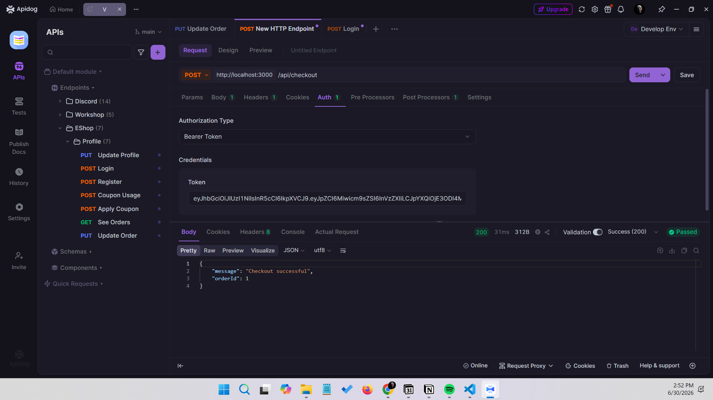
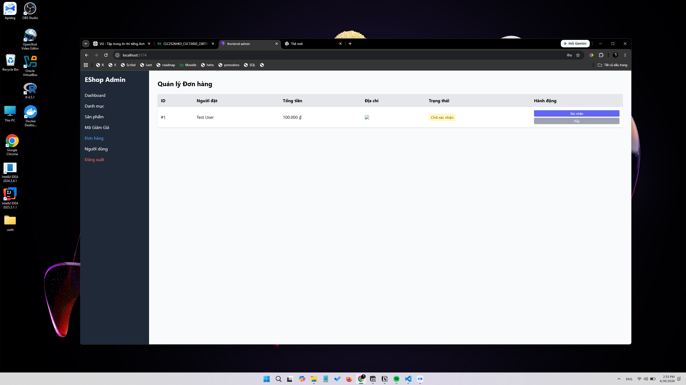
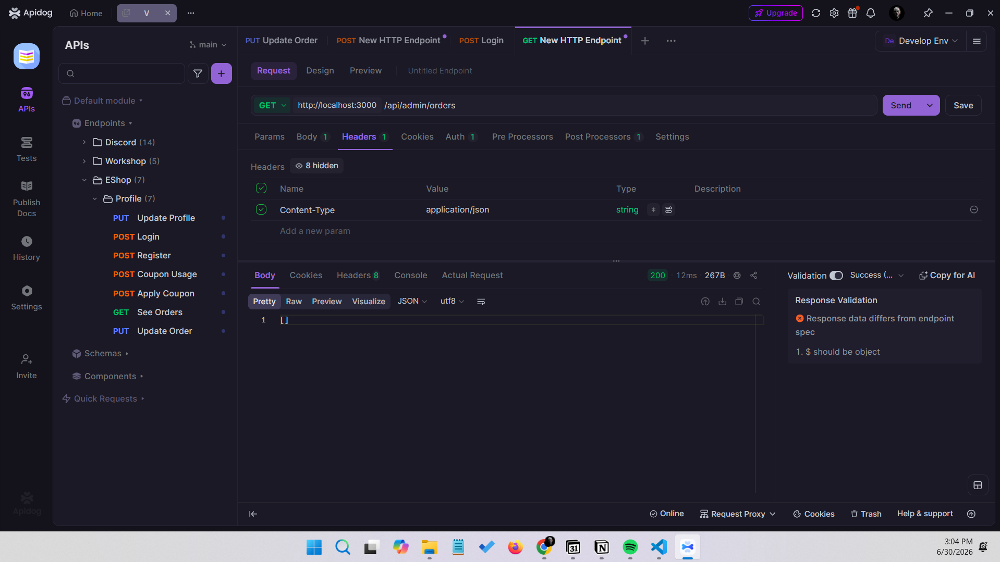
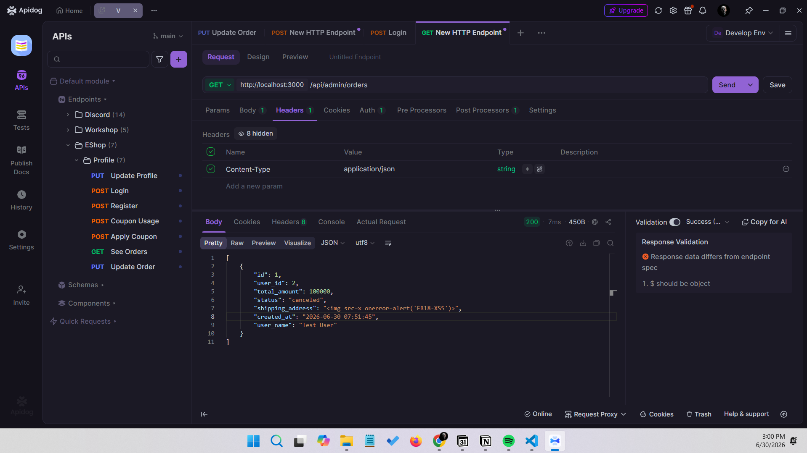
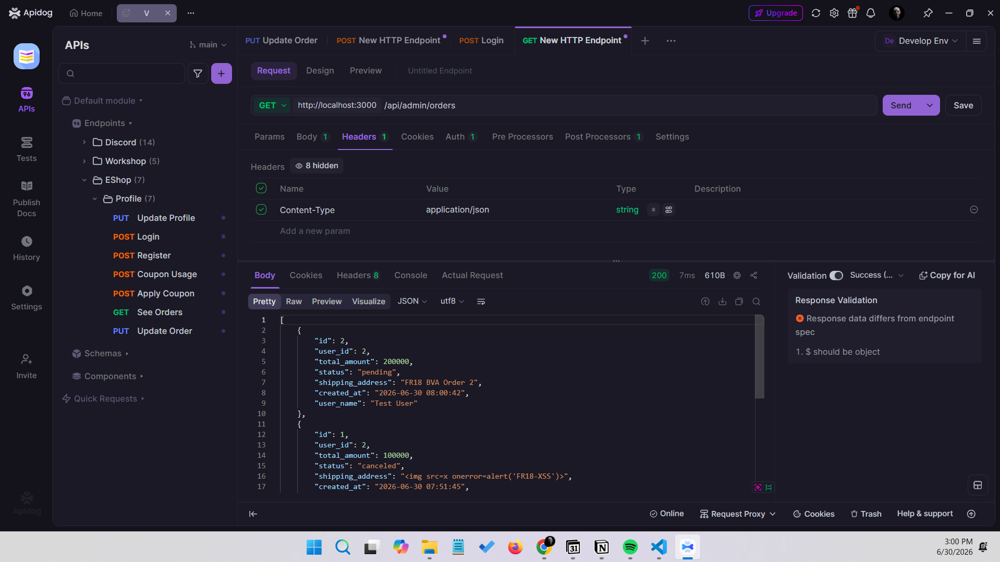

# FR-18 - Admin Order Management

## 1. Feature Overview

FR-18 allows an admin to view all orders and update order statuses. The actual code uses `GET /api/admin/orders` and `PUT /api/admin/orders/:id/status`; both routes pass through the `authenticateToken` middleware.

## 2. Requirement Summary

According to the SRS, only admins can view/update orders, order status must follow the FR-10 state machine, `delivered` and `canceled` are final states, and shipping addresses must be displayed safely. In the actual code, backend admin APIs only verify that a token exists and do not check `role=admin`; transition `canceled -> delivered` is allowed; and the admin UI displays shipping address using `dangerouslySetInnerHTML`.

## 3. Domain Testing

### 3.1 Input Variables / Conditions

| Variable / Condition | Description | Valid Domain | Invalid Domain |
|---|---|---|---|
| Token | Admin API authentication | Valid JWT | No token, invalid token |
| Role | Admin permission | `role=admin` | `role=user` with valid token |
| Order ID | Order being viewed/updated | Existing ID | Non-existing ID |
| Current status | Current order state | pending, confirmed, shipping | delivered/canceled final state |
| Target status | Desired new state | Valid FR-10 transition edge | Skipped transition, backward transition, transition from final state |
| Shipping address | User data displayed in admin UI | Escaped text | Rendered HTML/script |
| Error response | Invalid transition response | 400 with clear message | Wrong 200, silent failure |

### 3.2 Domain Testing Explanation

1. Identify inputs/conditions: token, role, order id, current/target status, and shipping address.
2. Divide role domains and state-transition domains into valid and invalid classes.
3. Select representatives for each state-machine edge: pending->confirmed, confirmed->shipping, shipping->delivered, and cancellation from pending/confirmed.
4. Combine positive and negative cases, including non-admin, no-token, and non-existing-order cases.
5. Add security/UI cases because the admin UI renders address content as HTML.
6. Review actual code: middleware does not check role and backend contains suspicious `canceled -> delivered` logic.

### 3.3.0 Test Execution Setup

#### Environment
- Backend API: `http://localhost:3000/api`
- Admin Web: `http://localhost:5174`
- Web Frontend: `http://localhost:5173`
- API Client: Apidog/Postman/cURL

#### Test Accounts
| Role | Email | Password | Purpose |
|---|---|---|---|
| Admin | admin@eshop.com | Admin123! or admin123 | Used for admin order list and status update tests |
| Regular User | test@eshop.com | Test1234! | Used for creating orders and non-admin access tests |

Source-code note: `backend/database.js` seeds the admin password as `Admin123!`; `setup_guide.md` mentions `admin123`, so use `Admin123!` first when executing tests.

#### Common API Headers
For authenticated requests:

```http
Authorization: Bearer <token>
Content-Type: application/json
```

#### How to Get Tokens

1. Send `POST /api/login`.
2. Use the email/password from the test accounts.
3. Copy the returned JWT token.
4. Use it as `Authorization: Bearer <token>`.

#### How to Prepare Test Orders

To test status transitions, create several orders first.

Option A - using Web UI:

1. Open `http://localhost:5173`.
2. Log in as `test@eshop.com / Test1234!`.
3. Add a product to cart.
4. Complete checkout.
5. Open Admin Web and verify the new order appears.

Option B - using API:

1. Log in as a regular user.
2. Send `POST /api/checkout` with a valid user token.
3. Use a simple request body such as:

```json
{
  "total_amount": 100000,
  "shipping_address": "FR18 Test Address"
}
```

4. Save the returned `orderId`.

### 3.3 Domain Testing Test Cases

> Execution reset note: Previous screenshot evidence was removed. Current results are reset to `To be executed`. API tests can generate JSON/HTML evidence under `test_scripts/results/`, while UI and mobile behavior require manual review before final verdicts are written.


| TC ID | Technique | Domain Focus | Preconditions | Input Data | Steps | Expected Result | Actual Result | Verdict | Evidence |
|---|---|---|---|---|---|---|---|---|---|
| FR18-DT-01 | Domain Testing | Admin views all orders | Backend is running; admin account exists; at least one order exists | Admin token: `<admin_token>`<br>Endpoint: `GET /api/admin/orders`<br>Headers: `Authorization: Bearer <admin_token>` | 1. Log in as admin using `POST http://localhost:3000/api/login` with body `{"email":"admin@eshop.com","password":"Admin123!"}`.<br>2. Copy the admin JWT token.<br>3. Send `GET http://localhost:3000/api/admin/orders` with header `Authorization: Bearer <admin_token>`.<br>4. Alternatively, open `http://localhost:5174`, log in as admin, and click the Orders tab.<br>5. Observe whether all orders are displayed. | All orders are displayed with `id`, `user_name`, `total_amount`, `status`, `shipping_address`, and latest orders first. | API returned HTTP 403 Forbidden when the admin token attempted to view all orders. | Fail | Result log available in test_scripts/results/ |
| FR18-DT-02 | Domain Testing | Regular user calls admin orders | Backend is running; regular user account exists | Regular user token: `<user_token>`<br>Endpoint: `GET /api/admin/orders`<br>Headers: `Authorization: Bearer <user_token>` | 1. Log in as `test@eshop.com` using `POST http://localhost:3000/api/login` with body `{"email":"test@eshop.com","password":"Test1234!"}`.<br>2. Copy the regular user JWT token.<br>3. Send `GET http://localhost:3000/api/admin/orders` with header `Authorization: Bearer <user_token>`.<br>4. Observe response status and body. | According to SRS, regular user should be rejected with 401/403. | API returned HTTP 403 Forbidden, so regular user access to admin orders was blocked. | Pass | Result log available in test_scripts/results/ |
| FR18-DT-03 | Domain Testing | No token | Backend is running | No Authorization header<br>Endpoint: `GET /api/admin/orders` | 1. Send `GET http://localhost:3000/api/admin/orders` without the `Authorization` header.<br>2. Observe response status and body. | Returns `401 Unauthorized`. | API returned HTTP 401 Unauthorized, so admin order access without a token was blocked. | Pass | Result log available in test_scripts/results/ |
| FR18-DT-04 | Domain Testing | pending -> confirmed | A pending order exists | Admin token: `<admin_token>`<br>Order ID: `<pending_order_id>`<br>Endpoint: `PUT /api/admin/orders/<pending_order_id>/status`<br>Headers: `Authorization: Bearer <admin_token>`, `Content-Type: application/json`<br>Body: `{"status":"confirmed"}` | 1. Create or find an order with status `pending`.<br>2. Log in as admin and copy token.<br>3. Send `PUT http://localhost:3000/api/admin/orders/<pending_order_id>/status`.<br>4. Use header `Authorization: Bearer <admin_token>`.<br>5. Use body `{"status":"confirmed"}`.<br>6. Send `GET http://localhost:3000/api/admin/orders` again.<br>7. Verify the order status is now `confirmed`. | Success response is returned, and the order status becomes `confirmed`. | API returned HTTP 403 Forbidden for the admin order status operation; follow-up order status was not available. | Fail | Result log available in test_scripts/results/ |
| FR18-DT-05 | Domain Testing | confirmed -> shipping | A confirmed order exists | Admin token: `<admin_token>`<br>Order ID: `<confirmed_order_id>`<br>Endpoint: `PUT /api/admin/orders/<confirmed_order_id>/status`<br>Headers: `Authorization: Bearer <admin_token>`, `Content-Type: application/json`<br>Body: `{"status":"shipping"}` | 1. Use an order that is already `confirmed`, or first execute FR18-DT-04.<br>2. Send `PUT http://localhost:3000/api/admin/orders/<confirmed_order_id>/status` with body `{"status":"shipping"}`.<br>3. Call `GET http://localhost:3000/api/admin/orders`.<br>4. Verify status is `shipping`. | Success response is returned, and the order status becomes `shipping`. | API returned HTTP 403 Forbidden for the admin order status operation; follow-up order status was not available. | Fail | Result log available in test_scripts/results/ |
| FR18-DT-06 | Domain Testing | shipping -> delivered | A shipping order exists | Admin token: `<admin_token>`<br>Order ID: `<shipping_order_id>`<br>Endpoint: `PUT /api/admin/orders/<shipping_order_id>/status`<br>Headers: `Authorization: Bearer <admin_token>`, `Content-Type: application/json`<br>Body: `{"status":"delivered"}` | 1. Use an order that is already `shipping`, or first execute FR18-DT-04 then FR18-DT-05.<br>2. Send `PUT http://localhost:3000/api/admin/orders/<shipping_order_id>/status` with body `{"status":"delivered"}`.<br>3. Call `GET http://localhost:3000/api/admin/orders`.<br>4. Verify status is `delivered`. | Success response is returned, and the order status becomes `delivered`. | API returned HTTP 403 Forbidden for the admin order status operation; follow-up order status was not available. | Fail | Result log available in test_scripts/results/ |
| FR18-DT-07 | Domain Testing | pending -> canceled | A pending order exists | Admin token: `<admin_token>`<br>Order ID: `<pending_order_id>`<br>Endpoint: `PUT /api/admin/orders/<pending_order_id>/status`<br>Headers: `Authorization: Bearer <admin_token>`, `Content-Type: application/json`<br>Body: `{"status":"canceled"}` | 1. Create or find a `pending` order.<br>2. Send `PUT http://localhost:3000/api/admin/orders/<pending_order_id>/status` with body `{"status":"canceled"}`.<br>3. Call `GET http://localhost:3000/api/admin/orders`.<br>4. Verify status is `canceled`. | Success response is returned, and the order status becomes `canceled`. | API returned HTTP 403 Forbidden for the admin order status operation; follow-up order status was not available. | Fail | Result log available in test_scripts/results/ |
| FR18-DT-08 | Domain Testing | confirmed -> canceled | A confirmed order exists | Admin token: `<admin_token>`<br>Order ID: `<confirmed_order_id>`<br>Endpoint: `PUT /api/admin/orders/<confirmed_order_id>/status`<br>Headers: `Authorization: Bearer <admin_token>`, `Content-Type: application/json`<br>Body: `{"status":"canceled"}` | 1. Use an order that is already `confirmed`.<br>2. Send `PUT http://localhost:3000/api/admin/orders/<confirmed_order_id>/status` with body `{"status":"canceled"}`.<br>3. Call `GET http://localhost:3000/api/admin/orders`.<br>4. Verify status is `canceled`. | Success response is returned, and the order status becomes `canceled`. | API returned HTTP 403 Forbidden for the admin order status operation; follow-up order status was not available. | Fail | Result log available in test_scripts/results/ |
| FR18-DT-09 | Domain Testing | Invalid pending -> delivered | A pending order exists | Admin token: `<admin_token>`<br>Order ID: `<pending_order_id>`<br>Endpoint: `PUT /api/admin/orders/<pending_order_id>/status`<br>Headers: `Authorization: Bearer <admin_token>`, `Content-Type: application/json`<br>Body: `{"status":"delivered"}` | 1. Create or find a `pending` order.<br>2. Send `PUT http://localhost:3000/api/admin/orders/<pending_order_id>/status` with body `{"status":"delivered"}`.<br>3. Observe response status and body.<br>4. Call `GET http://localhost:3000/api/admin/orders`.<br>5. Verify the order status remains `pending`. | Rejected with clear error; status unchanged. | API returned HTTP 403 Forbidden for the admin order status operation; follow-up order status was not available. | Fail | Result log available in test_scripts/results/ |
| FR18-DT-10 | Domain Testing | delivered final state | A delivered order exists | Admin token: `<admin_token>`<br>Order ID: `<delivered_order_id>`<br>Endpoint: `PUT /api/admin/orders/<delivered_order_id>/status`<br>Headers: `Authorization: Bearer <admin_token>`, `Content-Type: application/json`<br>Body: `{"status":"canceled"}` | 1. Use an order that is already `delivered`, or execute `pending -> confirmed -> shipping -> delivered` first.<br>2. Send `PUT http://localhost:3000/api/admin/orders/<delivered_order_id>/status` with body `{"status":"canceled"}`.<br>3. Observe response status and body.<br>4. Call `GET http://localhost:3000/api/admin/orders`.<br>5. Verify status remains `delivered`. | Rejected because `delivered` is a final state; status unchanged. | API returned HTTP 403 Forbidden for the admin order status operation; follow-up order status was not available. | Fail | Result log available in test_scripts/results/ |
| FR18-DT-11 | Domain Testing | canceled final state | A canceled order exists | Admin token: `<admin_token>`<br>Order ID: `<canceled_order_id>`<br>Endpoint: `PUT /api/admin/orders/<canceled_order_id>/status`<br>Headers: `Authorization: Bearer <admin_token>`, `Content-Type: application/json`<br>Body: `{"status":"delivered"}` | 1. Use an order that is already `canceled`, or execute `pending -> canceled` first.<br>2. Send `PUT http://localhost:3000/api/admin/orders/<canceled_order_id>/status` with body `{"status":"delivered"}`.<br>3. Observe response status and body.<br>4. Call `GET http://localhost:3000/api/admin/orders`.<br>5. Verify status remains `canceled`. | Rejected because `canceled` is a final state; status unchanged. | API returned HTTP 403 Forbidden for the admin order status operation; follow-up order status was not available. | Fail | Result log available in test_scripts/results/ |
|FR18-DT-12 | Domain Testing | Shipping address XSS / unsafe HTML rendering | Backend, web frontend, and admin frontend are running | User token: `<user_token>`<br>Admin token: `<admin_token>`<br>Endpoint: `POST /api/checkout`<br>Checkout body: `{"total_amount":100000,"shipping_address":""}` | 1. Log in as a regular user and copy user token.<br>2. Send `POST http://localhost:3000/api/checkout` with the XSS shipping address.<br>3. Save returned `orderId`.<br>4. Open `http://localhost:5174`.<br>5. Log in as admin.<br>6. Click the Orders tab.<br>7. Locate the order created in step 2.<br>8. Observe whether the address is displayed as plain text or rendered as HTML.<br>9. Check whether any alert popup appears. | Address is escaped as text; no alert popup executes. | Checkout API returned success for an order containing the HTML shipping address, and the Admin Orders page rendered the address as an image element rather than escaped text. | Fail | [FR18-DT-12 checkout screenshot](evidence/screenshots/FR18-DT-12.png), [FR18-DT-12 admin UI screenshot](evidence/screenshots/FR18-DT-12-2.png)|

### 3.4 Domain Testing Screenshot Evidence



Caption: FR18-DT-12 checkout API evidence. The backend accepted the checkout request containing an HTML shipping address and returned a successful order creation response.



Caption: FR18-DT-12 admin UI evidence. The address column rendered the submitted HTML as an image element, confirming unsafe rendering in the Admin Orders interface.

## 4. Boundary Value Analysis

### 4.1 Boundary Variables

| Variable | Boundary Rule | Below Boundary | On Boundary | Above Boundary |
|---|---|---:|---:|---:|
| Displayed order count | Admin list handles 0..n orders | 0 | 1 | 2 |
| State pending | Start state | none | pending | confirmed |
| State confirmed | Can go to shipping or canceled | pending | confirmed | shipping |
| State shipping | Can only go to delivered | confirmed | shipping | delivered |
| Final delivered | No further transition allowed | shipping | delivered | canceled |
| Final canceled | No further transition allowed | pending/confirmed | canceled | delivered |

### 4.2 BVA Explanation

1. Identify state-boundary and list-size boundaries.
2. Select below/on/above boundary values for 0/1/2 orders and adjacent states.
3. Create tests around final states to detect transitions after completion.
4. Include both valid and invalid boundaries.
5. Review code: `canceled -> delivered` is marked valid in backend, which conflicts with the SRS.

### 4.3 Boundary Value Analysis Test Cases

> Execution reset note: Previous screenshot evidence was removed. Current results are reset to `To be executed`. API tests can generate JSON/HTML evidence under `test_scripts/results/`, while UI and mobile behavior require manual review before final verdicts are written.


| TC ID | Technique | Domain Focus | Preconditions | Input Data | Steps | Expected Result | Actual Result | Verdict | Evidence |
|---|---|---|---|---|---|---|---|---|---|
|FR18-BVA-01 | Boundary Value Analysis | 0 orders | Precondition: database has no orders, or run `node database.js` then ensure no checkout has been performed. | Admin token: `<admin_token>`<br>Endpoint: `GET /api/admin/orders`<br>Alternative UI: Admin Orders tab at `http://localhost:5174` | 1. Start backend with an empty `orders` table.<br>2. Log in as admin.<br>3. Call `GET http://localhost:3000/api/admin/orders` or open Admin Orders page.<br>4. Verify empty list/state. | Empty list/state shown, no crash. | API returned HTTP 200 with an empty array, so the empty orders boundary was handled without crashing. | Pass | [FR18-BVA-01 screenshot](evidence/screenshots/FR18-BVA-01.png)|
|FR18-BVA-02 | Boundary Value Analysis | 1 order | Backend is running; exactly one order can be created for this test. | User token: `<user_token>`<br>Admin token: `<admin_token>`<br>Create endpoint: `POST /api/checkout`<br>List endpoint: `GET /api/admin/orders`<br>Checkout body: `{"total_amount":100000,"shipping_address":"FR18 BVA One Order"}` | 1. Create exactly one order using `POST http://localhost:3000/api/checkout`.<br>2. Log in as admin.<br>3. Call `GET http://localhost:3000/api/admin/orders`.<br>4. Verify exactly one order appears. | Exactly 1 order is displayed. | API returned HTTP 200 with exactly one order object in the response. | Pass | [FR18-BVA-02 screenshot](evidence/screenshots/FR18-BVA-02.png)|
|FR18-BVA-03 | Boundary Value Analysis | 2+ orders | Backend is running; at least two orders can be created for this test. | User token: `<user_token>`<br>Admin token: `<admin_token>`<br>Create endpoint: `POST /api/checkout`<br>List endpoint: `GET /api/admin/orders`<br>Checkout body examples: `{"total_amount":100000,"shipping_address":"FR18 BVA Order 1"}`, `{"total_amount":200000,"shipping_address":"FR18 BVA Order 2"}` | 1. Create at least two orders using `POST http://localhost:3000/api/checkout`.<br>2. Log in as admin.<br>3. Call `GET http://localhost:3000/api/admin/orders`.<br>4. Verify all orders appear. | All orders are displayed, sorted by descending `id`. | API returned HTTP 200 with two orders sorted by descending `id` (`2` before `1`). | Pass | [FR18-BVA-03 screenshot](evidence/screenshots/FR18-BVA-03.png)|

### 4.4 Boundary Value Screenshot Evidence



Caption: FR18-BVA-01 evidence. The admin orders API returned an empty list for the zero-order boundary without an error.



Caption: FR18-BVA-02 evidence. The admin orders API returned one order object for the one-order boundary.



Caption: FR18-BVA-03 evidence. The admin orders API returned two order objects and displayed order ID 2 before order ID 1, matching descending order.
| FR18-BVA-04 | Boundary Value Analysis | Confirmed boundary | Two confirmed orders exist or can be prepared. | Admin token: `<admin_token>`<br>First order ID: `<confirmed_order_id_1>`<br>Second order ID: `<confirmed_order_id_2>`<br>Endpoint: `PUT /api/admin/orders/<order_id>/status`<br>Bodies: `{"status":"shipping"}` and `{"status":"canceled"}` | 1. Create two pending orders.<br>2. Change both to `confirmed` using `PUT /api/admin/orders/<order_id>/status` with body `{"status":"confirmed"}`.<br>3. For the first order, update `confirmed -> shipping` with body `{"status":"shipping"}`.<br>4. For the second order, update `confirmed -> canceled` with body `{"status":"canceled"}`.<br>5. Verify both transitions are accepted separately. | Both valid directions from `confirmed` are accepted separately. | API returned HTTP 403 Forbidden for the admin order status operation; follow-up order status was not available. | Fail | Result log available in test_scripts/results/ |
| FR18-BVA-05 | Boundary Value Analysis | Delivered final boundary | A delivered order exists or can be prepared. | Admin token: `<admin_token>`<br>Order ID: `<delivered_order_id>`<br>Endpoint: `PUT /api/admin/orders/<delivered_order_id>/status`<br>Body: `{"status":"canceled"}` | 1. Create a pending order.<br>2. Change `pending -> confirmed -> shipping -> delivered`.<br>3. Try `delivered -> canceled` with body `{"status":"canceled"}`.<br>4. Verify rejection and unchanged status by calling `GET /api/admin/orders`. | Rejected, and status remains `delivered`. | API returned HTTP 403 Forbidden for the admin order status operation; follow-up order status was not available. | Fail | Result log available in test_scripts/results/ |
| FR18-BVA-06 | Boundary Value Analysis | Canceled final boundary | A canceled order exists or can be prepared. | Admin token: `<admin_token>`<br>Order ID: `<canceled_order_id>`<br>Endpoint: `PUT /api/admin/orders/<canceled_order_id>/status`<br>Body: `{"status":"delivered"}` | 1. Create a pending order.<br>2. Change `pending -> canceled`.<br>3. Try `canceled -> delivered` with body `{"status":"delivered"}`.<br>4. Verify rejection and unchanged status by calling `GET /api/admin/orders`. | Rejected, and status remains `canceled`. | API returned HTTP 403 Forbidden for the admin order status operation; follow-up order status was not available. | Fail | Result log available in test_scripts/results/ |

## 5. AI Gap Analysis

### 5.1 AI-Suggested Cases

AI commonly suggests admin viewing orders, non-admin users being blocked, and basic transitions such as pending->confirmed or shipping->delivered.

### 5.2 Missing / Weak AI Cases

AI may miss the actual API role-check behavior, final state `canceled`, shipping-address XSS in admin UI, non-existing orders, and skipped transitions such as pending->delivered.

### 5.3 Why AI Might Miss Them

The state machine is more complex than simple CRUD. Without reading `server.js`, AI may trust the API document that says admin APIs check role, while the actual middleware only verifies token existence.

### 5.4 Human Corrections

Tests were corrected according to actual routes, with added role/user-token cases, final-state boundary tests, and XSS address cases because the admin UI uses `dangerouslySetInnerHTML`.

## 6. Potential or Confirmed Bugs

Confirmed FR-18 bugs are listed in `bug_report.md`.

| Related Test Case | Verdict | Notes | Evidence |
|---|---|---|---|
| FR18-DT-01 | Fail | Admin token returned HTTP 403 when viewing the admin order list. | `test_scripts/results/json/fr18_admin_order_api_results.json`, `test_scripts/results/html/fr18_admin_order_api_results.html` |
| FR18-DT-04, FR18-DT-05, FR18-DT-06, FR18-DT-07, FR18-DT-08, FR18-BVA-04 | Fail | Valid admin order status transitions returned HTTP 403. | `test_scripts/results/json/fr18_admin_order_api_results.json`, `test_scripts/results/html/fr18_admin_order_api_results.html` |
| FR18-DT-09, FR18-DT-10, FR18-DT-11, FR18-BVA-05, FR18-BVA-06 | Fail | State-machine validation could not be reached because admin status update requests returned HTTP 403 and no follow-up status was available. | `test_scripts/results/json/fr18_admin_order_api_results.json`, `test_scripts/results/html/fr18_admin_order_api_results.html` |
| FR18-DT-12 | Fail | Admin Orders renders the submitted HTML shipping address as an element rather than escaped text. | [FR18-DT-12 checkout screenshot](evidence/screenshots/FR18-DT-12.png), [FR18-DT-12 admin UI screenshot](evidence/screenshots/FR18-DT-12-2.png) |

FR18-DT-02, FR18-DT-03, FR18-BVA-01, FR18-BVA-02, and FR18-BVA-03 are not listed as bugs because the result logs and reviewed screenshots show the expected access or list-size behavior.

## 7. API Execution Helper

### Login as Admin
```bash
curl -X POST http://localhost:3000/api/login \
  -H "Content-Type: application/json" \
  -d '{"email":"admin@eshop.com","password":"Admin123!"}'
```

### Login as Regular User
```bash
curl -X POST http://localhost:3000/api/login \
  -H "Content-Type: application/json" \
  -d '{"email":"test@eshop.com","password":"Test1234!"}'
```

### Create Order as User
```bash
curl -X POST http://localhost:3000/api/checkout \
  -H "Content-Type: application/json" \
  -H "Authorization: Bearer <user_token>" \
  -d '{"total_amount":100000,"shipping_address":"FR18 Test Address"}'
```

### View Admin Orders
```bash
curl -X GET http://localhost:3000/api/admin/orders \
  -H "Authorization: Bearer <admin_token>"
```

### Update Order Status
```bash
curl -X PUT http://localhost:3000/api/admin/orders/<order_id>/status \
  -H "Content-Type: application/json" \
  -H "Authorization: Bearer <admin_token>" \
  -d '{"status":"confirmed"}'
```
