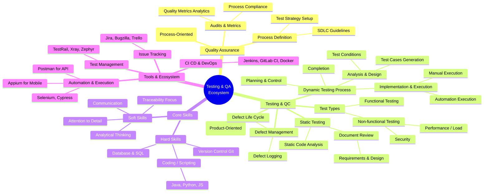

# QA/QC Role Mindmap

```mermaid
mindmap
  root((Testing & QA
  Ecosystem))
    Quality Assurance
      (Process-Oriented)
      Process Definition
        SDLC Guidelines
        Test Strategy Setup
      Audits & Metrics
        Process Compliance
        Quality Metrics Analytics
    Testing & QC
      (Product-Oriented)
      Static Testing
        Document Review
          Requirements & Design
        Static Code Analysis
      Dynamic Testing Process
        Planning & Control
        Analysis & Design
          Test Conditions
          Test Cases Generation
        Implementation & Execution
          Manual Execution
          Automation Execution
        Completion
      Test Types
        Functional Testing
        Non-functional Testing
          Performance / Load
          Security
      Defect Management
        Defect Logging
        Defect Life Cycle
    Core Skills
      Hard Skills
        Coding / Scripting
          Java, Python, JS
        Database & SQL
        Version Control Git
      Soft Skills
        Analytical Thinking
        Attention to Detail
        Communication
        Traceability Focus
    Tools & Ecosystem
      Test Management
        TestRail, Xray, Zephyr
      Issue Tracking
        Jira, Bugzilla, Trello
      Automation & Execution
        Selenium, Cypress
        Appium for Mobile
        Postman for API
      CI CD & DevOps
        Jenkins, GitLab CI, Docker
```
