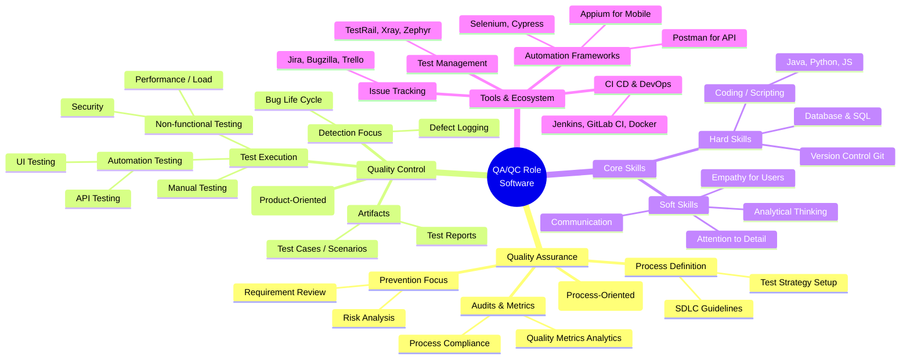

# QA/QC Role Mindmap

```mermaid
mindmap
  root((QA/QC Role
  Software))
    Quality Assurance
      (Process-Oriented)
      Prevention Focus
        Risk Analysis
        Requirement Review
      Process Definition
        SDLC Guidelines
        Test Strategy Setup
      Audits & Metrics
        Process Compliance
        Quality Metrics Analytics
    Quality Control
      (Product-Oriented)
      Detection Focus
        Defect Logging
        Bug Life Cycle
      Test Execution
        Manual Testing
        Automation Testing
          UI Testing
          API Testing
        Non-functional Testing
          Performance / Load
          Security
      Artifacts
        Test Cases / Scenarios
        Test Reports
    Core Skills
      Hard Skills
        Coding / Scripting
          Java, Python, JS
        Database & SQL
        Version Control Git
      Soft Skills
        Analytical Thinking
        Attention to Detail
        Communication
        Empathy for Users
    Tools & Ecosystem
      Test Management
        TestRail, Xray, Zephyr
      Issue Tracking
        Jira, Bugzilla, Trello
      Automation Frameworks
        Selenium, Cypress
        Appium for Mobile
        Postman for API
      CI CD & DevOps
        Jenkins, GitLab CI, Docker
```
