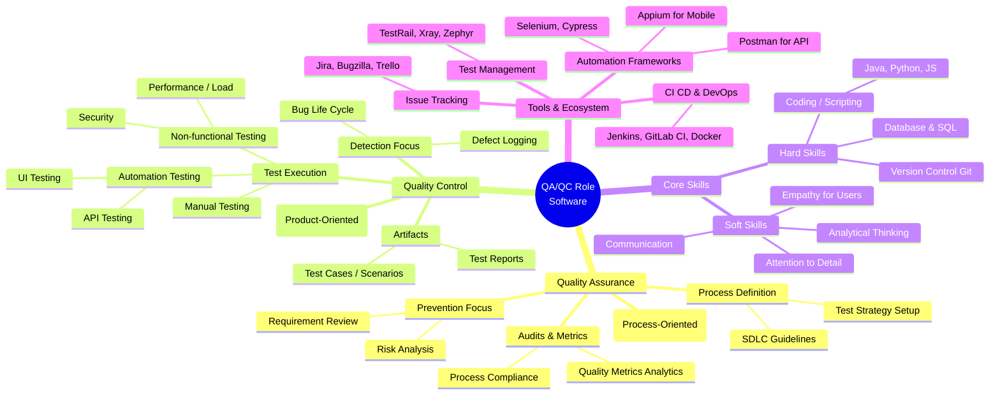

### Timestamp: 16:45 28/05/2026

**AI Tool:** `Claude Code`

**Prompt:**

```text
❯ Hãy giúp tôi viết phần AI Impact Analysis cho cả 10 job dựa vào nội dung của  
  mỗi job, sau khi hoàn thành hãy giải thích cho tôi lý do bạn viết những phân  
  tích đó một cách rõ ràng. Nội dung phân tích được viết bằng tiếng Anh. Hãy    
  fan out các subagent để thực hiện và tổng kết lại nội dung tôi yêu cầu       
```

**AI Output:**

```text
● Tất cả 5 subagents đã hoàn thành. Đây là tổng kết toàn bộ nội dung và lý do:

  ---
  Tổng kết AI Impact Analysis — 10 Jobs

  1. PNJ — Senior QC Automation Tester

  ▎ "AI is transforming this role from a traditional test executor into an AI 
  ▎ system evaluator — tasks like writing test scripts and generating test data 
  ▎ are increasingly augmented by LLM-based tools, while the job's explicit 
  ▎ demands for testing AI accuracy, fairness, and bias in training data 
  ▎ represent entirely new human-led responsibilities that AI cannot 
  ▎ self-assess. The critical human skill that remains irreplaceable is end-user
  ▎  empathy combined with business risk judgment, since determining whether an 
  ▎ AI feature is trustworthy in real-world edge cases requires contextual 
  ▎ reasoning that automated tools cannot replicate."

  Lý do: JD có hẳn một section riêng "Kiểm thử AI" (LLM evaluation, model
  fairness, training data QA). Đây là nghịch lý thú vị: AI tạo ra công việc mới
  cho QA ngay cả khi nó tự động hóa công việc cũ. Anchor human value vào
  "end-user empathy + risk judgment" vì JD ghi rõ đó là must-have.

  ---
  2. Nakivo — Automation QA Engineer

  ▎ "AI tools like Copilot and Cursor — explicitly listed as required experience
  ▎  — are already augmenting script generation and test case design in this 
  ▎ role, reducing the manual effort needed to build and maintain automation 
  ▎ frameworks for Nakivo's backup/storage product. However, the role's core 
  ▎ value shifts toward cross-functional defect analysis and troubleshooting 
  ▎ complex infrastructure issues (VMware, Hyper-V, AWS), where understanding 
  ▎ system context and failure causality still requires human analytical 
  ▎ judgment that AI-assisted code generation cannot replace."

  Lý do: JD liệt kê Copilot/Cursor/Perplexity là required (không phải
  nice-to-have), nên phân tích AI augmentation là thực tế, không phải suy đoán.
  Human moat nằm ở troubleshoot hệ thống storage phức tạp (VMware, Hyper-V) —
  môi trường distributed này AI chưa thể tự phán đoán root cause.

  ---
  3. OneMountGroup — Senior QC Engineer

  ▎ "AI tools like GitHub Copilot and ChatGPT are already embedded in this role 
  ▎ to accelerate routine test case generation, script authoring, and test data 
  ▎ creation — effectively offloading the mechanical parts of a QC Engineer's 
  ▎ workload. However, the core human value lies in architecting automation 
  ▎ frameworks across diverse stacks (web, mobile, API, performance), 
  ▎ integrating them into CI/CD pipelines, and applying domain-specific judgment
  ▎  in Fintech/Banking contexts where data accuracy and risk-based testing 
  ▎ decisions cannot be delegated to a model."

  Lý do: JD explicitly yêu cầu AI tools trong responsibilities. Contrast rõ: "AI
   làm generation" vs "human sở hữu framework architecture + domain risk
  judgment trong Fintech" — fintech/banking là ngành đặc biệt nhạy cảm với
  accuracy nên không thể trust hoàn toàn vào AI.

  ---
  4. soxesAG — Senior QA Engineer

  ▎ "AI tools are taking over the repetitive, template-driven portions of this 
  ▎ hybrid QA/BA role — test case generation, defect pattern analysis, test data
  ▎  preparation, and documentation drafting — which directly aligns with the 
  ▎ job's explicit list of AI-assisted tasks. The irreplaceable human 
  ▎ contribution remains in requirements analysis and stakeholder clarification:
  ▎  interpreting ambiguous business needs from overseas partners and 
  ▎ translating them into testable specifications requires the cross-cultural 
  ▎ communication and contextual judgment that AI tools currently cannot 
  ▎ replicate."

  Lý do: Role này là QA kết hợp BA — JD ghi rõ 4 nhiệm vụ AI hỗ trợ. Human moat
  nằm ở "requirements clarification với overseas partners" — cross-cultural
  communication và xử lý yêu cầu mơ hồ là điểm yếu hiện tại của AI.

  ---
  5. Bosch — Senior QA/QC Automation Tester

  ▎ "AI is augmenting this role by automating test case generation, accelerating
  ▎  result analysis, and enabling self-healing locators within Playwright 
  ▎ frameworks — directly addressing the responsibility to 'explore AI-driven 
  ▎ approaches to improve testing efficiency' listed in the job description. 
  ▎ However, the core human skill of designing scalable test architectures for 
  ▎ 500,000+ users, integrating them into CI/CD pipelines, and mentoring team 
  ▎ members in automation practices remains irreplaceable by AI tools alone."

  Lý do: JD ghi "Explore AI-driven approaches" là Key Responsibility, nên dùng
  chính ngôn ngữ của JD làm anchor. Scale (500k+ users) và mentoring duties là
  hai yếu tố AI không thể thay thế — architectural thinking ở quy mô lớn đòi hỏi
   human judgment.

  ---
  6. KMS Technology — Software Test Engineer

  ▎ "KMS explicitly treats AI tool proficiency as a differentiator — listing 
  ▎ ChatGPT, GitHub Copilot, prompt engineering, and responsible AI use as 
  ▎ nice-to-have skills — signaling that AI is already accelerating test code 
  ▎ generation, debugging, and documentation across its broad testing tracks 
  ▎ (manual, automation, performance). Yet the role's core demands of 
  ▎ client-facing communication, cross-functional collaboration within Scrum 
  ▎ teams, and exercising judgment across multiple testing disciplines 
  ▎ simultaneously are human skills that AI tools currently augment rather than 
  ▎ replace."

  Lý do: KMS là posting duy nhất dành 4 bullets cho AI tools (dù chỉ
  nice-to-have), cho thấy đây là công ty đang chuyển dịch tư duy. Human moat là
  client communication + Scrum collaboration + breadth of testing disciplines.

  ---
  7. TEENUP — Product Tester

  ▎ "AI tools can increasingly generate test cases from user stories and detect 
  ▎ regression failures automatically, directly reducing the manual workload of 
  ▎ writing test plans and executing repetitive regression cycles that dominate 
  ▎ this role. However, the exploratory testing, edge-case intuition for a 
  ▎ family-facing AI product (TeenCare AI), and cross-functional collaboration 
  ▎ with PMs and engineers to interpret ambiguous behavioral requirements remain
  ▎  distinctly human responsibilities that AI cannot yet replace."

  Lý do: Role không đề cập AI skill nhưng sản phẩm là "TeenCare AI" — ironic là
  tester của AI product lại không yêu cầu AI skill. Phân tích theo hướng risk:
  regression + test-case writing là mục tiêu dễ bị tự động hóa nhất. Exploratory
   testing của AI product đòi hỏi human intuition.

  ---
  8. GeneSolutions — Software Tester (SQL)

  ▎ "The most automatable parts of this role — SQL data validation queries, 
  ▎ regression test execution, and structured bug logging — are precisely the 
  ▎ areas where AI-assisted testing tools are advancing fastest, putting the 
  ▎ manual-only, no-automation nature of this position at measurable risk. What 
  ▎ remains hard to automate is the domain-specific business logic analysis for 
  ▎ Gene Solutions' internal operational workflows and the UAT facilitation that
  ▎  requires communicating nuanced defect feedback between non-technical users 
  ▎ and developers."

  Lý do: JD yêu cầu hoàn toàn manual, không có automation. SQL assertion và
  regression testing là những thứ AI đang tự động hóa nhanh nhất — mức độ rủi ro
   cao nhất trong danh sách 10. Human moat: domain knowledge của
  biotech/internal workflows và bridge role trong UAT.

  ---
  9. GrapeCity — Manual/Automation Tester

  ▎ "AI tools (e.g., GitHub Copilot, AI-assisted test generation platforms) are 
  ▎ beginning to automate the creation of test cases and regression scripts from
  ▎  requirements — directly overlapping with this role's core tasks of writing 
  ▎ test designs and automation scripts. However, the cross-platform exploratory
  ▎  testing judgment, log analysis, and precise bug reporting that GrapeCity 
  ▎ requires still depend on human analytical skills that current AI cannot 
  ▎ reliably replicate."

  Lý do: Không có AI mention trong JD → phân tích theo hướng risk. Tasks dễ bị
  tự động hóa nhất (test case generation, automation scripting) map trực tiếp
  vào những gì JD yêu cầu. Anchor human value vào log analysis và exploratory
  testing cross-platform.

  ---
  10. Pizza Hut — Senior/Lead QA Engineer

  ▎ "AI is increasingly capable of augmenting lower-level tasks in this role — 
  ▎ such as automated defect triage, test framework recommendations, and CI/CD 
  ▎ pipeline health monitoring — but the defining responsibilities here 
  ▎ (defining org-wide quality strategy, mentoring globally distributed teams, 
  ▎ and embedding quality culture across engineering and product) require 
  ▎ cross-functional leadership and contextual judgment that AI cannot replace. 
  ▎ This role's value shifts further toward strategic decision-making and human 
  ▎ coordination as AI absorbs more of the routine automation and reporting 
  ▎ work."

  Lý do: Đây là role leadership/strategy (8+ years exp, global teams) — AI không
   thể own quality strategy hay mentor distributed teams. Contrasted rõ ràng: AI
   làm defect triage + CI/CD monitoring, human làm quality culture và cross-team
   leadership.

  ---
  Tất cả 10 file đã được cập nhật. Bạn có thể verify bằng cách mở bất kỳ file
  nào trong IDE.
```

### Timestamp: 9:21 30/05/2026

**AI Tool:** `Gemini`

**Prompt:**

```text
For each of the following AI/LLM-related software defects, provide a structured entry
with these exact fields:
- Source URL (direct link to official report, CVE entry, or authoritative news article)
- Description (2-3 sentences, technical)
- Severity: Critical / High / Medium / Low (justify in 1 sentence)
- Real-world consequences (who was affected, what was the impact)
- Solution/Remediation (how was it fixed or mitigated)

Defects to cover:
1. ChatGPT hallucination in legal proceedings — Mata v. Avianca (2023)
2. Air Canada chatbot false refund policy hallucination (2024)
3. Samsung employee data leak via ChatGPT (2023)
4. GitHub Copilot generating vulnerable code patterns (CWE-022, CWE-089) (2022-2023)
5. Google Gemini racially inaccurate historical image generation (Feb 2024)
6. Apple Intelligence false BBC news summary — Luigi Mangione (Dec 2024)
7. DeepSeek unsecured ClickHouse database exposure (Jan 2025)
8. Microsoft Recall plaintext screenshot capture (May 2024)
```

**AI Output:**

Link to Google Docs: [AI Defects](https://docs.google.com/document/d/1vT8C7ob3IxrjK1jzGeybkERaL6ICFp5ssbk7tmPHecs/edit?usp=sharing)

---

### Timestamp: 9:31 30/05/2026

**AI Tool:** `Gemini`

**Prompt:**

```text
For each of the following software defects, provide a structured entry with these exact fields:
- CVE ID (if applicable)
- Source URL (CVE database entry or authoritative security advisory)
- Description (2-3 sentences, technical root cause)
- Severity: Critical / High / Medium / Low - state the official CVSS score and justify in 1 sentence
- Real-world consequences (who was affected, what was the impact)
- Solution/Remediation (how was it fixed or mitigated)

Defects to cover:
1. Log4Shell (CVE-2021-44228, actively exploited 2022)
2. MOVEit Transfer SQL Injection first wave (CVE-2023-34362)
3. LastPass password vault breach (2022)
4. OpenSSL Buffer Overflow (CVE-2022-3602, 2022)
5. Microsoft Exchange ProxyNotShell (CVE-2022-41040)
6. Okta source code breach by Lapsus$ group (2022)
7. XZ Utils backdoor supply chain attack (CVE-2024-3094)
8. Citrix Bleed session token hijacking (CVE-2023-4966)
9. Apple iOS BLASTPASS zero-click exploit (CVE-2023-41064)
10. Microsoft Outlook zero-click RCE MonikerLink (CVE-2024-21413)
11. CrowdStrike Falcon sensor update global BSOD (July 2024)
12. MOVEit Transfer SQL Injection second wave (CVE-2023-35708)
```

**AI Output:**

Link to Google Docs: [Software Defects](https://docs.google.com/document/d/1OlLViMr7ga0feMZNV4QDXRXjomyCLzHCJpPfR6tbRxk/edit?usp=sharing)

### Timestamp: 2:08 02/06/2026

**AI Tool:** `Gemini`

**Prompt:**

```text
For each of the following software defects, provide a structured entry with these exact fields:
- CVE ID
- Source URL (CVE database entry or authoritative security advisory)
- Description (2-3 sentences, technical root cause)
- Severity: Critical / High / Medium / Low — state the official CVSS score and justify in 1 sentence
- Real-world consequences (who was affected, what was the impact)
- Solution/Remediation (how was it fixed or mitigated)

Defects to cover:
1. Ivanti Connect Secure stack buffer overflow RCE (CVE-2025-0282, Jan 2025)
2. SAP NetWeaver Visual Composer unauthenticated file upload RCE (CVE-2025-31324, Apr 2025)
3. Windows Common Log File System (CLFS) driver zero-day privilege escalation (CVE-2025-29824, Apr 2025)
4. Next.js middleware authentication bypass via x-middleware-subrequest header (CVE-2025-29927, Mar 2025)
5. OpenClaw (aka clawdbot or Moltbot) WebSocket token leakage via unvalidated URL parameter (CVE-2026-25253, Jan 2026)
6. Linux kernel crypto algif_aead memory boundary fix (CVE-2026-31431)

```

**AI Output:**

Link to Google Docs: [Recent Defects](https://docs.google.com/document/d/18jBCyQNRm1YA8i7rKfHq7hjTSOBswC2CH1cjNDkMCkY/edit?usp=sharing)

### Timestamp: 9:15 02/06/2026

**AI Tool:** `Gemini`

**Prompt:**

```text
Decribe the XZ Utils backdoor (CVE-2024-3094) as a software defect entry using exactly this format:

- CVE ID
- Source URL (CVE database entry or authoritative security advisory)
- Description (2-3 sentences, technical root cause)
- Severity: Critical / High / Medium / Low — state the official CVSS score and justify in 1 sentence
- Real-world consequences (who was affected, what was the impact)
- Solution/Remediation (how was it fixed or mitigated)

Be specific and technical. Include details about: who introduced the backdoor, how it was injected, which systems were affected, how it was discovered, and what the actual impact was.
```

**AI Output:**

```markdown
Here is the structured software defect entry for the XZ Utils supply chain compromise, following your exact specifications.

---

## XZ Utils Upstream Supply Chain Compromise

* **CVE ID:** CVE-2024-3094
* **Source URL:** [https://nvd.nist.gov/vuln/detail/CVE-2024-3094](https://nvd.nist.gov/vuln/detail/CVE-2024-3094)
* **Description:** The defect is a deliberately engineered backdoor injected into the upstream `xz` repository build infrastructure. During compilation, a malicious `build-to-host.m4` macro executes a multi-stage decoding script that extracts a hidden binary payload from ostensibly benign test compression files (`bad-3-corrupt_lzma2.xz` and `good-large_compressed.lzma`). This payload is statically woven into the resulting `liblzma` shared library, intercepting symbols and using glibc's `IFUNC` mechanism to substitute OpenSSL's cryptographic verification routines (`RSA_public_decrypt`) with malicious code when loaded by an active OpenSSH daemon (`sshd`).
* **Severity:** Critical — CVSS Score: 10.0. The flaw receives the maximum possible severity rating because it enables remote, unauthenticated attackers to execute arbitrary system commands via public-key authentication payloads without leaving a trace in system logs.
* **Real-world consequences:** A malicious contributor operating under the persona **"Jia Tan" (JiaT75)** spent over two years gaining project maintainer status through social engineering before embedding the backdoor into versions 5.6.0 and 5.6.1 of XZ Utils. The compromised packages were pulled into rolling-release and bleeding-edge Linux distributions, including Debian (testing/unstable), Fedora 41/Rawhide, openSUSE Tumbleweed, and Kali Linux. Microsoft engineer Andres Freund discovered the backdoor entirely by accident after noticing that `sshd` processes were consuming unexpected CPU cycles and suffering a minor 500ms login latency during routine database performance micro-benchmarks. Because it was intercepted during the distribution testing phase, the backdoor was caught right before making its way into stable enterprise Linux distributions, completely averting what would have been a catastrophic, global remote-access vector across millions of internet-facing servers.
* **Solution/Remediation:** Linux distribution maintainers immediately purged the 5.6.0 and 5.6.1 upstream tarballs and forced mandatory package downgrades to known-safe legacy baselines (such as XZ Utils 5.4.6 Stable). System administrators running affected instances were advised to roll back package manager states or rebuild environments from fresh installations. Long-term defense necessitated updating continuous integration pipelines to strip unauthorized pre-built binary components from source distribution archives and tightening organizational vetting for third-party open-source project maintainership changes.
```

### Timestamp : 16:08 02/06/2026

**AI Tool:** `Claude`

**Prompt:**

```text
Tôi đang thực hiện bài tập thiết kế kịch bản kiểm thử hộp đen cho một thiết bị gia dụng trực quan. Thiết bị là một chiếc quạt treo tường hiệu Senko, Model TC1626. Thiết bị này có cấu trúc điều khiển và vận hành gồm ba phân hệ chính:

1. Dây giật bên phải (SPEED): Điều khiển tốc độ gió theo vòng lặp tuần hoàn cơ học (Mức 0 -> 1 -> 2 -> 3 -> 0).
2. Dây giật bên trái (SWING): Điều khiển bật/tắt chế độ đảo gió tự động sang hai bên trái/phải.
3. Khớp nối cổ quạt (TILT): Cơ chế nấc lẫy cơ học giữa thân quạt và cụm mô-tơ, cho phép dùng tay bẻ đầu quạt ngẩng lên hoặc gập xuống theo các khấc cố định để chỉnh hướng dọc.
Yêu cầu về cấu trúc đầu ra: Hãy đóng vai một chuyên gia QA/QC và tạo ra danh sách các test cases tiêu chuẩn để kiểm tra chức năng của từng phân hệ trên. Kết quả đầu ra bắt buộc phải trình bày dưới dạng bảng gồm chính xác 6 cột sau:

* Objective: Mục tiêu kiểm thử.
* Input: Dữ liệu/Tác động đầu vào.
* Steps: Các bước thực hiện tuần tự.
* Expected: Kết quả mong đợi theo thiết kế.
* Actual: Kết quả thực tế (Yêu cầu: Để trống cột này, không tự ý điền).
* Verdict: Đánh giá Đạt/Không đạt (Yêu cầu: Để trống cột này, không tự ý điền).
```

**AI Output:**

```markdown
# Test Cases – Quạt treo tường Senko TC1626

## Phân hệ 1: Dây giật SPEED (vòng lặp 0→1→2→3→0)

| Objective | Input | Steps | Expected | Actual | Verdict |
|---|---|---|---|---|---|
| Kiểm tra chuyển mức từ 0 lên 1 | 1 lần giật từ trạng thái tắt | 1. Quạt ở Mức 0 (tắt)<br>2. Giật dây SPEED 1 lần | Mô-tơ chạy ở Mức 1 (tốc độ thấp nhất) | | |
| Kiểm tra tăng tuần tự 1→2→3 | 3 lần giật liên tiếp | 1. Quạt ở Mức 0<br>2. Giật lần 1 → 2 → 3 | Lần lượt đạt Mức 1, Mức 2, Mức 3; tốc độ tăng dần | | |
| Kiểm tra vòng lặp về 0 | Giật lần thứ 4 | 1. Quạt đang ở Mức 3<br>2. Giật dây SPEED 1 lần | Quạt trở về Mức 0 (tắt hoàn toàn) | | |
| Kiểm tra tính tuần hoàn liên tục | 8 lần giật liên tiếp | 1. Bắt đầu từ Mức 0<br>2. Giật 8 lần | Hoàn thành đúng 2 chu kỳ, kết thúc tại Mức 0 | | |
| Kiểm tra giật nhanh liên tiếp | 2 lần giật trong <1 giây | 1. Quạt ở Mức 0<br>2. Giật nhanh 2 lần | Đếm đúng 2 nấc, dừng ở Mức 2, không bỏ nấc/nhảy nấc | | |
| Kiểm tra giật không dứt khoát | Kéo dây nửa hành trình rồi thả | 1. Quạt ở Mức 0<br>2. Kéo dây ~50% hành trình, thả ra | Cơ cấu không đổi mức HOẶC nhả về vị trí cũ; không kẹt giữa hai nấc | | |
| Kiểm tra độ ổn định tốc độ | Duy trì mỗi mức 60 giây | 1. Đặt lần lượt Mức 1, 2, 3<br>2. Quan sát mỗi mức 60s | Tốc độ gió ổn định, không tự thay đổi/chập chờn | | |
| Kiểm tra lực giật và độ bền cơ cấu | 50 chu kỳ giật | 1. Lặp lại giật qua 4 mức × 50 lần | Lực giật ổn định, không trượt nấc, dây không đứt/kẹt | | |

## Phân hệ 2: Dây giật SWING (bật/tắt đảo gió)

| Objective | Input | Steps | Expected | Actual | Verdict |
|---|---|---|---|---|---|
| Kiểm tra bật chế độ đảo gió | 1 lần giật khi đang tắt swing | 1. Quạt chạy Mức 2, swing OFF<br>2. Giật dây SWING 1 lần | Đầu quạt bắt đầu đảo trái/phải tự động | | |
| Kiểm tra tắt chế độ đảo gió | 1 lần giật khi đang bật swing | 1. Quạt đang đảo gió<br>2. Giật dây SWING 1 lần | Đầu quạt ngừng đảo, đứng yên tại vị trí hiện tại | | |
| Kiểm tra biên độ đảo trái/phải | Bật swing, quan sát 1 chu kỳ | 1. Bật swing<br>2. Quan sát góc quét hai bên | Biên độ quét đối xứng, đủ rộng theo thiết kế, dừng đúng giới hạn hai biên | | |
| Kiểm tra độc lập với SPEED | Đổi mức tốc độ khi đang swing | 1. Bật swing ở Mức 1<br>2. Giật SPEED đổi sang Mức 3 | Đảo gió vẫn duy trì; chỉ tốc độ gió thay đổi | | |
| Kiểm tra swing khi quạt tắt (Mức 0) | Giật SWING khi mô-tơ gió tắt | 1. Quạt ở Mức 0<br>2. Giật dây SWING | Cơ cấu swing đóng/mở theo thiết kế nhưng không có gió; đầu quạt có/không đảo tùy cơ cấu | | |
| Kiểm tra duy trì trạng thái swing khi tắt/bật gió | Tắt rồi bật lại quạt | 1. Bật swing + Mức 2<br>2. Giật SPEED về 0 rồi quay lại Mức 1 | Trạng thái swing được giữ/ngắt đúng theo thiết kế cơ khí của model | | |
| Kiểm tra độ êm khi đảo gió | Quan sát 10 chu kỳ đảo | 1. Bật swing<br>2. Quan sát/lắng nghe | Chuyển động mượt, không giật cục, không tiếng kêu bất thường tại điểm đảo chiều | | |

## Phân hệ 3: Khớp nối cổ quạt TILT (nấc lẫy chỉnh hướng dọc)

| Objective | Input | Steps | Expected | Actual | Verdict |
|---|---|---|---|---|---|
| Kiểm tra ngẩng đầu lên từng nấc | Bẻ đầu quạt hướng lên | 1. Đầu quạt ở vị trí ngang<br>2. Dùng tay bẻ ngẩng lên từng khấc | Mỗi khấc giữ chắc, có tiếng/cảm giác "tách" định vị rõ ràng | | |
| Kiểm tra gập đầu xuống từng nấc | Bẻ đầu quạt hướng xuống | 1. Đầu quạt ở vị trí ngang<br>2. Bẻ gập xuống từng khấc | Mỗi khấc xuống giữ chắc, định vị rõ ràng | | |
| Kiểm tra giới hạn nấc trên cùng | Bẻ vượt nấc cao nhất | 1. Bẻ đầu quạt lên hết tầm | Dừng tại nấc cuối, có chặn cứng, không gãy/lỏng khớp | | |
| Kiểm tra giới hạn nấc dưới cùng | Bẻ vượt nấc thấp nhất | 1. Bẻ đầu quạt xuống hết tầm | Dừng tại nấc cuối, có chặn cứng, không gãy/lỏng khớp | | |
| Kiểm tra độ giữ vị trí khi chạy | Vận hành ở góc nghiêng tối đa | 1. Đặt đầu nghiêng nấc cao nhất<br>2. Chạy Mức 3 trong 2 phút | Đầu quạt giữ nguyên góc, không tự tụt do rung động | | |
| Kiểm tra giữ vị trí khi kết hợp swing | Tilt nghiêng + swing bật | 1. Nghiêng đầu lên 1 nấc<br>2. Bật swing + Mức 3 | Góc dọc giữ ổn định trong khi đảo ngang; khớp không lỏng dần | | |
| Kiểm tra độ bền lẫy cơ khí | 30 chu kỳ bẻ lên–xuống | 1. Bẻ qua toàn bộ dải nấc 30 lần | Lực giữ mỗi nấc không suy giảm rõ rệt, không trờn nấc | | |
| Kiểm tra lực bẻ phù hợp | Cảm nhận lực tay | 1. Bẻ đầu quạt qua các nấc | Lực vừa phải: đủ chặt để giữ, đủ nhẹ để chỉnh bằng tay không cần dụng cụ | | |

**Lưu ý kiểm thử:** Một số test case (đặc biệt CTC swing khi Mức 0 và giữ trạng thái swing khi tắt/bật gió) phụ thuộc vào thiết kế cơ khí cụ thể của TC1626 — cần xác nhận với tài liệu kỹ thuật/nhà sản xuất để chốt Expected chính xác trước khi chạy.
```

### Timestamp: 00:30 03/06/2026

**AI Tool:** `Gemini`

**Prompt:**

```text
Hãy giúp tôi vẽ một QA/QC role mindmap bằng mermaid
```

**AI Output:**

```markdown
### QA/QC Role Mindmap (Mermaid)

Dưới đây là sơ đồ tư duy phân rã vai trò QA/QC. Bạn có thể sao chép đoạn code này vào các trình duyệt hỗ trợ Mermaid (như GitHub, Notion, hoặc Mermaid Live Editor) để xem/chỉnh sửa trực quan.



### Timestamp: 00:30 03/06/2026

