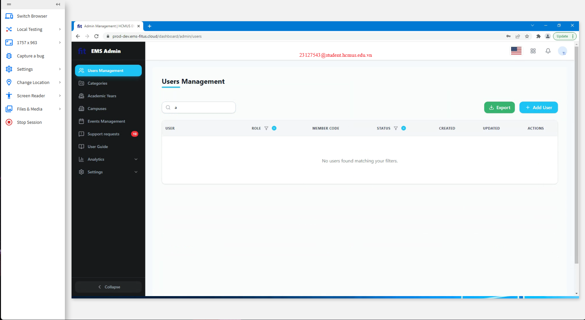
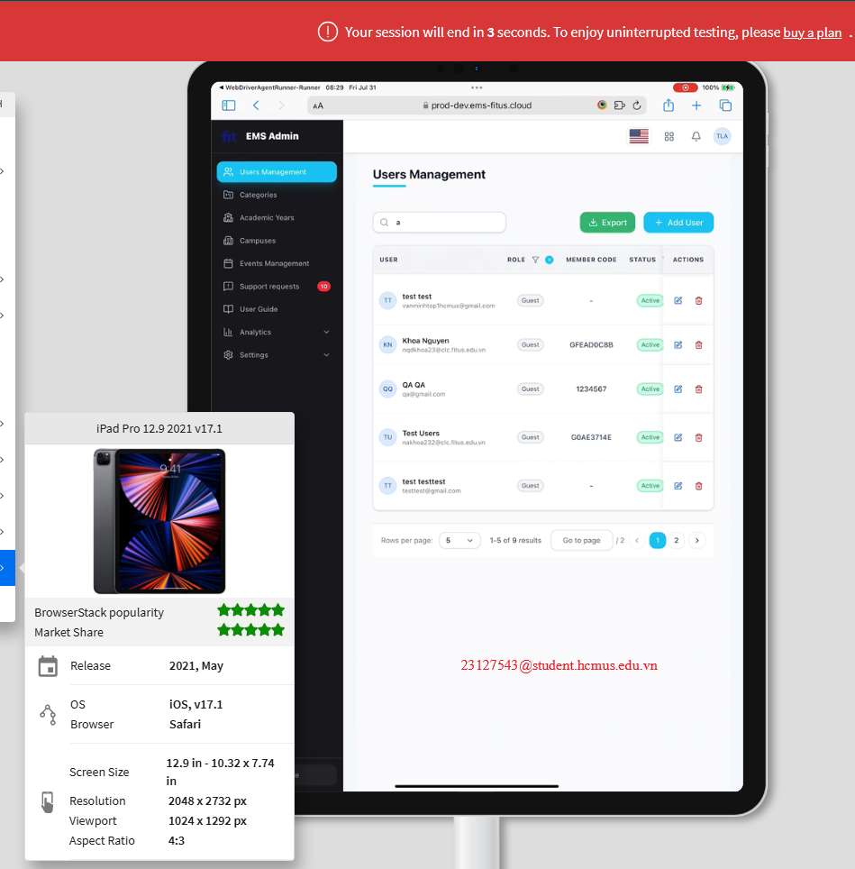
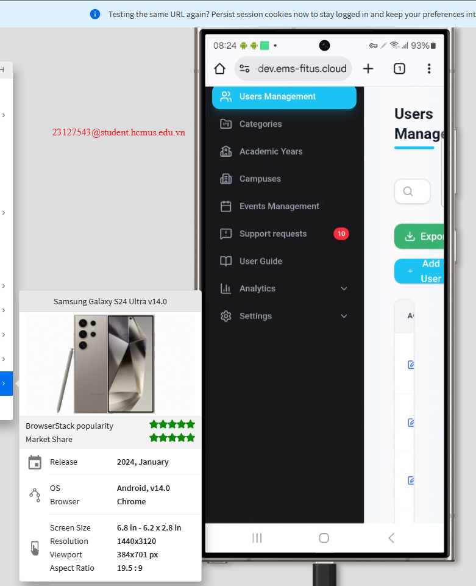
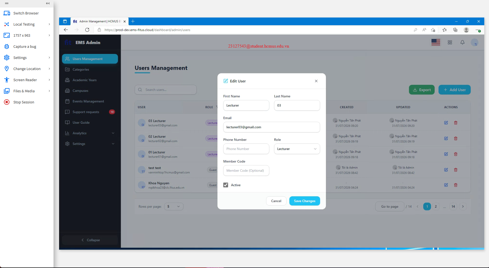
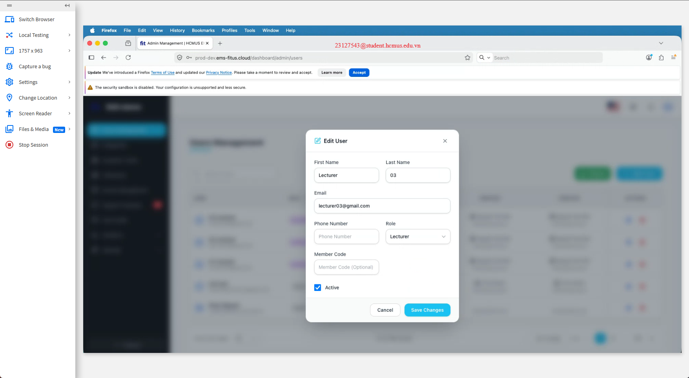
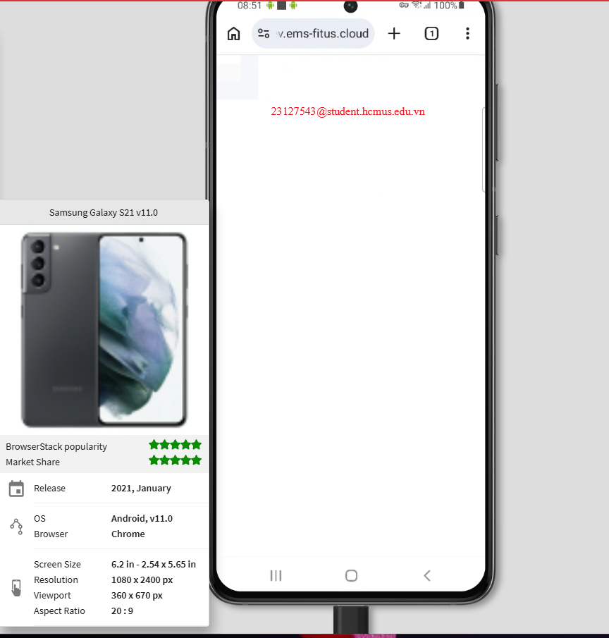
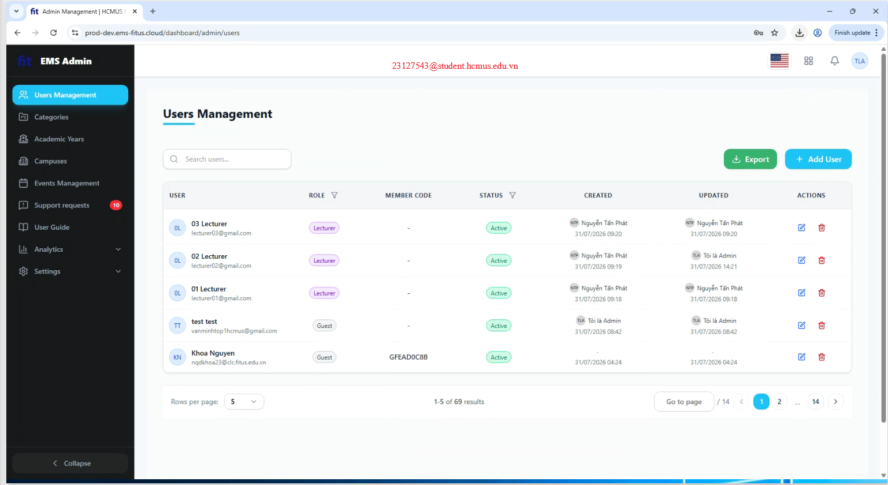
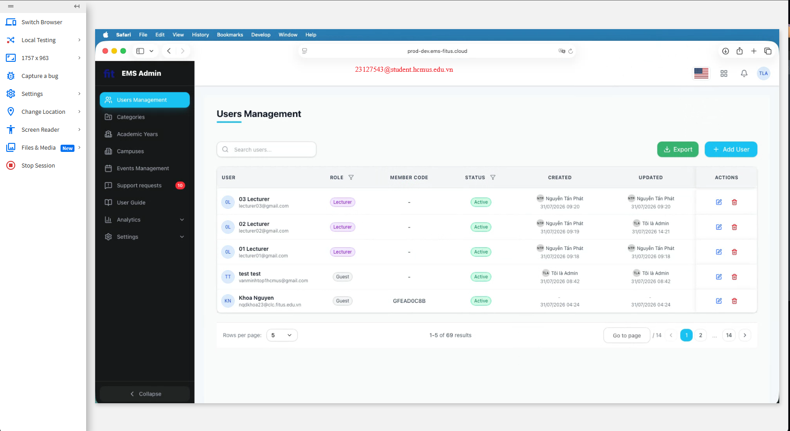
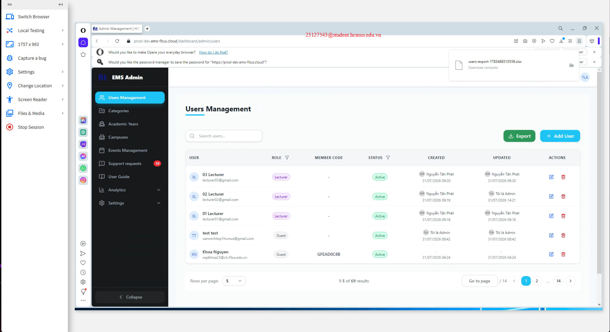

# GUI Usability Homework Report

## 1. Chosen Scenario

- Application name: EMS, the Event Management System for the Faculty of Information Technology.
- Scenario tested: Admin user administration, based on Scenario C.
- Objective: Evaluate the Users Management screens for GUI quality, form behavior, navigation, and feedback/state behavior.
- Assumptions:
  - The selected scenario is the admin user-management flow.
- Why this scenario was chosen:
  - It covers multiple core admin interactions in EMS.
  - It includes list views, editing dialogs, and export feedback.
  - It provides good coverage for both GUI checklist execution and cross-browser compatibility testing.

## 2. Selected Screens (>= 3)

### Screen 1 - Users List

Reason for selection:
- This is the main entry point for user administration and the most visible data-management screen.

GUI components inspected:
- Sidebar navigation
- Search field
- Role and status filters
- Users table
- Action buttons
- Pagination controls

### Screen 2 - Edit User Dialog

Reason for selection:
- This screen exercises form behavior, validation presentation, and modal interaction.

GUI components inspected:
- Modal dialog
- Text inputs
- Role selector
- Active checkbox
- Save and cancel actions

### Screen 3 - Export to Excel Flow

Reason for selection:
- This screen verifies asynchronous feedback and download behavior.

GUI components inspected:
- Export button
- Download feedback
- Table layout after export action
- Page-level status presentation

## 3. GUI Checklist Execution Results

## GUI Checklist

**SUT:** EMS - <https://prod-dev.ems-fitus.cloud/>

---

## Coverage Summary

| Interface Aspect | Items | AI-generated | Human-added |
| --- | ---: | ---: | ---: |
| IA-01 - General UI standards | 17 | 13 | 4 |
| IA-02 - Forms | 21 | 14 | 7 |
| IA-03 - Navigation | 13 | 13 | 0 |
| IA-04 - Feedback / state | 10 | 10 | 0 |
| **Total** (target > 40) | 61 | 50 | 11 |

---

## IA-01 - General UI Standards

Layout, alignment, typography, colour, consistency, EN/VI i18n, empty & loading states.

| ID | Interface Aspect | Checklist Item | Result | Evidence | Notes |
| --- | --- | --- | --- | --- | --- |
| IA-01-01 | IA-01 | On a data list with filters and sortable columns, column headers, filter labels, and action-button labels use consistent terminology across screens (no synonyms for the same action, e.g. "Delete" vs. "Remove"). | Pass |  |  |
| IA-01-02 | IA-01 | On any screen, primary and secondary buttons follow one consistent visual hierarchy (font weight, colour, size) across the application rather than a per-screen style. | Fail |  | inconsistent size |
| IA-01-03 | IA-01 | On a multi-field form, field labels use one consistent alignment style (all left- or all top-aligned) within the form, with no ad-hoc mixing for sibling fields. | Pass |  |  |
| IA-01-04 | IA-01 | On a data list with filters and sortable columns, a zero-match filter/search result renders a dedicated empty-state message instead of a blank table body. | Pass |  |  |
| IA-01-05 | IA-01 | On a data list or detail page performing an asynchronous data fetch, a loading indicator (skeleton or spinner) is shown while the fetch is pending rather than a blank or frozen screen. | Pass |  |  |
| IA-01-06 | IA-01 | On any screen, body text and field-label text maintain a minimum contrast ratio of 4.5:1 against their background. | Pass |  |  |
| IA-01-07 | IA-01 | On any screen, non-text UI elements (icon glyphs, input outlines, button borders) maintain a minimum contrast ratio of 3:1 against their adjacent background. | Pass |  |  |
| IA-01-08 | IA-01 | On any screen, an icon used without accompanying visible text (e.g. a status icon or action icon) exposes an accessible name (alt text or aria-label) conveying its meaning. | Pass |  |  |
| IA-01-09 | IA-01 | On any screen, the currently focused interactive element (button, link, input) shows a visible focus indicator distinct from its unfocused state. | Pass |  |  |
| IA-01-10 | IA-01 | On any screen, typography (font family, base font size, heading scale) is consistent across all screens, with no ad-hoc font substitution on a subset of screens. | Pass |  |  |
| IA-01-11 | IA-01 | On a status badge / colour-coded state, the colour palette is consistent across the application - the same colour is never reused to mean two different states in different contexts. | Pass |  |  |
| IA-01-12 | IA-01 | On any screen, interactive elements (links, buttons, clickable icons) are visually distinguishable from static text or decorative elements at a glance, without requiring a hover to reveal. | Fail |  | button Cancel looks like normal text field |
| IA-01-13 | IA-01 | On a data list with filters and sortable columns, numeric and date columns use one consistent alignment (e.g. right-aligned) within the column, not mixed left/right per row. | Pass |  |  |
| IA-01-14 | IA-01 | After switching the interface language, every chrome string on the screen (nav items, icon-only button names, tooltips, validation messages) is rendered in the selected language, with no string left in the other language. | Pass |  |  |
| IA-01-15 | IA-01 | Switching the interface language keeps the user on the current screen and preserves the current view state (active filter, tab, scroll position) instead of resetting to a default screen. | Pass |  |  |
| IA-01-16 | IA-01 | Dates, times and numbers are formatted per the selected locale, and any displayed event time carries an explicit time-zone label. | Fail |  | No time-zone |
| IA-01-17 | IA-01 | Vietnamese strings render with all diacritics intact, with no font fallback artifacts and no truncation caused by the string being longer than its English counterpart. | Pass |  |  |

## IA-02 - Forms

Labels, validation, error placement, required-field handling, upload, rich-text editor.

| ID | Interface Aspect | Checklist Item | Result | Evidence | Notes |
| --- | --- | --- | --- | --- | --- |
| IA-02-01 | IA-02 | On a multi-field form, every required field is marked with a visible indicator (e.g. a red asterisk) next to its label. | Fail |  | no asterisk for required field |
| IA-02-02 | IA-02 | On a multi-field form, submitting with a required field left empty blocks submission and shows a visible error message near that field. | Pass |  |  |
| IA-02-03 | IA-02 | On a multi-field form, a failed-validation error returns keyboard focus to the offending field and visually highlights it. | Pass |  |  |
| IA-02-04 | IA-02 | On a multi-field form with an image/file upload, attempting to upload a file that violates a stated size or type constraint shows an error message naming the specific constraint violated, not a generic failure message. | Pass |  |  |
| IA-02-05 | IA-02 | On a text input field, entering only whitespace characters is rejected as if the field were empty, not accepted as valid content. | Fail |  | can fill in space-only input for First Name |
| IA-02-06 | IA-02 | On a text input field with a stated character limit, typing beyond the limit is visibly prevented or truncated at the boundary rather than silently accepted past it. | Fail |  | can enter more than 10 digits for field Phone Number |
| IA-02-07 | IA-02 | On a date input field, an invalid day/month combination (e.g. 30 February) is rejected with a visible error rather than silently accepted or auto-corrected. | Pass |  |  |
| IA-02-08 | IA-02 | On a multi-field form with a rich-text or long-text input, the field's state on first load contains no leftover placeholder or sample text that could be mistaken for real content. | Pass |  |  |
| IA-02-09 | IA-02 | On a multi-field form consisting of a single primary text field, pressing Enter while focus is inside that field submits the form. | Pass |  |  |
| IA-02-10 | IA-02 | On a multi-field form, the submit control visibly disables or switches to a busy/loading state immediately after the first click, preventing a visible second submit attempt. | Fail |  | button doesn't change state after clicking |
| IA-02-11 | IA-02 | On a multi-field form, an available Reset or Cancel action visibly clears every entered field back to its default value. | Pass |  |  |
| IA-02-12 | IA-02 | On a multi-field form, each failed-validation field shows an explicit text error message associated with that field, not only a border-colour change. | Pass |  |  |
| IA-02-13 | IA-02 | On a multi-field form, every field has a visible label or instruction text available before the user needs to enter a value into it. | Pass |  |  |
| IA-02-14 | IA-02 | On a multi-field form, where a validation rule is known (e.g. a required format or numeric range), the error message states how to correct the input, not only that it is invalid. | Pass |  |  |
| IA-02-15 | IA-02 | On a dropdown or select control, the control has a visible label, its option list is non-empty, its ordering is consistent, and any default or blank option sits at a fixed position in the list. | Pass |  |  |
| IA-02-16 | IA-02 | On a checkbox or radio group, the default selection is correct, clicking the label toggles the control, Space toggles it while focused, and a radio group allows exactly one selection. | Pass |  |  |
| IA-02-17 | IA-02 | A control in a disabled state is visually distinct (greyed), does not take a text cursor, does not receive keyboard focus, and the reason it is disabled is discoverable on the screen. | Pass |  |  |
| IA-02-18 | IA-02 | An unusually long value in a field or a label does not break the layout of its containing block (no overlap, no clipping, no forced horizontal scroll). | Pass |  |  |
| IA-02-19 | IA-02 | Within one form, the validation trigger is consistent across fields - either all fields validate on blur, or all validate on submit, not a mix. | Pass |  |  |
| IA-02-20 | IA-02 | Content authored in the rich-text editor renders on the read view exactly as composed (headings, lists, links preserved), with no raw HTML tags exposed. | Pass |  |  |
| IA-02-21 | IA-02 | An uploaded thumbnail or banner renders at its specified aspect ratio without distortion, with no broken-image placeholder, and a fallback image is shown when the source is missing. | Pass |  |  |

## IA-03 - Navigation

Menu, breadcrumb, tabs, sidebar, drag-and-drop reorder, back/return, deep links.

| ID | Interface Aspect | Checklist Item | Result | Evidence | Notes |
| --- | --- | --- | --- | --- | --- |
| IA-03-01 | IA-03 | On the main navigation menu, every top-level section reachable from it loads its corresponding screen without a dead link or error page. | Pass |  |  |
| IA-03-02 | IA-03 | On a screen reached through at least one level of navigation, the breadcrumb trail accurately reflects the current path, and each earlier segment is clickable to navigate back to it. | Pass |  |  |
| IA-03-03 | IA-03 | On tabs separating a list into named states, exactly one tab is marked active/selected at a time, and its visual state is clearly distinct from the inactive tabs. | Pass |  |  |
| IA-03-04 | IA-03 | On a multi-field form, the keyboard tab order moves through fields in the same logical order as their visual layout (top-to-bottom, left-to-right). | Pass |  |  |
| IA-03-05 | IA-03 | On a detail/preview page reached from a data list, a back/return action returns the user to that data list with the prior filter selection and scroll position preserved. | Pass |  |  |
| IA-03-06 | IA-03 | On a data list supporting a reorderable sequence (e.g. drag-and-drop), a dragged item shows a visible drop-target indicator during the drag, and the list visually reflects the new order immediately after drop. | Pass |  |  |
| IA-03-07 | IA-03 | On any screen, every interactive element (button, link, form control) is reachable and operable using only the keyboard (Tab / Shift+Tab / Enter / Space), without requiring a mouse. | Pass |  |  |
| IA-03-08 | IA-03 | On any modal or dialog, keyboard focus does not become trapped inside it - the user can exit via a standard key (e.g. Tab cycling out, or Esc). | Pass |  |  |
| IA-03-09 | IA-03 | On any screen, the keyboard focus order when tabbing through interactive elements follows a logical sequence matching the visual reading order. | Pass |  |  |
| IA-03-10 | IA-03 | On a data list or detail page, a link's visible text (or accessible name) describes its destination or purpose without relying solely on surrounding context (e.g. not just "click here"). | Pass |  |  |
| IA-03-11 | IA-03 | Across different screens of the application, the main navigation menu appears in the same relative location and item order, so a returning user does not need to relearn its layout. | Pass |  |  |
| IA-03-12 | IA-03 | On a detail page reachable via a shareable/deep link, loading that link directly (not through in-app navigation) renders the same screen content as navigating to it through the UI. | Pass |  |  |
| IA-03-13 | IA-03 | On a confirmation dialog guarding a destructive or uncorrectable action, an explicit Cancel or close control is available to back out without performing the action. | Pass |  |  |

## IA-04 - Feedback / State

Toasts, badges, confirmation dialogs, progress bars, status colours, real-time updates.

| ID | Interface Aspect | Checklist Item | Result | Evidence | Notes |
| --- | --- | --- | --- | --- | --- |
| IA-04-01 | IA-04 | On an asynchronous action (e.g. upload, export, submit), a toast or inline message confirms success or failure once the action completes. | Fail |  | no notification after export |
| IA-04-02 | IA-04 | On an asynchronous action that takes longer than an instant (e.g. upload, export, check-in scan), a progress indicator is shown for the duration of the action, not only at its start and end. | Fail |  | no progress indicator |
| IA-04-03 | IA-04 | On a status badge / colour-coded state, the state is conveyed through both a colour and a text label or icon, not through colour alone. | Pass |  |  |
| IA-04-04 | IA-04 | On a detail/preview page with a status-dependent primary action button, if the underlying state changes (e.g. via another action on the same page), the button's enabled state or label updates to match without requiring a manual page reload. | Pass |  |  |
| IA-04-05 | IA-04 | On a confirmation dialog guarding a destructive or uncorrectable action, the dialog states plainly which action will occur and requires an explicit confirm click before proceeding. | Fail |  | button Cancel doesn't require an explicit confirm click before proceeding |
| IA-04-06 | IA-04 | On a data-validation error, the message is phrased in plain language describing what went wrong, not a raw error code or stack trace. | Pass |  |  |
| IA-04-07 | IA-04 | On any screen where an action shifts focus automatically (e.g. after a validation failure or opening a dialog), focus lands on the element the user needs to act on next. | Pass |  |  |
| IA-04-08 | IA-04 | On a custom-built interactive control that is not a native HTML element (e.g. a custom dropdown, toggle, or status badge), the control exposes an accessible name and role to assistive technology. | Pass |  |  |
| IA-04-09 | IA-04 | On a toast or loading-state message triggered by an asynchronous action, the message is announced to assistive technology without forcing a keyboard focus change away from the user's current task. | Pass |  |  |
| IA-04-10 | IA-04 | On a real-time updating element (e.g. a live badge or count reflecting a state change made elsewhere), the update is visually reflected on screen without the user manually refreshing the page. | Pass |  |  |

---

## 4. Usability Report

Task 2 was intentionally not performed.

- No usability testing data is included.
- No participants were recruited for this submission package.
- No SUS or UEQ-S results are reported.

## 5. Cross-Platform / Cross-Browser Report

## Cross-Browser / Cross-Platform Matrix

## Coverage Overview

- Scenario: User administration
- Screens tested: C1 Users list, C2 Assign Role / edit user, C4 Export to Excel
- Evidence basis: existing screenshots in `task3/` and its subfolders

## Matrix

| Test ID | Screen | Browser | Version | OS | Device | Tested feature/page | Result | Observations | Screenshot |
| --- | --- | --- | --- | --- | --- | --- | --- | --- | --- |
| T3-C1-01 | C1 Users list | Chrome | Not visible | Windows | Desktop | Users Management list | Pass | Layout is stable on desktop; sidebar, search, filters, and table columns render correctly. |  |
| T3-C1-02 | C1 Users list | Safari | v17.1 | iOS | Tablet | Users Management list | Pass | Responsive layout is preserved on the tablet viewport; the table remains readable and controls stay accessible. |  |
| T3-C1-03 | C1 Users list | Chrome | v14.0 | Android | Phone | Users Management list | Minor Issue | The content is heavily constrained in the phone viewport and part of the page is clipped to the right, but the screen still loads. |  |
| T3-C2-01 | C2 Assign Role / edit user | Chrome | Not visible | Windows | Desktop | Edit User dialog | Pass | Modal layout, fields, and action buttons are centered and legible over the dimmed background. |  |
| T3-C2-02 | C2 Assign Role / edit user | Firefox | Not visible | macOS | Desktop | Edit User dialog | Pass | The dialog structure and form controls remain intact in Firefox on macOS, with no visible overlap. |  |
| T3-C2-03 | C2 Assign Role / edit user | Chrome | v11.0 | Android | Phone | Edit User dialog | Fail | The viewport is severely constrained on phone, leaving only a narrow portion of the page visible and making the dialog unusable. |  |
| T3-C4-01 | C4 Export to Excel | Chrome | Not visible | Windows | Desktop | Users export action | Pass | Export feedback is visible and the table remains aligned after the action. |  |
| T3-C4-02 | C4 Export to Excel | Safari | Not visible | macOS | Desktop | Users export action | Pass | Export state and table presentation are preserved in Safari on macOS. |  |
| T3-C4-03 | C4 Export to Excel | Opera | Not visible | Windows | Desktop | Users export action | Pass | Export completion is visible and the desktop layout remains consistent in Opera. |  |

## Notes

- Browser version is only recorded when it is visible in the screenshot overlay.
- The matrix uses only evidence already present in the Task 3 folder.
- Minor issues and fail states are limited to what can be seen in the screenshots.

## 6. Overall Findings

- GUI quality:
  - The interface is clean and mostly consistent across the main admin screens.
- Consistency:
  - Layout, spacing, and branding are generally stable.
  - Some button hierarchy and feedback behaviors need refinement.
- Navigation:
  - Navigation is the strongest area in the tested scenario.
- Forms:
  - The edit-user dialog is usable, but validation and required-field cues are incomplete.
- Feedback/state:
  - This is the weakest area in the checklist results.
  - Async actions need clearer progress and completion feedback.
- Responsiveness:
  - Desktop and larger layouts are good.
  - Phone layouts are not robust enough for reliable use.
- Browser compatibility:
  - Chrome, Firefox, Safari, and Opera all support the tested desktop flows well.
  - Mobile phone rendering is the main compatibility risk.

## 7. Conclusion

The checklist execution shows that EMS user administration is generally solid on desktop, with consistent navigation and readable layouts. However, the failed checklist items indicate that form safeguards and feedback/state messaging need improvement, especially around required-field handling, submit-state signaling, and confirmation clarity. Cross-browser testing confirms that the desktop experience is stable across Chrome, Firefox, Safari, and Opera, while phone-sized views introduce noticeable usability problems. Overall, the GUI quality is acceptable for desktop use, but the responsive behavior and asynchronous feedback should be improved before considering the flow fully submission-ready.
