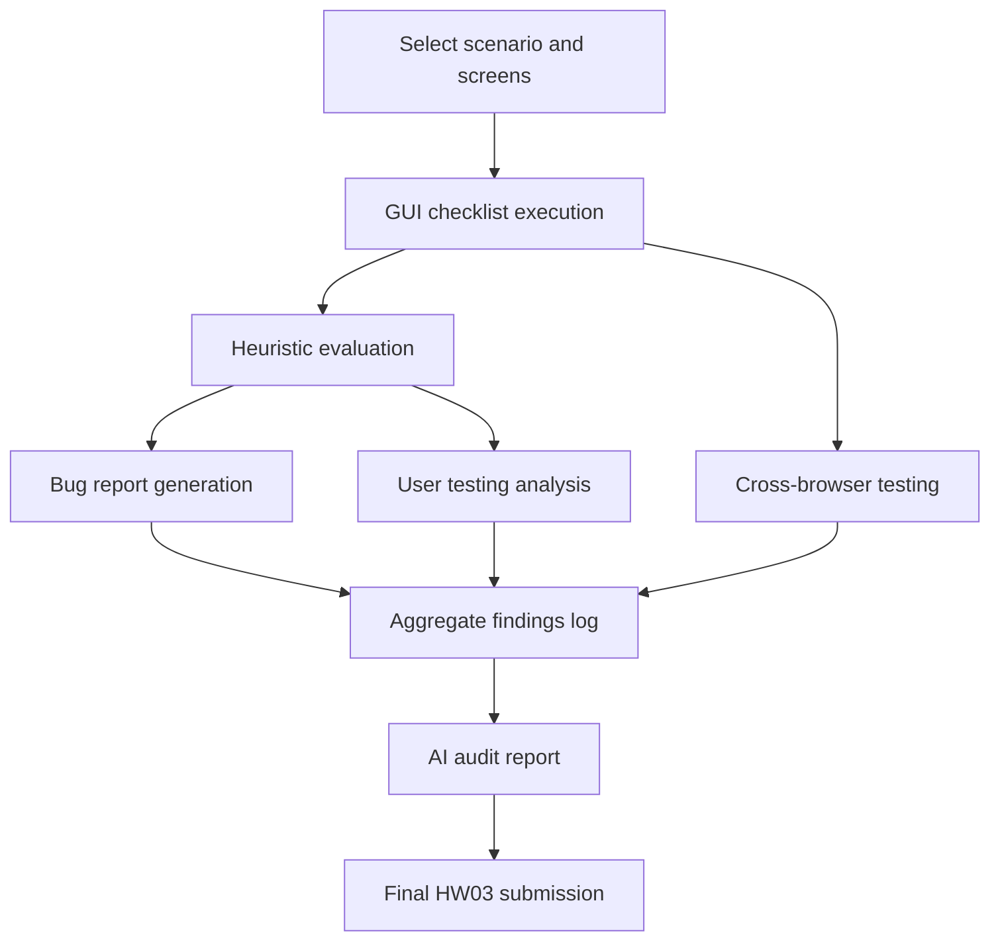

# HW03 Agent Skills

This directory contains reusable AI Agent Skills for HW03 GUI, usability, compatibility, and AI-audit work.

## Purpose of Each Agent

- `gui-checklist-testing-SKILL.md`
  - Executes a GUI checklist against a selected screen.
  - Produces a structured checklist execution report with PASS / FAIL / N/A, evidence notes, and screenshot references where needed.

- `heuristic-evaluation-SKILL.md`
  - Performs usability evaluation using Nielsen's 10 Heuristics, Shneiderman's 8 Golden Rules, and Norman's Design Principles.
  - Produces a usability report with issues, violated principles, severity, and recommended fixes.

- `user-testing-analysis-SKILL.md`
  - Analyzes user-testing sessions from observer notes, completion time, errors, and SUS / UEQ-S data.
  - Produces a usability testing report with participant summaries, grouped issues, metrics, and prioritized findings.

- `cross-browser-testing-SKILL.md`
  - Executes compatibility testing across operating systems, browsers, and device classes.
  - Produces a compatibility matrix with pass/fail results for rendering, layout, fonts, responsiveness, interaction, scrolling, dialogs, and forms.

- `bug-report-generator-SKILL.md`
  - Converts findings into professional bug reports.
  - Produces a standardized bug report with environment, preconditions, steps, expected vs actual results, severity, priority, evidence, and suggested fix.

- `ai-audit-report-SKILL.md`
  - Produces the AI Audit Report required by HW03.
  - Records the AI tool, prompts, generated output, human modifications, validation, and limitations.

- `gui-testing-master-agent-SKILL.md`
  - Coordinates the other skills.
  - Selects the appropriate specialist agent based on the user task and the HW03 deliverables.

## How the Agents Work Together

The skills are designed to support the full HW03 workflow:

1. Use the checklist skill to inspect selected screens and capture defects.
2. Use the heuristic skill to evaluate usability issues that may not be direct checklist failures.
3. Use the bug-report generator to convert defects into formal bug reports.
4. Use the user-testing-analysis skill to process the five-user study into a usability report.
5. Use the cross-browser testing skill to build the required compatibility matrix.
6. Use the AI audit skill to record the AI interaction history and limitations.
7. Use the master agent to route work to the correct specialist skill and keep the artifacts consistent.

## Recommended Execution Order for HW03

1. Define the scenario and selected screens.
2. Run `gui-checklist-testing-SKILL.md` on each screen.
3. Run `heuristic-evaluation-SKILL.md` on the same screens or flow.
4. Convert defects and usability findings with `bug-report-generator-SKILL.md`.
5. Run `cross-browser-testing-SKILL.md` for the required compatibility coverage.
6. Collect and analyze the five real-user sessions with `user-testing-analysis-SKILL.md`.
7. Generate the AI Audit Report with `ai-audit-report-SKILL.md`.
8. Use `gui-testing-master-agent-SKILL.md` to coordinate or repeat any step on additional screens.

## Workflow Diagram

## Mapping Between HW03 Tasks and Agent Skills

| HW03 Task | Corresponding Agent Skill |
| --- | --- |
| Task 1A: Shared GUI checklist design | `gui-checklist-testing-SKILL.md` |
| Task 1B: Checklist execution on selected screens | `gui-checklist-testing-SKILL.md` |
| Task 1B: Bug reporting | `bug-report-generator-SKILL.md` |
| Task 2: User testing analysis | `user-testing-analysis-SKILL.md` |
| Task 3: Cross-browser / cross-platform matrix | `cross-browser-testing-SKILL.md` |
| Bug & Usability Findings Log | `bug-report-generator-SKILL.md` and `user-testing-analysis-SKILL.md` |
| AI Audit Report | `ai-audit-report-SKILL.md` |
| Overall orchestration | `gui-testing-master-agent-SKILL.md` |

## Notes

- These skills are reusable across GUI projects.
- They intentionally focus on output structure and decision logic rather than product-specific content.
- Where HW03 imposes explicit artifacts, the skills require those artifacts in their outputs.
