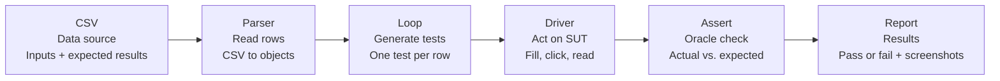

# Data-Driven Testing

> **Test Automation Concept**  
> One test script, many data rows - explained with the Triangle classification exercise.

**Example SUT:** eTriangle  
**Test suite:** 36 cases  
**Tools and data source:** Playwright + CSV

---

## 1. What Is Data-Driven Testing?

**Data-Driven Testing (DDT)** is an automation approach where the test logic is written once and executed repeatedly with many sets of inputs and expected results read from an external data source.

### Core idea

| Component | Description |
|---|---|
| **Test data** | Inputs and expected outcomes stored in CSV, Excel, JSON, or a database. |
| **Test logic** | Test steps and assertions written once in code. |
| **Separation** | Test data can change without modifying the code, and the test logic can change without rewriting every test case. |

### DDT formula

```text
1 parameterized test
(reusable logic)

x

N rows of data
(inputs + expected result)

=

N executed test cases
(generated automatically)
```

---

## 2. Why Use Data-Driven Testing?

### 2.1. Scale coverage

Add a scenario by adding a data row rather than writing a new test function.

### 2.2. Maintainability

The test logic lives in one place. A defect in the test steps is fixed once for every test case.

### 2.3. Collaboration

Testers and domain experts can edit the data table without needing to read or modify test code.

### 2.4. Suitable for Equivalence Partitioning and Boundary Value Analysis

Equivalence classes and boundary values can be represented as additional rows in the test-data source.

### 2.5. Traceability

Each data row carries a test-case ID and an expected result. The data table therefore also serves as test documentation.

### 2.6. Reusability

The same test driver can be reused for similar features or input forms.

---

## 3. Hard-Coded Tests vs. Data-Driven Tests

### 3.1. Hard-coded tests

```javascript
test('equilateral', () => {
  fill(5, 5, 5);
  click();
  expect(type).toBe('Equilateral');
});

test('scalene', () => {
  fill(6, 7, 8);
  click();
  expect(type).toBe('Scalene');
});
```

This approach uses one function per test case. As the suite grows, it creates copy-paste code, duplication, and higher maintenance cost.

### 3.2. Data-driven test

```javascript
for (const tc of readCases(csv)) {
  test(tc.TC_ID, () => {
    fill(tc.s1, tc.s2, tc.s3);
    click();
    expect(type).toBe(tc.Expected_Type);
  });
}
```

One loop covers every test case. Adding a scenario only requires adding another row to the CSV file.

### Comparison summary

| Aspect | Hard-coded approach | Data-driven approach |
|---|---|---|
| Test-case implementation | One function per case | One reusable loop for all cases |
| Repetition | High | Low |
| Adding scenarios | Add more test code | Add another data row |
| Maintenance | Changes may need to be repeated | Logic is updated in one place |
| Traceability | Depends on test naming and code | Test IDs can map directly to data rows |

---

## 4. Anatomy of a Data-Driven Test Suite

The data-driven testing workflow consists of six stages:



| Stage | Responsibility |
|---|---|
| **CSV / data source** | Stores inputs and expected results. |
| **Parser** | Reads the CSV rows and converts them into objects. |
| **Loop** | Generates one executable test for each row. |
| **Driver** | Interacts with the system under test by filling fields, clicking controls, and reading outputs. |
| **Assertion** | Compares the actual result with the expected result defined by the test oracle. |
| **Report** | Records pass/fail results and supporting evidence such as screenshots. |

> **Key point:** Only the CSV changes when scenarios are added or modified. The parser, loop, driver, and assertion are written once and reused for every row.

---

## 5. Example System Under Test: eTriangle

The example system is a small web application named **eTriangle**. A user enters three side lengths, presses **Draw!**, and the application displays the resulting triangle type.

Its single output makes it a straightforward target for data-driven checks.

### Inputs

- `side1`
- `side2`
- `side3`

These values are entered through three text fields.

### Action

Click the **Draw!** button.

### Output

The application displays one triangle classification label:

- `Equilateral`
- `Isosceles`
- `Scalene`
- `Right`
- `Invalid`

### Example interaction shown in the slide

| Field | Value |
|---|---:|
| Side 1 | 3 |
| Side 2 | 4 |
| Side 3 | 5 |

After the user clicks **Draw!**, the application displays:

```text
Triangle Type: Right
```

The visual example also depicts the generated triangle alongside the form.

---

## 6. Step 1 - Define the Test Data in CSV

Each CSV row represents a complete test case containing:

- a test-case ID;
- three input values;
- the expected triangle type;
- an oracle derived from correct geometry.

### Example test data

| TC_ID | side1 | side2 | side3 | Expected_Type |
|---|---:|---:|---:|---|
| DT01 | 5 | 5 | 5 | Equilateral |
| DT06 | 6 | 7 | 8 | Scalene |
| DT07 | 3 | 4 | 5 | Right |
| DT08 | 5 | 4 | 3 | Right |
| DT12 | 3 | 2 | 1 | Invalid |
| DT22 | 5 | 5 | *(empty)* | Invalid |

### Permutation coverage: DT07 vs. DT08

`DT07` and `DT08` contain the same set of side lengths, `{3, 4, 5}`, but in a different order.

Data-driven testing makes it easy to test every permutation because each permutation only requires another row in the data file.

---

## 7. Step 2 - Implement the Parameterized Script

One loop reads the CSV and creates one test for every row. The test logic does not change when new data is added.

```javascript
const cases = readCases('domain-testcases.csv');

for (const tc of cases) {
  test(`${tc.TC_ID} -> ${tc.Expected_Type}`, async ({ page }) => {
    await page.goto(SUT_URL);
    await page.fill('#side1', tc.side1);
    await page.fill('#side2', tc.side2);
    await page.fill('#side3', tc.side3);
    await page.click('input[value="Draw!"]');

    const actual = await page.locator('#type').innerText();
    expect(actual).toBe(tc.Expected_Type); // oracle check
  });
}
```

### Why this implementation matters

- Approximately ten lines of reusable logic drive all 36 test cases.
- Cases can be added, edited, or removed in the CSV with zero code changes.
- Including `TC_ID` in each generated test name maps a failed test directly back to its source row.
- The test asserts the exact output label with `toBe`, so an incorrect but non-empty triangle type is still detected.

---

## 8. Step 3 - Execute and Report

The test runner converts 36 CSV rows into 36 executed tests. A failed assertion represents a difference between the actual result and the test oracle. Each failure is saved with a screenshot.

### Execution results

| Metric | Count |
|---|---:|
| Total test cases | 36 |
| Passed | 21 |
| Failed | 15 |
| Distinct defects | 5 |
| Test-logic blocks | 1 |

The chart in the slide shows that 21 of the 36 cases passed and 15 failed.

### Sample failures identified by the data rows

| Test case | Inputs | Expected result | Actual application result |
|---|---|---|---|
| DT08 | `(5, 4, 3)` | Right | Scalene |
| DT12 | `(3, 2, 1)` | Invalid | Scalene |
| DT22 | `(5, 5, empty)` | Invalid | Isosceles |

These failures demonstrate that the suite detects both ordering-related classification defects and invalid-input handling defects.

---

## 9. Key Takeaways

### 9.1. Write the logic once

One parameterized test replaces dozens of copy-pasted test functions.

### 9.2. Grow the suite through data

Every new equivalence class, boundary value, invalid input, or input permutation can be added as another CSV row.

### 9.3. Keep the oracle in the data

Expected results must come from the specification or domain rules, not from the code under test.

### 9.4. Produce traceable evidence

Test IDs and expected values map failures back to requirements, data rows, and screenshots.

> **Data-Driven Testing = one reliable script x a growing table of cases.**
