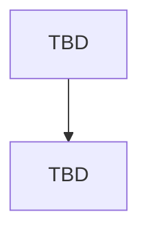

# Main Report — HW05

**Assignment:** HW05-AI: Performance Testing on EShop
**Tool:** k6 (bonus track, in place of JMeter)

---

## 1. Student Information

| Field | Value |
| ----- | ----- |
| Student name | Lê Hoàng Lâm |
| Student ID | 23127216 |
| Group | 02 |
| Class / Cohort | 23KTPM1 |
| GitHub repository | [github.com/lhlam2515/software-testing](https://github.com/lhlam2515/software-testing) |
| SUT | EShop, [github.com/ttbhanh/eshop-sut](https://github.com/ttbhanh/eshop-sut) |
| SUT deployment | Local, backend API at `http://localhost:3000` |
| Date | TBD |

---

## 2. Test Environment

### 2.1 Hardware and runtime

| Field | Value |
| ----- | ----- |
| Hostname | TBD |
| CPU | TBD |
| RAM | TBD |
| Storage | TBD |
| OS / kernel | TBD |
| Node.js version | TBD |
| SQLite / database mode | TBD (note whether WAL is enabled, relevant to Task 2) |
| k6 version | TBD |
| Resource monitor | TBD (htop) |

Evidence: `assets/screenshots/hardware/`.

### 2.2 Load generator and SUT on the same machine

TBD: state that k6 and the backend share the same host, and what that means for the measurements (the generator competes with the SUT for CPU, so the observed ceiling is a floor on the SUT's true capacity, not its true capacity).

### 2.3 Data seeding and reset procedure

TBD: how the database was seeded before each run, how it was reset between runs, and how the account lockout (locks after 2 consecutive failures, for 180 seconds) was cleared between Stress and Spike runs (section 6, Task 1).

---

## 3. Scope: Endpoint Selection

### 3.1 Selected endpoint groups

| Group | Method + path | SRS | Why representative of the group |
| ----- | ------------- | --- | ------------------------------- |
| Read-heavy | `GET /api/products?search={keyword}` | FR-05 | Search over the product name is the only read path in the SUT whose cost grows with the data volume. Every other read resolves by primary key or returns a small fixed table, so search is the read that can actually saturate something. |
| Auth-heavy | `POST /api/login` | FR-02 | Password verification plus JWT issuance, guarded by a counter-based lockout: each failure adds 2 to `login_attempts`, and the account locks for 180 seconds once the counter reaches 3 (so 2 consecutive failures trigger it, not 3). Section 5 names the lockout behaviour explicitly for this group. |
| Transactional | `POST /api/cart` | FR-07 | An authenticated write that mutates per-user state. In the current implementation it does not upsert: every call `push()`es a new entry onto an in-memory array keyed by user id, so adding the same product twice produces two array entries, not a quantity bump, and the whole array is lost on backend restart. Section 5 names add-to-cart as a transactional example. |

### 3.2 Scenario pairing and justification

| Scenario | Endpoint group | Why this pairing |
| -------- | -------------- | ---------------- |
| Load | Transactional, `POST /api/cart` | This request does not touch the database at all — it pushes onto an in-memory array on the backend process, so a sustained run makes the process's own resident memory the thing under test rather than the database. Load is the only scenario of the three whose question ("does the system hold the expected rate") does not require driving the system past its limit, which matches a steady run long enough to watch that memory growth. |
| Stress | Read-heavy, `GET /api/products?search=` | Stress asks where the system breaks, which means driving it past the point of failure repeatedly. Only an endpoint that creates no state can be pushed that way without a reset between attempts. An unindexed `LIKE` scan also gives a failure mode that can be named, not just observed. |
| Spike | Auth-heavy, `POST /api/login` | Spike asks whether the system recovers after a surge. The lockout locks an account for 180 seconds after 2 consecutive failures (each failure adds 2 to the attempt counter, which locks at 3), which is itself a recovery curve: error rate rises during the surge, stays elevated for the lockout window, then returns to baseline. The endpoint's own behaviour supplies the phenomenon the scenario is designed to measure. |

Each pairing also matches the report view chosen for that scenario in section 4.4: the aggregate view fits the steady run, the per-stage percentile view fits the search for a breaking point, and the time-series view fits the recovery curve.

### 3.3 Non-overlap declaration (section 5)

Group 02 has two members. The split was agreed on 2026-08-06; the note sent to the other member is at `group/endpoint-split-note.md`.

| Member | Read-heavy | Auth-heavy | Transactional |
| ------ | ---------- | ---------- | ------------- |
| Lê Hoàng Lâm (23127216) | `GET /api/products?search=` | `POST /api/login` | `POST /api/cart` |
| Other member | `GET /api/admin/orders` | `POST /api/register` | `POST /api/checkout` |

No endpoint appears twice. The full cart to checkout workflow was deliberately narrowed to `POST /api/cart` so that `POST /api/checkout` (FR-08, which the other member covered in HW02) stays available to them.

Status: confirmed by the other member on 2026-08-08.

---

## 4. Task 1 — AI-assisted test design and execution

### 4.1 How the test plans were designed with AI

TBD: the step-by-step prompting sequence, not a single generic prompt. One subsection per step, each cross-referenced to `prompt_log.md`.

| Step | What the AI was asked to do | Prompt log entry | Output artifact |
| ---- | --------------------------- | ---------------- | --------------- |
| 1 | TBD | TBD | TBD |
| 2 | TBD | TBD | TBD |
| 3 | TBD | TBD | TBD |

### 4.2 Test plan parameters

| Scenario | VU profile (stages) | Ramp-up | Think time | Duration | Thresholds |
| -------- | ------------------- | ------- | ---------- | -------- | ---------- |
| Load | TBD | TBD | TBD | TBD | TBD |
| Stress | TBD | TBD | TBD | TBD | TBD |
| Spike | TBD | TBD | TBD | TBD | TBD |

TBD: the justification for each parameter, and which of them came from the AI versus from human correction.

### 4.3 Data-driven inputs

| Group | CSV file | Rows | Fields | How it is consumed |
| ----- | -------- | ---- | ------ | ------------------ |
| Read-heavy | TBD | | | TBD |
| Auth-heavy | TBD | | | TBD |
| Transactional | TBD | | | TBD |

Each endpoint group has its own CSV. No file is shared between groups (section 6, Task 1).

### 4.4 Report views used

k6 has no listener concept, so the requirement for three distinct listener types is met with three distinct analysis views, one per scenario.

| Scenario | Report view | k6 mechanism | Why this view fits this scenario |
| -------- | ----------- | ------------ | -------------------------------- |
| Load | Aggregate HTML summary report | `handleSummary()` writing an HTML file | Load asks whether the system holds a steady expected load. That is a single verdict per endpoint over the whole run, so one aggregate row per endpoint (count, error rate, p50/p90/p95/p99, throughput) is the right granularity. Per-request detail adds nothing to the verdict. |
| Stress | Raw per-request log with percentiles recomputed from it | `--out csv=` plus a post-run script over the raw rows | Stress asks where the system breaks. The answer is a VU level, not a run-wide average, so the raw rows are grouped by load stage and percentiles and error codes are recomputed per stage. A run-wide summary averages the healthy stages together with the failing ones and hides the breaking point. |
| Spike | Time-series view | `--out json=` plus a chart over the timestamped stream | Spike asks whether the system recovers after a surge. Recovery is a shape over time (latency spike, then decay back to baseline, or not), which no aggregate number carries. Only a timestamped series distinguishes "recovered in 20s" from "never recovered". |

No view type repeats.

> Raw logs and HTML reports are produced for all three scenarios, since section 14 requires both for each run. This table records which view each scenario is analysed and reported through, which is what the "do not repeat a type" rule constrains.

TBD: the chart images and the post-run scripts, once the runs exist.

### 4.5 Human review: what the AI got wrong

| # | AI-generated element | What was wrong or missing | Correction applied | Why the AI missed it |
| - | -------------------- | ------------------------- | ------------------ | -------------------- |
| 1 | TBD | TBD | TBD | TBD |
| 2 | TBD | TBD | TBD | TBD |
| 3 | TBD | TBD | TBD | TBD |

Categories to cover if they apply: unrealistic ramp-up or think-time, wrong VU counts, weak or absent assertions, missing account-lockout handling, missing correlation of tokens between requests, missing data-driven parameterization.

### 4.6 Execution results

#### 4.6.1 Load

| Metric | Value |
| ------ | ----- |
| Requests | TBD |
| Error rate | TBD |
| p50 / p90 / p95 / p99 (ms) | TBD |
| Throughput (RPS) | TBD |
| Backend CPU (peak) | TBD |
| Backend RSS (peak) | TBD |
| Thresholds passed | TBD |

Evidence: raw log `TBD`, HTML report `TBD`, resource monitor `assets/screenshots/resource-monitor/TBD`.

Observations: TBD.

#### 4.6.2 Stress

*Same table structure as 4.6.1.*

#### 4.6.3 Spike

*Same table structure as 4.6.1.*

### 4.7 Account-lockout handling

TBD: whether Stress or Spike runs triggered the account lockout (2 consecutive failures, 180-second lock — see section 3.1), how it was reset between runs, and the exact steps (section 6, Task 1). Required even if the answer is that lockout was never triggered, in which case explain why.

### 4.8 Endurance threshold

TBD: the soak run (10 to 15 minutes at sustained load) and the empirically determined threshold.

| Metric | Value | How it was determined |
| ------ | ----- | --------------------- |
| Maximum stable RPS | TBD | TBD |
| VU count at first sustained error-rate breach | TBD | TBD |
| p95 at the stable ceiling | TBD | TBD |
| Memory ceiling (backend RSS) | TBD | TBD |
| Memory growth over the soak window | TBD | TBD (whether a leak is visible) |

### 4.9 Issues found

TBD: summary of functional bugs and performance issues, detailed in [BUG_REPORT.md](./BUG_REPORT.md).

---

## 5. Task 2 — AI analysis and misinterpretation hunt

### 5.1 The AI's analysis

TBD: the prompt given to the AI to analyse the raw logs, and a summary of what it produced. Full verbatim prompt and output in `prompt_log.md` and `[AI-02]_AI_Audit_Report.md`.

### 5.2 Misinterpretations, with correct values from the raw logs

| # | AI claim | Correct value from raw log | Source (file, how it was computed) | Nature of the error |
| - | -------- | -------------------------- | ---------------------------------- | ------------------- |
| 1 | TBD | TBD | TBD | TBD |
| 2 | TBD | TBD | TBD | TBD |
| 3 | TBD | TBD | TBD | TBD |

Every corrected value must be traceable to a raw log file, with the computation shown (section 6, Task 2).

### 5.3 The AI's proposed optimizations: feasible or hallucinated

| # | Proposed optimization | Verdict | Reasoning |
| - | --------------------- | ------- | --------- |
| 1 | TBD | feasible / hallucinated | TBD |
| 2 | TBD | feasible / hallucinated | TBD |
| 3 | TBD | feasible / hallucinated | TBD |

Reasoning must be grounded in the SUT as it actually is (SQLite, Express, single process), not in a generic web-stack assumption.

---

## 6. Task 3 — Continuous Performance Testing proposal (G9.6)

### 6.1 The model

TBD: a pipeline that watches the SUT's commits, decides whether a performance run is warranted, executes it, and flags p95 regressions.

### 6.2 Flow chart

### 6.3 Decision rules

| Decision point | Rule | Rationale |
| -------------- | ---- | --------- |
| When to run | TBD | TBD |
| Which scenario to run | TBD | TBD |
| What counts as a regression | TBD | TBD |
| What to do on a regression | TBD | TBD |

### 6.4 Trade-offs

| Trade-off | Discussion |
| --------- | ---------- |
| Compute cost per run vs coverage | TBD |
| False alarms vs missed regressions | TBD |
| Shared-runner noise vs dedicated hardware | TBD |
| Blocking the merge vs reporting asynchronously | TBD |

---

## 7. Agent Skill

TBD: what the skill does, how it maps onto the workflow in Tasks 1 and 2, and how it is reused on a new endpoint group. Source in `artifacts/skills/`, demo video link in [README.md](./README.md).

---

## 8. AI Critique (200 to 300 words)

TBD. Must be student-written, not AI-generated (section 10). Address: where the AI got something wrong, biased, or incomplete; why it failed to catch the issue; what principle about collaborating with AI came out of this assignment.

---

## 9. Conclusion

TBD.

---

## References

TBD.
