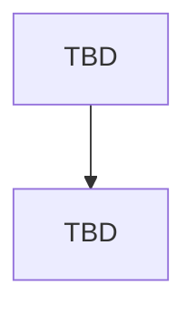

# Main Report — HW05

**Assignment:** HW05-AI: Performance Testing on EShop
**Tool:** k6 (bonus track, in place of JMeter)

---

## 1. Student Information

| Field | Value |
| ----- | ----- |
| Student name | Lê Hoàng Lâm |
| Student ID | 23127216 |
| Group | 02 |
| Class / Cohort | 23KTPM1 |
| GitHub repository | [github.com/lhlam2515/software-testing](https://github.com/lhlam2515/software-testing) |
| SUT | EShop, [github.com/ttbhanh/eshop-sut](https://github.com/ttbhanh/eshop-sut) |
| SUT deployment | Local, backend API at `http://localhost:3000` |
| Date | TBD |

---

## 2. Test Environment

### 2.1 Hardware and runtime

| Field | Value |
| ----- | ----- |
| Hostname | TBD |
| CPU | TBD |
| RAM | TBD |
| Storage | TBD |
| OS / kernel | TBD |
| Node.js version | TBD |
| SQLite / database mode | TBD (note whether WAL is enabled, relevant to Task 2) |
| k6 version | TBD |
| Resource monitor | TBD (htop) |

Evidence: `assets/screenshots/hardware/`.

### 2.2 Load generator and SUT on the same machine

TBD: state that k6 and the backend share the same host, and what that means for the measurements (the generator competes with the SUT for CPU, so the observed ceiling is a floor on the SUT's true capacity, not its true capacity).

### 2.3 Data seeding and reset procedure

TBD: how the database was seeded before each run, how it was reset between runs, and how the account lockout (locks after 2 consecutive failures, for 180 seconds) was cleared between runs. Since login is cached per VU and only a small dedicated sub-scenario inside Spike deliberately fails login (section 3.2), lockout is expected primarily around Spike runs, but `reset_lockout.js` is still run before every scenario as a precaution (section 6, Task 1).

---

## 3. Scope: End-to-End Workflow

Section 6, Task 1 requires all three test plans (Load / Stress / Spike) to exercise **the same end-to-end workflow**, covering all three endpoint groups in one journey. This replaces the one-endpoint-per-scenario pairing used in earlier drafts of this report — the requirement changed on 2026-08-13 (see the assignment's section 5 and 6, Task 1: *"a virtual user may log in, browse or search products, then add an item to the cart and complete checkout"*).

### 3.1 Selected workflow

| Step | Group | Method + path | SRS | Why this step is representative of the group |
| ---- | ----- | -------------- | --- | ---------------------------------------------- |
| 1. Login | Auth-heavy | `POST /api/login` | FR-02 | Password verification plus JWT issuance, guarded by a counter-based lockout: each failure adds 2 to `login_attempts`, and the account locks for 180 seconds once the counter reaches 3 (so 2 consecutive failures trigger it, not 3). The SRS exposes no other auth-heavy endpoint. |
| 2. Browse / search | Read-heavy | `GET /api/products?search={keyword}` | FR-05 | Search over the product name is the only read path in the SUT whose cost grows with data volume. Every other read resolves by primary key or returns a small fixed table. |
| 3. Add to cart | Transactional | `POST /api/cart` | FR-07 | An authenticated write that mutates per-user state. It does not upsert: every call `push()`es a new entry onto an in-memory array keyed by user id, so adding the same product twice produces two array entries, and the whole array is lost on backend restart. |
| 4. Checkout | Transactional | `POST /api/checkout` | FR-08 | Inserts one order row per request. It does **not** read from the cart populated in step 3 — `total_amount` / `shipping_address` come directly from the request body — so cart and order are functionally disconnected (logged as BUG-05-LAM-007 in `BUG_REPORT.md`). |

### 3.2 Load profile design and justification

All three scenarios run the identical four-step journey above; they differ only in load profile, not in which endpoints they exercise. Journey logic is factored into a shared `lib/journey.js` (login → browse → search → cart → checkout, each step tagged for per-step metrics), reused by all three named test plans, following the structure of the lecturer-provided `ref/Demo/k6/lib/journey.js`.

| Scenario | Load profile | Why this profile answers a different question on the same workflow |
| -------- | ------------- | ---------------------------------------------------------------------- |
| Load | Ramp to expected peak VUs, hold, ramp down | Asks whether the system holds the expected rate across the whole journey — checkout's per-request order insert and cart's in-memory growth are the parts most likely to degrade under sustained rate. |
| Stress | Ramp progressively past the expected peak until failure | Asks where the journey breaks first. The unindexed `LIKE` search is the most likely first failure point among the four steps, so the breaking point is expected to correlate with search latency, not login or cart. |
| Spike | Sudden surge to a high VU count, then drop | Asks whether the journey recovers after a surge. The login step supplies a genuine recovery phenomenon here: a small, dedicated low-VU sub-scenario deliberately fails login to trigger the 180-second lockout, producing an error-rate spike followed by a decay back to baseline once the lockout window elapses — visible only on a time axis. |

**Login is cached per VU, not repeated every iteration.** Calling `/api/login` on every iteration (the default pattern in `ref/Demo/k6/lib/journey.js`, which uses one fixed credential with no lockout to worry about) would let a 100-VU Load run alone exhaust the account pool and trigger lockout — a failure mode that did not exist under the old one-endpoint-per-scenario model, where only Spike touched `/api/login`. Each VU logs in once and reuses its token for subsequent iterations; only the Spike sub-scenario above intentionally uses invalid credentials (`auth_credentials.csv`, `valid_flag=false`), keeping the fail budget small and bounded (pool ≥ 200 accounts, fail rate ≤ 5% within that sub-scenario) rather than spread across all traffic.

The load-profile choice also matches the report view chosen for that scenario in section 4.4: the aggregate view fits the steady run, the per-stage percentile view fits the search for a breaking point, and the time-series view fits the recovery curve.

### 3.3 Non-overlap declaration (section 5)

Group 02 has two members. Section 5's non-overlap rule now compares **workflows** ("no two members may test the same workflow"), a higher bar than the endpoint-level split agreed on 2026-08-06 (`group/endpoint-split-note.md`). Re-confirmation at the workflow level was sent to the other member on 2026-08-13 and is pending.

| Member | Workflow | Auth-heavy | Read-heavy | Transactional |
| ------ | -------- | ---------- | ---------- | -------------- |
| Lê Hoàng Lâm (23127216) | Customer purchase journey: login → search products → add to cart → checkout | `POST /api/login` (customer account) | `GET /api/products?search=` | `POST /api/cart` + `POST /api/checkout` |
| Other member (proposed) | Admin order-management journey: login → review orders → update order status | `POST /api/login` (admin account) | `GET /api/admin/orders` | `PUT /api/admin/orders/:id/status` |

Three of the four steps use different endpoints, and the narratives differ (customer purchase vs. admin operations); `POST /api/login` is shared only because it is the SRS's sole auth-heavy endpoint.

Status: **pending confirmation** from the other member as of 2026-08-13.

---

## 4. Task 1 — AI-assisted test design and execution

### 4.1 How the test plans were designed with AI

TBD: the step-by-step prompting sequence, not a single generic prompt. One subsection per step, each cross-referenced to `prompt_log.md`.

| Step | What the AI was asked to do | Prompt log entry | Output artifact |
| ---- | --------------------------- | ---------------- | --------------- |
| 1 | TBD | TBD | TBD |
| 2 | TBD | TBD | TBD |
| 3 | TBD | TBD | TBD |

### 4.2 Test plan parameters

| Scenario | VU profile (stages) | Ramp-up | Think time | Duration | Thresholds |
| -------- | ------------------- | ------- | ---------- | -------- | ---------- |
| Load | TBD | TBD | TBD | TBD | TBD |
| Stress | TBD | TBD | TBD | TBD | TBD |
| Spike | TBD | TBD | TBD | TBD | TBD |

TBD: the justification for each parameter, and which of them came from the AI versus from human correction.

### 4.3 Data-driven inputs

The requirement no longer mandates one CSV per endpoint group ("one or more CSV files, as appropriate for your workflow"); each file below feeds one step of the shared workflow.

| Workflow step | CSV file | Rows | Fields | How it is consumed |
| -------------- | -------- | ---- | ------ | ------------------ |
| Login | `auth_credentials.csv` | TBD | email, password, valid_flag | `valid_flag=false` rows used only by the Spike lockout sub-scenario (section 3.2), never by the main traffic |
| Search | `read_keywords.csv` | TBD | keyword, expected_hit_rate | Selected per iteration via `SharedArray` to vary search selectivity (high-hit / low-hit / miss) |
| Cart + checkout | `cart_checkout_payloads.csv` | TBD | product_id, quantity, total_amount, shipping_address | product_id/quantity feed `POST /api/cart`, total_amount/shipping_address feed `POST /api/checkout` — two independent requests, since checkout does not read from the cart (section 3.1) |

### 4.4 Report views used

k6 has no listener concept, so the requirement for three distinct listener types is met with three distinct analysis views, one per scenario.

| Scenario | Report view | k6 mechanism | Why this view fits this scenario |
| -------- | ----------- | ------------ | -------------------------------- |
| Load | Aggregate HTML summary report | `handleSummary()` writing an HTML file | Load asks whether the system holds a steady expected load. That is a single verdict per endpoint over the whole run, so one aggregate row per endpoint (count, error rate, p50/p90/p95/p99, throughput) is the right granularity. Per-request detail adds nothing to the verdict. |
| Stress | Raw per-request log with percentiles recomputed from it | `--out csv=` plus a post-run script over the raw rows | Stress asks where the system breaks. The answer is a VU level, not a run-wide average, so the raw rows are grouped by load stage and percentiles and error codes are recomputed per stage. A run-wide summary averages the healthy stages together with the failing ones and hides the breaking point. |
| Spike | Time-series view | `--out json=` plus a chart over the timestamped stream | Spike asks whether the system recovers after a surge. Recovery is a shape over time (latency spike, then decay back to baseline, or not), which no aggregate number carries. Only a timestamped series distinguishes "recovered in 20s" from "never recovered". |

No view type repeats.

> Raw logs and HTML reports are produced for all three scenarios, since section 14 requires both for each run. This table records which view each scenario is analysed and reported through, which is what the "do not repeat a type" rule constrains.

TBD: the chart images and the post-run scripts, once the runs exist.

### 4.5 Human review: what the AI got wrong

| # | AI-generated element | What was wrong or missing | Correction applied | Why the AI missed it |
| - | -------------------- | ------------------------- | ------------------ | -------------------- |
| 1 | TBD | TBD | TBD | TBD |
| 2 | TBD | TBD | TBD | TBD |
| 3 | TBD | TBD | TBD | TBD |

Categories to cover if they apply: unrealistic ramp-up or think-time, wrong VU counts, weak or absent assertions, missing account-lockout handling, missing correlation of tokens between requests, missing data-driven parameterization.

### 4.6 Execution results

#### 4.6.1 Load

| Metric | Value |
| ------ | ----- |
| Requests | TBD |
| Error rate | TBD |
| p50 / p90 / p95 / p99 (ms) | TBD |
| Throughput (RPS) | TBD |
| Backend CPU (peak) | TBD |
| Backend RSS (peak) | TBD |
| Thresholds passed | TBD |

Evidence: raw log `TBD`, HTML report `TBD`, resource monitor `assets/screenshots/resource-monitor/TBD`.

Observations: TBD.

#### 4.6.2 Stress

*Same table structure as 4.6.1.*

#### 4.6.3 Spike

*Same table structure as 4.6.1.*

### 4.7 Test bed setup/teardown and account-lockout handling

Test bed procedure: `setup_testbed.sh` resets the database to a clean baseline (`RESET_DB=1`), snapshots it to `database.sqlite.baseline`, then loads the perf data volume via `seed_perf.js`. `teardown_testbed.sh` restores the database from that snapshot once the session's scenarios are done, so the app is handed back in its pre-test state rather than left holding thousands of perf rows. Run once per session (setup before the first scenario, teardown after the last), not per individual k6 run.

TBD: whether Stress or Spike runs triggered the account lockout (2 consecutive failures, 180-second lock — see section 3.1), how it was reset between runs (`reset_lockout.js`, run between individual k6 runs within the session, distinct from the session-level teardown above), and the exact steps (section 6, Task 1). Required even if the answer is that lockout was never triggered, in which case explain why.

### 4.8 Endurance threshold

TBD: the soak run (10 to 15 minutes at sustained load) and the empirically determined threshold.

| Metric | Value | How it was determined |
| ------ | ----- | --------------------- |
| Maximum stable RPS | TBD | TBD |
| VU count at first sustained error-rate breach | TBD | TBD |
| p95 at the stable ceiling | TBD | TBD |
| Memory ceiling (backend RSS) | TBD | TBD |
| Memory growth over the soak window | TBD | TBD (whether a leak is visible) |

### 4.9 Issues found

TBD: summary of functional bugs and performance issues, detailed in [BUG_REPORT.md](./BUG_REPORT.md).

---

## 5. Task 2 — AI analysis and misinterpretation hunt

### 5.1 The AI's analysis

TBD: the prompt given to the AI to analyse the raw logs, and a summary of what it produced. Full verbatim prompt and output in `prompt_log.md` and `[AI-02]_AI_Audit_Report.md`.

### 5.2 Misinterpretations, with correct values from the raw logs

| # | AI claim | Correct value from raw log | Source (file, how it was computed) | Nature of the error |
| - | -------- | -------------------------- | ---------------------------------- | ------------------- |
| 1 | TBD | TBD | TBD | TBD |
| 2 | TBD | TBD | TBD | TBD |
| 3 | TBD | TBD | TBD | TBD |

Every corrected value must be traceable to a raw log file, with the computation shown (section 6, Task 2).

### 5.3 The AI's proposed optimizations: feasible or hallucinated

| # | Proposed optimization | Verdict | Reasoning |
| - | --------------------- | ------- | --------- |
| 1 | TBD | feasible / hallucinated | TBD |
| 2 | TBD | feasible / hallucinated | TBD |
| 3 | TBD | feasible / hallucinated | TBD |

Reasoning must be grounded in the SUT as it actually is (SQLite, Express, single process), not in a generic web-stack assumption.

---

## 6. Task 3 — Continuous Performance Testing proposal (G9.6)

### 6.1 The model

TBD: a pipeline that watches the SUT's commits, decides whether a performance run is warranted, executes it, and flags p95 regressions.

### 6.2 Flow chart

### 6.3 Decision rules

| Decision point | Rule | Rationale |
| -------------- | ---- | --------- |
| When to run | TBD | TBD |
| Which scenario to run | TBD | TBD |
| What counts as a regression | TBD | TBD |
| What to do on a regression | TBD | TBD |

### 6.4 Trade-offs

| Trade-off | Discussion |
| --------- | ---------- |
| Compute cost per run vs coverage | TBD |
| False alarms vs missed regressions | TBD |
| Shared-runner noise vs dedicated hardware | TBD |
| Blocking the merge vs reporting asynchronously | TBD |

---

## 7. Agent Skill

TBD: what the skill does, how it maps onto the workflow in Tasks 1 and 2, and how it is reused on a new endpoint group. Source in `artifacts/skills/`, demo video link in [README.md](./README.md).

---

## 8. AI Critique (200 to 300 words)

TBD. Must be student-written, not AI-generated (section 10). Address: where the AI got something wrong, biased, or incomplete; why it failed to catch the issue; what principle about collaborating with AI came out of this assignment.

---

## 9. Conclusion

TBD.

---

## References

TBD.
