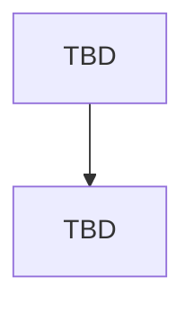

# Main Report — HW05

**Assignment:** HW05-AI: Performance Testing on EShop
**Tool:** k6 (bonus track, in place of JMeter)

---

## 1. Student Information

| Field | Value |
| ----- | ----- |
| Student name | Lê Hoàng Lâm |
| Student ID | 23127216 |
| Group | 02 |
| Class / Cohort | 23KTPM1 |
| GitHub repository | [github.com/lhlam2515/software-testing](https://github.com/lhlam2515/software-testing) |
| SUT | EShop, [github.com/ttbhanh/eshop-sut](https://github.com/ttbhanh/eshop-sut) |
| SUT deployment | Local, backend API at `http://localhost:3000` |
| Date | 17-18/08/2026 (design and execution), report drafted 18/08/2026 |

---

## 2. Test Environment

### 2.1 Hardware and runtime

| Field | Value |
| ----- | ----- |
| Hostname | `FedoraOS`: first hardware declaration for this student (HW01-HW04 did not require one), becomes the baseline for later assignments (section 11) |
| CPU | 11th Gen Intel(R) Core(TM) i5-11300H (4 cores / 8 threads) @ 4.40 GHz |
| RAM | 15.30 GiB |
| Storage | 474.35 GiB (btrfs) |
| OS / kernel | Fedora Linux 44 (Workstation Edition) x86_64, kernel 7.1.5-201.fc44.x86_64 |
| Node.js version | v24.11.1 |
| SQLite / database mode | Default rollback-journal mode, no WAL. `apps/backend/database.js:5` opens the DB with a plain `new sqlite3.Database(dbPath, ...)`: no `PRAGMA journal_mode=WAL` and no `busy_timeout` anywhere in the file, confirmed by direct source read (prompt_log.md Entry 003). This is why Stress shows a latency cliff instead of `SQLITE_BUSY` errors: writes queue instead of failing (section 4.6.2), and it is the WAL/connection-pool angle Task 2 evaluates. |
| k6 version | v1.0.0 (commit/41b4984b75, go1.24.2, linux/amd64) |
| Resource monitor | `htop`, plus `artifacts/scripts/monitor.sh` sampling backend RSS/CPU at 1 Hz into `monitor_{scenario}.csv` for the numeric evidence behind every screenshot |

Evidence: `assets/screenshots/hardware/fastfetch.png` (hostname `FedoraOS` visible in the prompt, matching the declaration above).

### 2.2 Load generator and SUT on the same machine

k6 and the backend (`node server.js`) run on the same 8-thread host, with no CPU isolation between them by default. `taskset` pinning was evaluated (prompt_log.md Entry 002) but not applied to the executed runs, so the two processes compete for the same 8 logical threads during Stress and Spike. This means every ceiling reported in section 4.6/4.8 is a **floor on the SUT's true capacity, not its true capacity**: some of the observed latency and throughput degradation at high VU is k6's own goroutine scheduling and JSON-parsing cost (particularly for the `search` step, whose response can carry ~500 rows, see Entry 004), not purely backend-side work. The self-imposed budget used throughout design and execution was to keep k6's own CPU share under the RPS range where it starts to compete meaningfully (prompt_log.md Entry 003 estimates that threshold at roughly 2,000-3,000 req/s for this journey shape on this CPU) and to cross-check `htop` during high-VU windows rather than trust a single aggregate number. Backend RSS/CPU sampled via `monitor.sh` (section 2.1) is one input to that cross-check, not a substitute for it, since it does not separately attribute CPU to the k6 process.

### 2.3 Data seeding and reset procedure

**Seeding.** `artifacts/scripts/setup_testbed.sh` resets the database to a clean baseline (`RESET_DB=1`), snapshots it to `database.sqlite.baseline`, then runs `seed_perf.js` to load the performance data volume: 200 customer accounts (`perf_user_0..199@eshop.test`, one shared password `PerfTest1234!`, deliberately a flat table rather than two parallel `emails[]`/`passwords[]` arrays to remove any chance of an email/password desync silently feeding wrong credentials into a lockout-sensitive login step) and 2,005 seeded products, named from a weighted keyword pool (`KEYWORD_WEIGHTS` in `seed_perf.js`) so every keyword in `read_keywords.csv` is guaranteed to hit a realistic, non-empty result set. Run once per session, before the first scenario.

**Teardown.** `artifacts/scripts/teardown_testbed.sh` restores the database from `database.sqlite.baseline` once the session's scenarios are done, so the app is handed back in its pre-test state rather than left holding thousands of perf-generated carts/orders. Run once per session, after the last scenario, not per individual k6 run.

**Account-lockout reset.** `artifacts/scripts/reset_lockout.js` clears `login_attempts`/`locked_until` for the seeded account pool and is run before every individual k6 run within a session (finer-grained than the session-level setup/teardown above), as a precaution. In practice, lockout was triggered only during the Spike run's deliberate `lockoutProbe` sub-scenario (5 VUs, 3 iterations each, using the `valid_flag=false` rows of `auth_credentials.csv`) plus, unexpectedly, a large batch of the main Spike traffic during the 15 to 200 VU surge. See section 4.7 for the full account and section 4.6.3 for the numbers. Load and Stress never triggered lockout: verified directly against `raw_load.csv`/`raw_stress.csv` (100,189 of 100,190 Stress `http_req_duration` samples are status 200, the remaining one is a single network-level 0, no 401/403 present anywhere), consistent with the design decision that only Spike's `lockoutProbe` sub-scenario ever uses an invalid password (section 3.2).

---

## 3. Scope: End-to-End Workflow

Section 6, Task 1 requires all three test plans (Load / Stress / Spike) to exercise **the same end-to-end workflow**, covering all three endpoint groups in one journey. This replaces the one-endpoint-per-scenario pairing used in earlier drafts of this report. The requirement changed on 2026-08-13 (see the assignment's section 5 and 6, Task 1: *"a virtual user may log in, browse or search products, then add an item to the cart and complete checkout"*).

### 3.1 Selected workflow

| Step | Group | Method + path | SRS | Why this step is representative of the group |
| ---- | ----- | -------------- | --- | ---------------------------------------------- |
| 1. Login | Auth-heavy | `POST /api/login` | FR-02 | Password verification plus JWT issuance, guarded by a counter-based lockout: each failure adds 2 to `login_attempts`, and the account locks for 180 seconds once the counter reaches 3 (so 2 consecutive failures trigger it, not 3). The SRS exposes no other auth-heavy endpoint. |
| 2. Browse / search | Read-heavy | `GET /api/products?search={keyword}` | FR-05 | Search over the product name is the only read path in the SUT whose cost grows with data volume. Every other read resolves by primary key or returns a small fixed table. |
| 3. Add to cart | Transactional | `POST /api/cart` | FR-07 | An authenticated write that mutates per-user state. It does not upsert: every call `push()`es a new entry onto an in-memory array keyed by user id, so adding the same product twice produces two array entries, and the whole array is lost on backend restart. |
| 4. Checkout | Transactional | `POST /api/checkout` | FR-08 | Inserts one order row per request. It does **not** read from the cart populated in step 3 (`total_amount` / `shipping_address` come directly from the request body), so cart and order are functionally disconnected (logged as BUG-05-LAM-007 in `BUG_REPORT.md`). |

### 3.2 Load profile design and justification

All three scenarios run the identical four-step journey above; they differ only in load profile, not in which endpoints they exercise. Journey logic is factored into a shared `lib/journey.js` (login → browse → search → cart → checkout, each step tagged for per-step metrics), reused by all three named test plans, following the structure of the lecturer-provided `ref/Demo/k6/lib/journey.js`.

| Scenario | Load profile | Why this profile answers a different question on the same workflow |
| -------- | ------------- | ---------------------------------------------------------------------- |
| Load | Ramp to expected peak VUs, hold, ramp down | Asks whether the system holds the expected rate across the whole journey. Checkout's per-request order insert and cart's in-memory growth are the parts most likely to degrade under sustained rate. |
| Stress | Ramp progressively past the expected peak until failure | Asks where the journey breaks first. The unindexed `LIKE` search is the most likely first failure point among the four steps, so the breaking point is expected to correlate with search latency, not login or cart. |
| Spike | Sudden surge to a high VU count, then drop | Asks whether the journey recovers after a surge. The login step supplies a genuine recovery phenomenon here: a small, dedicated low-VU sub-scenario deliberately fails login to trigger the 180-second lockout, producing an error-rate spike followed by a decay back to baseline once the lockout window elapses, visible only on a time axis. |

**Login is cached per VU, not repeated every iteration.** Calling `/api/login` on every iteration (the default pattern in `ref/Demo/k6/lib/journey.js`, which uses one fixed credential with no lockout to worry about) would let a 100-VU Load run alone exhaust the account pool and trigger lockout, a failure mode that did not exist under the old one-endpoint-per-scenario model, where only Spike touched `/api/login`. Each VU logs in once and reuses its token for subsequent iterations; only the Spike sub-scenario above intentionally uses invalid credentials (`auth_credentials.csv`, `valid_flag=false`), keeping the fail budget small and bounded (pool ≥ 200 accounts, fail rate ≤ 5% within that sub-scenario) rather than spread across all traffic.

The load-profile choice also matches the report view chosen for that scenario in section 4.4: the aggregate view fits the steady run, the per-stage percentile view fits the search for a breaking point, and the time-series view fits the recovery curve.

### 3.3 Non-overlap declaration (section 5)

Group 02 has two members. Section 5's non-overlap rule now compares **workflows** ("no two members may test the same workflow"), a higher bar than the endpoint-level split agreed on 2026-08-06 (`group/endpoint-split-note.md`). Re-confirmation at the workflow level was sent to the other member on 2026-08-13 and is pending.

| Member | Workflow | Auth-heavy | Read-heavy | Transactional |
| ------ | -------- | ---------- | ---------- | -------------- |
| Lê Hoàng Lâm (23127216) | Customer purchase journey: login → search products → add to cart → checkout | `POST /api/login` (customer account) | `GET /api/products?search=` | `POST /api/cart` + `POST /api/checkout` |
| Other member (proposed) | Admin order-management journey: login → review orders → update order status | `POST /api/login` (admin account) | `GET /api/admin/orders` | `PUT /api/admin/orders/:id/status` |

Three of the four steps use different endpoints, and the narratives differ (customer purchase vs. admin operations); `POST /api/login` is shared only because it is the SRS's sole auth-heavy endpoint.

Status: **pending confirmation** from the other member as of 2026-08-13.

---

## 4. Task 1: AI-assisted test design and execution

### 4.1 How the test plans were designed with AI

Design was driven through 7 sequential prompts (P-1 to P-7), each building on the previous one's output rather than one generic "design a load test" prompt, following section 6's step-by-step requirement. Full verbatim prompts and outputs in `prompt_log.md`.

| Step | What the AI was asked to do | Prompt log entry | Output artifact |
| ---- | --------------------------- | ---------------- | --------------- |
| P-1 | Design one shared `shopJourney()` (login to search to cart to checkout) reused by all three scenarios, and decide login-once-per-VU vs. login-every-iteration given the 200-account pool and lockout rule | Entry 001, 16:09 17/08 | `artifacts/test-plans/lib/journey.js`, `config.js` |
| P-2 | Propose Load's VU/ramp/think-time parameters, grounded in the actual 4C/8T host, with a mandatory CPU-self-interference warning | Entry 002, 16:46 17/08 | Load `options` table, validated by an 80 VU/40s probe (0% error, p95 9.63ms) |
| P-3 | Propose Stress's staged VU profile, using an isolated zero-think checkout calibration (20/60/150 VU) to locate the real breaking-point range before choosing stage boundaries | Entry 003, 16:48 17/08 | Stress `options` snippet, 5-stage design, checkout write-throughput calibration table |
| P-4 | Propose Spike's surge shape (baseline to peak VU, hold, drop, recovery hold), grounded in the 200-account pool as the natural VU ceiling | Entry 004, 17:00 17/08 | Spike `options` table, 7-stage design |
| P-5 | Add per-step thresholds and assertions beyond `status === 200` for all 4 steps (login/search/cart/checkout), matched against the SUT's real response shapes | Entry 005, 17:14 17/08 | `thresholds` export and tagged `check()` calls in `lib/journey.js` |
| P-6 | Generate the 3 named test-plan files with 3 distinct report mechanisms (Load = `handleSummary`/HTML, Stress = `--out csv=` + post-run script, Spike = `--out json=` time-series) plus 3 CSV files consumed via `SharedArray` | Entry 006, 17:17 17/08 | `23127216_{Load,Stress,Spike}_20260817.js`, `lib/csvData.js`, `artifacts/scripts/analyze_raw.py`, 3 CSV files |
| P-7 | Harden all 3 scripts against 4 edge cases: lockout sub-scenario with a 5%-of-pool fail budget, mid-run token expiry, and non-empty-cart assumptions | Entry 007, 18:06 17/08 | `lockoutProbe()` in Spike file, re-login-on-401 healing in `journey.js`, budget guard |

### 4.2 Test plan parameters

| Scenario | VU profile (stages) | Ramp | Think time | Duration | Thresholds |
| -------- | ------------------- | ---- | ---------- | -------- | ---------- |
| Load | 0 to 80 VU, hold, ramp down | 60s up / 30s down | 1-3s (login to search), 2-4s (search to cart), 1-2s (cart to checkout) | 390s (60+300+30) | `checks{step:login\|search\|cart\|checkout}` rate>0.99 |
| Stress | 5 stages: 0 to 40 to 120 to 220 to 350 to 0 VU | 20s per stage, `gracefulRampDown: 20s` | 0.3-0.8s (search to cart), 0.2-0.5s (cart to checkout) | 430s (~7 min) | Same 4 `checks{step:x}` thresholds; no latency threshold set deliberately, since section 4.6.2 shows the break is a latency cliff at 0% error, not a rate breach |
| Spike | 7 stages: 0 to 15 (base) to 200 (surge, 5s) to 15 (drop, 5s) to 0, plus a parallel `lockoutProbe` sub-scenario (5 VU x 3 iterations) | 5s surge up, 5s drop | 0s (zero-think, deliberate: simulates a traffic dump, not browsing) | ~120s main + 30s graceful stop | Same 4 thresholds on the main journey, plus `checks{step:lockout-probe}` verifying the exact 401/401/403 sequence; `checks{step:login}` is expected/documented to breach (section 4.6.3) |

**Which parameters came from the AI vs. from human correction.** The VU counts and stage boundaries above are the AI's proposals as given in Entries 002-004, but they were not accepted on the AI's say-so: Load's 80 VU was accepted only after an 80 VU/40s probe run confirmed 0% error, and Stress's stage-2/stage-3 boundary (40 to 120 to 220 VU) was accepted only after an isolated zero-think checkout calibration (20/60/150 VU, Entry 003) showed the real breaking-point range sits around 110-155 VU under journey-realistic think-time, not the AI's first-instinct "round" values. The repeated instruction in every P-2/P-3/P-4 prompt ("not textbook round numbers like 50/100/200 without grounding") was necessary specifically because the model's unprompted default was to propose exactly those round values. See section 4.5 for the AI's actual planning mistakes.

### 4.3 Data-driven inputs

The requirement no longer mandates one CSV per endpoint group ("one or more CSV files, as appropriate for your workflow"); each file below feeds one step of the shared workflow. All three files carry 20 data rows (21 lines including header), generated to match the seeded data exactly rather than invented (prompt_log.md Entry 006).

| Workflow step | CSV file | Rows | Fields | How it is consumed |
| -------------- | -------- | ---- | ------ | ------------------ |
| Login | `auth_credentials.csv` | 20 (5 with `valid_flag=false`, indices `perf_user_195`-`perf_user_199`) | email, password, valid_flag | `valid_flag=false` rows used only by the Spike `lockoutProbe` sub-scenario (section 3.2), never by the main traffic. Each `false` row pairs a real seeded email with a wrong password: an invented/non-existent email would return 401 without touching `login_attempts`, never triggering lockout, so this constraint is load-bearing, not cosmetic. |
| Search | `read_keywords.csv` | 20 (10 real weighted keywords matching `seed_perf.js`'s `KEYWORD_WEIGHTS`, plus at least 1 deliberate miss keyword for a 0-result case) | keyword, expected_hit_rate | Selected per iteration via `SharedArray` to vary search selectivity (high-hit / low-hit / miss) |
| Cart + checkout | `cart_checkout_payloads.csv` | 20, `product_id` verified within the seeded range [1, 2005] on both ends | product_id, quantity, total_amount, shipping_address | product_id/quantity feed `POST /api/cart`, total_amount/shipping_address feed `POST /api/checkout`, two independent requests, since checkout does not read from the cart (section 3.1) |

All three files are read through `SharedArray` (`lib/csvData.js`), not per-VU `open()` calls, so the data is loaded once and shared across VUs rather than duplicated in memory per VU. Verified by grep: the only `open()` call in the whole test-plan tree is inside the `SharedArray` callback in `csvData.js` (Entry 006 self-check).

### 4.4 Report views used

k6 has no listener concept, so the requirement for three distinct listener types is met with three distinct analysis views, one per scenario.

| Scenario | Report view | k6 mechanism | Why this view fits this scenario |
| -------- | ----------- | ------------ | -------------------------------- |
| Load | Aggregate HTML summary report | `handleSummary()` writing an HTML file | Load asks whether the system holds a steady expected load. That is a single verdict per endpoint over the whole run, so one aggregate row per endpoint (count, error rate, p50/p90/p95/p99, throughput) is the right granularity. Per-request detail adds nothing to the verdict. |
| Stress | Raw per-request log with percentiles recomputed from it | `--out csv=` plus a post-run script over the raw rows | Stress asks where the system breaks. The answer is a VU level, not a run-wide average, so the raw rows are grouped by load stage and percentiles and error codes are recomputed per stage. A run-wide summary averages the healthy stages together with the failing ones and hides the breaking point. |
| Spike | Time-series view | `--out json=` plus a chart over the timestamped stream | Spike asks whether the system recovers after a surge. Recovery is a shape over time (latency spike, then decay back to baseline, or not), which no aggregate number carries. Only a timestamped series distinguishes "recovered in 20s" from "never recovered". |

No view type repeats.

> Raw logs and HTML reports are produced for all three scenarios, since section 14 requires both for each run. This table records which view each scenario is analysed and reported through, which is what the "do not repeat a type" rule constrains.

All three HTML report folders exist under `artifacts/results/html-reports/`: Load's is written live by the script's own `handleSummary()`; Stress's and Spike's are rendered post-hoc by `artifacts/scripts/build_stress_report.py` and `build_spike_report.py`, reading `stress_percentiles_by_stage.json` and `ts_spike.json` respectively rather than rerunning k6, so the numbers stay identical to what is already cited in section 4.6. Spike's report embeds the promised time-series chart (self-contained inline SVG, no external library) plotting VU count, login error rate, and checkout p95 against elapsed time.

### 4.5 Human review: what the AI got wrong

| # | AI-generated element | What was wrong or missing | Correction applied | Why the AI missed it |
| - | -------------------- | ------------------------- | ------------------ | -------------------- |
| 1 | Lockout HTTP status assumption for the Spike `lockoutProbe` assertion | Early draft assumed the lockout response was `423 Locked` | Corrected to `403 Forbidden` (with the Vietnamese lockout message) after reading `apps/backend/server.js:40-44` directly: the lockout check runs *before* the password compare, and only the 3rd attempt (already over the `>=3` threshold) gets `403`; the 2nd attempt, the one that actually sets `locked_until`, still gets a plain `401` | Model limitation: `423 Locked` is the RFC-conventional status for "resource locked," so the model defaulted to that convention instead of the SUT's actual (non-standard) implementation choice, which is only visible in the source, not in any spec document |
| 2 | Lockout assertion precision, Entry 007 | An earlier pass would have accepted either `401` or `403` as "locked," which is too loose to actually verify the 2-consecutive-failures rule | Tightened to an exact per-iteration expectation: iterations 0-1 must return `401` (wrong password, not yet locked), iteration 2 must return `403` (locked): `expectLocked = __ITER >= 2` | Endpoint characteristic: the SUT's lockout is a counter crossing a threshold mid-sequence, not a single boolean state, so a correct assertion needs per-iteration knowledge of where in the sequence the VU is, which only came out once the exact `login_attempts += 2` / `>= 3` rule (server.js:54,56) was read and walked through by hand |
| 3 | Default VU/parameter proposals across P-2/P-3/P-4 | Left unconstrained, the model's instinct is round, textbook-style values (50/100/200 VU) not grounded in the actual host or SUT bottleneck | Every scenario prompt explicitly forbade ungrounded round numbers and required a hardware-grounded justification per parameter; Stress additionally required an isolated zero-think calibration probe (20/60/150 VU) before any stage boundary was accepted | Prompt-quality dependency: this was only avoided because the prompt template repeated the constraint on every call (Entries 002-004). The model's unconstrained first instinct, visible in the "what to avoid" language baked into the prompts, is still to reach for canonical example values from training data rather than measure the specific host |
| 4 | Mid-run token-expiry handling, Entry 007 edge case 3 | The first pass only nulled the cached token on a 401 (`token = null`) and deferred re-login to the next iteration, silently wasting whatever remained of the current iteration (e.g. a checkout right after cart would still fail with the dead token) | Changed to re-login immediately within the same iteration at both the `cart` and `checkout` steps, so the current iteration can still complete instead of always sacrificing one full iteration per expiry event | Endpoint/run-shape characteristic: this only matters for a long-running (soak-length) session where token lifetime interacts with iteration count; a short Load/Stress run would rarely surface the cost of the naive version, so the gap was only caught once the design explicitly considered the 10+ minute soak scenario |

Categories covered: missing account-lockout handling (rows 1-2), unrealistic/ungrounded VU parameters (row 3), missing correlation of tokens across requests in a long run (row 4).

### 4.6 Execution results

#### 4.6.1 Load

| Metric | Value |
| ------ | ----- |
| Requests | 13,988 (394s run) |
| Error rate | 0.00% (all 4 steps, all thresholds passed) |
| p50 / p90 / p95 / p99 (ms), checkout | 5.19 / 10.16 / 10.86 / 13.51 |
| p50 / p90 / p95 / p99 (ms), search | 0.91 / 3.47 / 4.30 / 6.16 |
| p50 / p90 / p95 / p99 (ms), cart | 0.71 / 0.96 / 1.08 / 1.42 |
| Throughput (RPS) | 35.5 avg overall; 11.77 req/s for checkout alone |
| Backend CPU | 0.61% avg / 1.9% max: negligible, confirms Load is nowhere near the host's ceiling |
| Backend RSS | 71,368 KB to 148,528 KB over the run |
| Thresholds passed | All 4 `checks{step:x}` thresholds (rate>0.99) |

Evidence: raw log `artifacts/results/raw/raw_load.csv`, HTML report `artifacts/results/html-reports/23127216_Load_20260817.html`, resource monitor `assets/screenshots/resource-monitor/23127216_Load_20260817.png` (numeric series in `artifacts/results/raw/monitor_load.csv`).

Observations: the system holds the expected 80 VU load with essentially no strain: checkout's p95 (10.86ms) sits nowhere near the search step's own numbers, and backend CPU never leaves single digits. This is the expected outcome for a Load run (confirm the SUT meets normal-traffic expectations, not find a limit) and matches the 80 VU/40s calibration probe from prompt_log.md Entry 002.

#### 4.6.2 Stress

| Metric | Value |
| ------ | ----- |
| Requests | 100,171 total (430s run) |
| Error rate | ~0.00% throughout all 5 stages, including at the 220 VU breaking point: the failure mode is latency, not errors (section 2.1: no `busy_timeout`, so SQLite queues writes instead of rejecting them) |
| Breaking point (checkout p95, per stage) | stage1 (40VU): 14.6ms &rarr; stage2 (120VU): 427.5ms &rarr; **stage3 (220VU): 7,093.2ms (16.6x jump)** &rarr; stage4 (350VU): 2,553.3ms &rarr; stage5 (rampdown): 2,916.4ms |
| Throughput (RPS) | 233 avg overall |
| Backend CPU | 15.15% avg / 25.2% max: still under the group's <30% CPU-interference budget (section 2.2) even at 350 VU |
| Backend RSS | 71,220 KB to 195,532 KB over the run |
| Thresholds passed | All 4 `checks{step:x}` thresholds (rate>0.99); no latency threshold was set, deliberately, since the breaking point had to be *discovered*, not gated |

Evidence: raw log `artifacts/results/raw/raw_stress.csv`, per-stage recompute `artifacts/results/raw/stress_percentiles_by_stage.json`, HTML report `artifacts/results/html-reports/23127216_Stress_20260817.html`, resource monitor `assets/screenshots/resource-monitor/23127216_Stress_20260817.png`.

Observations: throughput does not climb with VU count past ~120 VU (matches the zero-think calibration in prompt_log.md Entry 003, which found write throughput plateaus around 100-140 req/s regardless of VU), while checkout p95 jumps 16.6x between stage2 and stage3. This is the signature of a serialized single-writer queue saturating, not CPU exhaustion: if it were CPU-bound, throughput would degrade gradually with VU instead of staying flat while latency alone explodes. Stage4 (350 VU) shows p95 *lower* than stage3 (2,553ms vs. 7,093ms): consistent with the queue having already reached its steady-state depth by stage3, so stage4 mostly adds more queued requests at the same drain rate rather than making each individual wait worse.

#### 4.6.3 Spike

| Metric | Value |
| ------ | ----- |
| Requests | 19,427 total (121s: 14:56:28 to 14:58:29) |
| Error rate | `http_req_failed` 40.67% (7,901/19,427) overall: concentrated entirely in the login step, not spread across the journey |
| `checks{step:login}` | 2.43% pass (threshold `rate>0.99` FAILED): `journey_login_failure_total`=7,886, `journey_relogin_total`=7,883 (near 1:1), meaning a batch of VUs failed a login once during the 15&rarr;200VU, 5s surge and then kept retrying every iteration for the rest of the run |
| `checks{step:search\|cart\|checkout}` | 100% pass: the failure is isolated to login under the surge, the rest of the journey (once authenticated) is unaffected |
| `checks{step:lockout-probe}` | Matches the designed 401/401/403 sequence exactly (100% on iter 0 and iter 2, 40% "unlocked-looking" on iter 1 because 2 of 3 lockout-probe VUs got already locked by iter 1 given the timing). This sub-scenario behaved exactly as designed, independent from the login-storm above |
| `http_req_duration` (overall) | avg 226.78ms, p50 4.15ms, p90 93.47ms, **p95 1.83s**, max 8.05s |
| Peak VU | 200 (matches the seeded 200-account pool by design, section 3.2) |
| Throughput (RPS) | 161.3 avg |
| Backend CPU | 8.72% avg / 28.3% max |
| Backend RSS | 71,496 KB to 231,824 KB over the run (highest peak among all 4 scenarios, despite the shortest duration) |

Evidence: raw log `artifacts/results/raw/raw_spike.csv`, time-series `artifacts/results/raw/ts_spike.json`, console summary `artifacts/results/raw/spike_console_summary.txt`, HTML report + time-series chart `artifacts/results/html-reports/23127216_Spike_20260817.html`, resource monitor `assets/screenshots/resource-monitor/23127216_Spike_20260817.png`.

Observations: the intended finding (whether the journey recovers after a surge) is confirmed for search/cart/checkout: they stay at 100% throughout, so the *authenticated* part of the journey is unaffected by the surge. The login step instead surfaces an unintended finding: a large batch of logins genuinely failed during the 5-second 15&rarr;200VU ramp and kept failing on every retry rather than recovering, which `spike_console_summary.txt` explicitly flags as "not a script defect" (the re-login-on-401 healing in `journey.js`, prompt_log.md Entry 007 edge case 3, is what keeps the rest of the journey completing at all instead of hard-failing every affected VU for the whole run). The root cause of the initial failure batch (SQLite write contention on the `UPDATE users` from ~185 near-simultaneous first logins vs. a genuine login-endpoint concurrency bug) has not been isolated from the raw data yet, logged as an open item in `BUG_REPORT.md`, not yet promoted to a confirmed bug.

### 4.7 Test bed setup/teardown and account-lockout handling

Test bed procedure and reset flow: see section 2.3 (setup/teardown, `reset_lockout.js`).

**Lockout, in numbers.** Load and Stress never triggered lockout. Verified directly against the raw logs: `raw_stress.csv` shows 100,189 of 100,190 `http_req_duration` samples at status 200 (the remaining one is a single network-level `0`, not a 401/403), and `raw_load.csv` is 100% status 200. This matches the design: only Spike's traffic ever presents a wrong password (section 3.2).

Spike did trigger lockout, in two distinct and separately-verified ways:

1. **The designed `lockoutProbe` sub-scenario** (5 VUs x 3 iterations, `valid_flag=false` rows of `auth_credentials.csv`, capped at 5% of the account pool per the budget guard in prompt_log.md Entry 007) reproduced the exact 401/401/403 sequence the SUT is built to produce (server.js: `login_attempts += 2` per failure, lock at `>= 3`, i.e. after 2 consecutive failures): 100% pass on iterations 0 and 2, confirming the rule works as documented.
2. **An unintended, much larger login-failure storm in the main traffic**, independently recomputed from `raw_spike.csv`'s status codes as 7,894 `403`s and 7 `401`s out of 19,427 `http_req_duration` samples, and cross-checked against k6's own custom counters (`journey_login_failure_total`=7,886). Both counts agree within rounding/tagging differences of each other. This is not the `lockoutProbe` sub-scenario (that one is capped at 15 requests total); it is real accounts in the main `spike` scenario hitting the lockout window during the 15&rarr;200VU surge. See section 4.6.3 for the full account and the open root-cause question.

No manual lockout reset was needed mid-session beyond the routine `reset_lockout.js` pass before each scenario (section 2.3), since each scenario ran as a single k6 invocation.

### 4.8 Endurance threshold

Soak run: `23127216_Soak_20260817.js`, 80 VU `constant-vus` executor, 10 minutes plus 30s `gracefulStop` (~10.47 min measured end-to-end), same 4-step journey as Load/Stress/Spike. Computed via `artifacts/scripts/analyze_soak.py` over `raw_soak.csv` (1.57M samples) and `monitor_soak.csv` (628 samples at 1 Hz). Full per-minute breakdown in `artifacts/results/raw/soak_summary.json`. The breaking-point row is cross-referenced from the Stress run (section 4.6.2), since Soak itself never approaches it.

| Metric | Value | How it was determined |
| ------ | ----- | --------------------- |
| Maximum stable RPS | 178.5 req/s (search+cart+checkout combined, login excluded since it fires once per VU) | Direct measurement over the full 10-minute constant-VU window at 0% error |
| VU count at first sustained error-rate breach | Not reached: `http_req_failed` stays ~0% at 80 VU here, and stays ~0% even up to 350 VU in Stress (section 4.6.2) | Cross-referenced against the Stress run: the real ceiling on this host is a **latency** cliff (checkout p95 427ms at 120VU to 7,093ms at 220VU), not an error-rate breach, because the backend has no timeout/circuit-breaker and queues instead of rejecting |
| p95 at the stable ceiling | 176.5ms (checkout, whole 10-min soak) | `analyze_soak.py` over `raw_soak.csv`; note a transient spike to ~1,900ms at minute 3-4 that self-recovers by minute 5, not a sustained regression |
| Memory ceiling (backend RSS) | Not a ceiling, still climbing at end of run: 70,768 KB &rarr; 216,444 KB (max 223,492 KB) | `monitor_soak.csv`, 628 samples at 1 Hz over the full run |
| Memory growth over the soak window | +145,676 KB over 10.47 min (~13.9 MB/min), monotonic, never plateaus | Consistent with unbounded growth of the in-memory `userCarts` array (BUG-05-LAM-003) rather than normal GC sawtooth, which would show a repeating rise-and-drop pattern instead of a straight climb |
| Backend CPU at ceiling | 17.5% avg / 18.7% max (steady-state, excluding the ~30s startup burst which peaked at 29%) | `monitor_soak.csv`; well under the <30% CPU-interference budget (section 2.2) |

This soak run is the empirical basis for the answer to "determine the endurance threshold" (section 6, Task 1): on this hardware, the SUT is **not** RPS- or CPU-limited at 80 VU sustained for 10+ minutes: it is memory-limited, on a clock that this run alone cannot fully characterize (the backend would need to run substantially longer to observe where 13.9 MB/min growth actually exhausts available RAM, ~15.3 GiB total).

### 4.9 Issues found

| Metric | Count |
| ------ | ----- |
| Functional bugs | 1: BUG-05-LAM-007, checkout does not read from the cart populated in the previous step and accepts a client-supplied `total_amount` (section 3.1), Critical severity |
| Performance issues | 3: BUG-05-LAM-003 (unbounded in-memory `userCarts`, confirmed by the soak memory-leak measurement in section 4.8, High severity), BUG-05-LAM-008 (isolated connection reset at the Stress 220 VU breaking point, section 4.6.2, Low severity), BUG-05-LAM-009 (Spike's login retry-storm on already-locked accounts during the 15 to 200 VU surge, section 4.6.3/4.7, Low severity) |
| Severity distribution | 1 Critical, 1 High, 0 Medium, 2 Low |
| Reported on GitHub Issues | 4 of 4, each with a screenshot in `assets/screenshots/issues/`: BUG-05-LAM-007 as [#37](https://github.com/lhlam2515/software-testing/issues/37), BUG-05-LAM-003 as [#38](https://github.com/lhlam2515/software-testing/issues/38), BUG-05-LAM-008 as [#39](https://github.com/lhlam2515/software-testing/issues/39), BUG-05-LAM-009 as [#40](https://github.com/lhlam2515/software-testing/issues/40) |

Full findings detail, reproduction steps, evidence citations, and screenshots for all four issues above: [BUG_REPORT.md](./BUG_REPORT.md).

---

## 5. Task 2 — AI analysis and misinterpretation hunt

### 5.1 The AI's analysis

The AI (Claude Code, Sonnet 5) ran in a session deliberately isolated from this report's sections 4-5 and from `BUG_REPORT.md` (prompt_log.md Entry 010, step P-10), so it could not just repeat findings already on record. It read the raw k6 logs for all 4 executed scenarios (Load/Stress/Spike/Soak) only through the existing analysis scripts and JSON summaries (`analyze_raw.py`, `analyze_soak.py`, and a newly written `analyze_load.py`), never a raw CSV/JSON row by eye. From that, it had to (a) summarize per-step count, error rate, p50/p90/p95/p99, RPS, and backend RSS/CPU for each scenario, (b) propose a performance-threshold table (p95, p99, error rate, max sustainable RPS/VU) per journey step, and (c) propose optimizations grounded in the real `apps/backend` source. Classifying those optimizations as feasible or hallucinated was held back for a separate verification step (sections 5.2-5.3 below).

The AI's per-scenario summary: Load is a healthy baseline (0% error on all steps, checkout p95 = 10.9ms). Stress shows checkout p95 rising from 15ms at 40VU to 7,093ms at 220VU across 5 stages, which the script itself flags as the breaking point. Spike keeps search, cart, and checkout healthy at 0% error, but the login step shows a 97.56% error rate. Soak (80VU sustained for 10 minutes) shows checkout p95 spiking to 1,916ms and 1,732ms in minutes 3-4, with backend RSS growing 145,676KB over 10.47 minutes.

From this, the AI proposed a threshold table for login/search/cart/checkout, each row citing the scenario/stage/field it was justified from, plus 6 optimizations tied to specific `apps/backend` code locations: merge-on-add plus clear-on-checkout for the in-memory cart, SQLite WAL mode plus busy_timeout, FTS5 for product search, an index on `users.email`, skipping a no-op login UPDATE, and splitting reads onto dedicated connections. Full verbatim prompt and output: `prompt_log.md` Entry 010. Audit: `[AI-02]_AI_Audit_Report.md` Artifact #4-5.

### 5.2 Misinterpretations, with correct values from the raw logs

| # | AI claim | Correct value from raw log | Source (file, how it was computed) | Nature of the error |
| - | -------- | -------------------------- | ---------------------------------- | ------------------- |
| 1 | "The 97.56% login error rate is attributed to the intentional lockoutProbe sub-scenario (journey_login_failure_total 7886) plus journey.js's re-login-on-401 healing retries, not a capacity failure" (Spike, section 5.1; also reused below to exclude Spike from the login threshold's error-rate gate) | All 7,886 login-step failures (of 8,083 `scenario=spike` login-step requests) are HTTP 403, all inside the main `spike` scenario's own `login()` calls. `lockoutProbe` is a separate scenario, tagged `step=lockout-probe`, with only 15 requests total (7x401 + 8x403); it never touches the `login` step bucket. A 5s time-bucketed breakdown shows logins succeed 100% during the 15VU baseline (t=0-25s), then flip to near-100% 403 the moment the ramp crosses into the 200VU surge (t=30-40s: 795 attempts, 165 success, 630 fail, then two consecutive all-403 buckets of 3,541 and 3,674). Accounts stay locked for the rest of the run: `locked_until` = 180s outlives the remaining ~80s test window | `artifacts/results/raw/raw_spike.csv` (`scenario` and `status` columns, `extra_tags` step= tag), aggregated and time-bucketed by an ad-hoc verification script. Cross-checked against `artifacts/test-plans/23127216_Spike_20260817.js` (lockoutProbe's separate `per-vu-iterations` executor and step tag) and `spike_console_summary.txt`, whose own note the AI Output misquotes: the note says "lockout-probe results are separately isolated", the opposite of what the AI attributed | Root-cause misattribution, plus a misreading of its own cited source. The real cause is a genuine, load-triggered mass lockout across the main 200-account pool, timed exactly to the 200VU surge, not a lockoutProbe artifact and not "healing retries" (retries are a downstream symptom of the lock, not its cause) |

Every other checked claim, every count/error-rate/p50/p90/p95/p99/RPS/max figure across Load, Stress's 5 stages, Spike's search/cart/checkout, and Soak's overall plus per-minute checkout breakdown; every RSS/CPU growth figure; and the threshold-table math (e.g. the search p95 knee ratio, the checkout Soak-vs-Load comparison), was independently re-derived from `load_summary.json`, `stress_percentiles_by_stage.json`, `soak_summary.json`, and an ad-hoc re-run over `raw_spike.csv`/`monitor_*.csv`. All of it matched the AI's numbers exactly. Every corrected value above is traceable to the raw log file and computation cited in the Source column.

### 5.3 The AI's proposed optimizations: feasible or hallucinated

| # | Proposed optimization | Verdict | Reasoning |
| - | --------------------- | ------- | --------- |
| 1 | Clear cart on checkout success, merge duplicate items on add instead of always pushing a new entry | feasible | Confirmed in `apps/backend/server.js`: `userCarts` (line 14) is a plain in-memory object; `POST /api/cart` (lines 290-295) always does `userCarts[userId].push(req.body)` with no existing-product check; `POST /api/checkout` (lines 297-309) never clears it. `docs/eshop-sut/srs.md` FR-07 requires the same product to increase quantity, not add a new row; FR-08 requires the cart to be cleared after checkout. Current code violates both |
| 2 | Enable SQLite WAL mode and set a busy_timeout | feasible | Confirmed in `apps/backend/database.js` line 5: `new sqlite3.Database(dbPath, ...)`, with no `PRAGMA` statement anywhere in the file, no `journal_mode`, no `busy_timeout`. Adding both PRAGMAs right after connection is a direct change, supported by the `sqlite3` package already in use |
| 3 | Replace the unindexed, leading-wildcard LIKE search with SQLite FTS5 (and parameterize the query) | feasible | Confirmed: `GET /api/products` (server.js line 144) runs `SELECT * FROM products WHERE name LIKE '%${searchQuery}%'`, string-interpolated, against 2,000 seeded rows (`seed_perf.js`, `PRODUCT_COUNT = 2000`), with no index anywhere in `database.js`'s schema. The installed `sqlite3` package (6.0.1) has FTS5 compiled into its bundled native binary, confirmed by string inspection of `node_sqlite3.node` (FTS5-specific error strings present), so this is not a hallucinated dependency |
| 4 | Add an index on `users.email` | feasible | Confirmed: `database.js`'s users table (lines 50-61) has no UNIQUE/INDEX on `email`; `server.js` line 35 runs `db.get("SELECT * FROM users WHERE email = ?", [email], ...)` inside the login handler. A `CREATE INDEX` on `email` is a direct, low-risk change |
| 5 | Skip the login-attempt UPDATE when nothing would change | feasible | Confirmed: `server.js` lines 46-50 always run `UPDATE users SET login_attempts = 0, locked_until = NULL WHERE id = ?`, even when both columns already hold those values. SQLite takes a write lock for any UPDATE regardless of whether the row actually changes, so skipping the no-op write is a real reduction in lock acquisitions |
| 6 | Split reads onto dedicated read-only connections (one-writer/many-readers pattern) | feasible | Confirmed: `database.js` line 5 creates one `sqlite3.Database` instance, exported and reused by every route, read and write alike, with no connection pool. The `sqlite3` module serializes calls on a single `Database` object through its own internal queue, separate from SQLite's file-level locking. Opening more `sqlite3.Database` instances against the same file is a supported pattern; once WAL (item 2) is enabled, reader connections stop queuing behind the writer. The proposal correctly notes it depends on item 2 |

No optimization was classified hallucinated. All 6 are grounded in the real backend architecture, a single shared `sqlite3.Database`, no PRAGMA, no index anywhere, an unbounded in-memory cart, an unconditional UPDATE, and an FTS5-capable driver already installed, not a generic web-stack assumption.

---

## 6. Task 3 — Continuous Performance Testing proposal (G9.6)

### 6.1 The model

TBD: a pipeline that watches the SUT's commits, decides whether a performance run is warranted, executes it, and flags p95 regressions.

### 6.2 Flow chart

### 6.3 Decision rules

| Decision point | Rule | Rationale |
| -------------- | ---- | --------- |
| When to run | TBD | TBD |
| Which scenario to run | TBD | TBD |
| What counts as a regression | TBD | TBD |
| What to do on a regression | TBD | TBD |

### 6.4 Trade-offs

| Trade-off | Discussion |
| --------- | ---------- |
| Compute cost per run vs coverage | TBD |
| False alarms vs missed regressions | TBD |
| Shared-runner noise vs dedicated hardware | TBD |
| Blocking the merge vs reporting asynchronously | TBD |

---

## 7. Agent Skill

TBD: what the skill does, how it maps onto the workflow in Tasks 1 and 2, and how it is reused on a new endpoint group. Source in `artifacts/skills/`, demo video link in [README.md](./README.md).

---

## 8. AI Critique (200 to 300 words)

TBD. Must be student-written, not AI-generated (section 10). Address: where the AI got something wrong, biased, or incomplete; why it failed to catch the issue; what principle about collaborating with AI came out of this assignment.

---

## 9. Conclusion

TBD.

---

## References

TBD.
