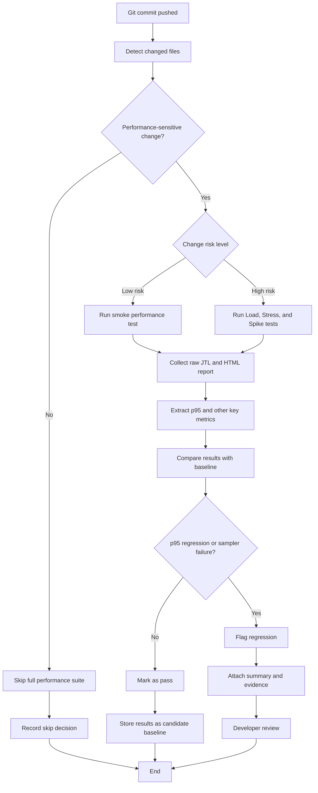

# Continuous Performance Testing Flowchart

This flowchart describes how the continuous performance-testing proposal works for the HW05 backend.

## Notes

- Performance-sensitive changes include backend code, database/schema changes, authentication, checkout, order-management logic, JMeter plans, and test data.
- Smoke tests are intended for small routine changes.
- Full Load, Stress, and Spike tests are intended for higher-risk changes.
- Baselines should come from the last known good run for the same scenario family.
- A regression should be flagged when the p95 delta exceeds the allowed threshold or when sampler failures appear.
