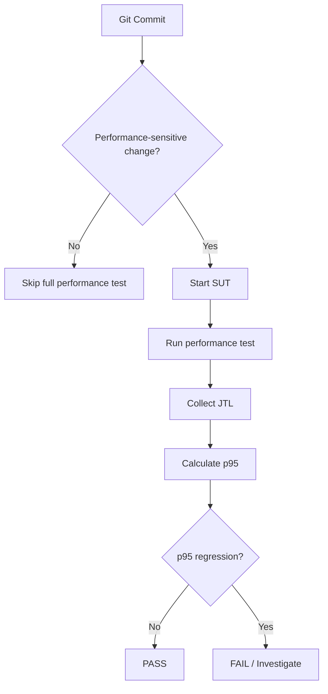

# Continuous Performance Testing

## Discussion

- Cost: full performance runs are expensive in CI time and machine resources.
- False positives: noisy hardware, background processes, and variable network conditions can trigger spurious regressions.
- False negatives: a short test may miss long-tail latency or memory growth.
- Baseline management: baseline JTLs and thresholds must be versioned and refreshed carefully.
- When to run Load: routine regression checks for normal paths.
- When to run Stress: only when changes may affect scaling, locking, or saturation behavior.
- When to run Endurance: periodic soak validation or when memory/CPU leaks are suspected.

## Threshold placeholders

- p95 threshold: TODO
- p99 threshold: TODO
- error-rate threshold: TODO

