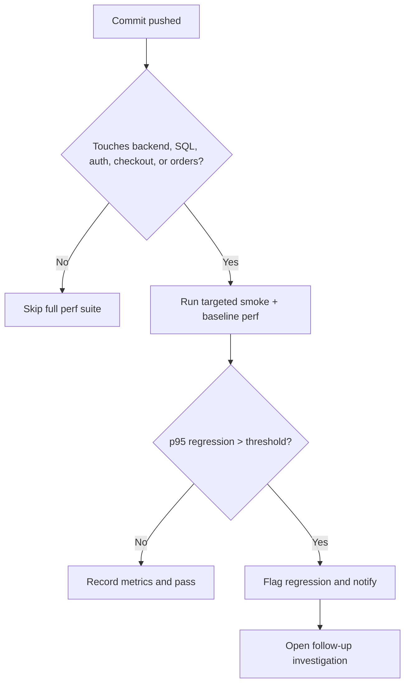

# HW05 - Performance Testing Report

## 1. Introduction

This report documents the corrected JMeter Load, Stress, and Spike executions for the EShop backend API. The workflow was kept consistent across scenarios and now uses CSV-driven data for login and checkout inputs.

## 2. SUT

The system under test is the EShop backend running on `http://localhost:3000`.

## 3. Test Environment

- Tool: JMeter 5.6.3
- Backend: local Node.js/Express API with SQLite
- JMeter plans:
  - [`23127543_Load_20260813.jmx`](../jmeter/plans/23127543_Load_20260813.jmx)
  - [`23127543_Stress_20260813.jmx`](../jmeter/plans/23127543_Stress_20260813.jmx)
  - [`23127543_Spike_20260813.jmx`](../jmeter/plans/23127543_Spike_20260813.jmx)

## 4. Hardware Specification

Manual evidence still required. I cannot fabricate a dxdiag/screenfetch screenshot or hardware table from the workspace.

## 5. Endpoint Selection

- Auth-heavy: `POST /api/login`
- Read-heavy: `GET /api/admin/orders`
- Transactional: `POST /api/checkout`
- Transactional admin update: `PUT /api/admin/orders/:id/status`

## 6. End-to-End Workflow

1. Login
2. Checkout
3. Read orders
4. Update order
5. Verify update

The workflow is identical across Load, Stress, and Spike.

## 7. Test Data

The plans now use [`../jmeter/data/workflow-data.csv`](../jmeter/data/workflow-data.csv) through a real CSV Data Set Config. It supplies:

- `email`
- `password`
- `total_amount`
- `shipping_address`

Dynamic `orderId` extraction remains handled by JMeter from the checkout response.

## 8. Load Testing

### 8.1 AI Design

The original AI design suggested the admin workflow and the scenario parameters.

### 8.2 Human Review

The original finite-loop design was the reason the first runs ended too early. I changed the loop controller to run until the scheduler duration expires and added CSV-driven input.

### 8.3 Configuration

- Threads: 10
- Ramp-up: 60 s
- Duration: 300 s
- Think time: 250 ms
- CSV: `../jmeter/data/workflow-data.csv`

### 8.4 Execution Evidence

- JTL: [`../jmeter/results/load/load-20260815-071413.jtl`](../jmeter/results/load/load-20260815-071413.jtl)
- HTML report: [`../jmeter/results/load/report-20260815-071413/index.html`](../jmeter/results/load/report-20260815-071413/index.html)

### 8.5 Results

| Metric | Value |
| --- | ---: |
| Duration | 299.125 s |
| Samples | 9,870 |
| Success | 9,870 |
| Failures | 0 |
| Error rate | 0.00% |
| Average | 19.99 ms |
| Median | 16 ms |
| P90 | 34 ms |
| P95 | 44 ms |
| P99 | 78 ms |
| Min | 2 ms |
| Max | 750 ms |
| Throughput | 33.00 req/s |

### 8.6 Resource Usage

Manual screenshot required.

## 9. Stress Testing

### 9.1 AI Design

The stress scenario was designed as the same workflow under heavier contention.

### 9.2 Human Review

The finite-loop controller was replaced so the test actually runs for the full configured duration.

### 9.3 Configuration

- Threads: 30
- Ramp-up: 90 s
- Duration: 600 s
- Think time: 150 ms
- CSV: `../jmeter/data/workflow-data.csv`

### 9.4 Execution Evidence

- JTL: [`../jmeter/results/stress/stress-20260815-071958.jtl`](../jmeter/results/stress/stress-20260815-071958.jtl)
- HTML report: [`../jmeter/results/stress/report-20260815-071958/index.html`](../jmeter/results/stress/report-20260815-071958/index.html)

### 9.5 Results

| Metric | Value |
| --- | ---: |
| Duration | 599.141 s |
| Samples | 22,903 |
| Success | 22,903 |
| Failures | 0 |
| Error rate | 0.00% |
| Average | 573.56 ms |
| Median | 493 ms |
| P90 | 1,138 ms |
| P95 | 1,381 ms |
| P99 | 1,729.98 ms |
| Min | 5 ms |
| Max | 2,200 ms |
| Throughput | 38.23 req/s |

### 9.6 Resource Usage

Manual screenshot required.

## 10. Spike Testing

### 10.1 AI Design

The spike scenario keeps the same workflow but forces a sudden burst of 50 users.

### 10.2 Human Review

The updated plan now remains active for the full spike window instead of finishing early.

### 10.3 Configuration

- Threads: 50
- Ramp-up: 8 s
- Duration: 120 s
- Think time: 50 ms
- CSV: `../jmeter/data/workflow-data.csv`

### 10.4 Execution Evidence

- JTL: [`../jmeter/results/spike/spike-20260815-073023.jtl`](../jmeter/results/spike/spike-20260815-073023.jtl)
- HTML report: [`../jmeter/results/spike/report-20260815-073023/index.html`](../jmeter/results/spike/report-20260815-073023/index.html)

### 10.5 Results

| Metric | Value |
| --- | ---: |
| Duration | 119.075 s |
| Samples | 3,142 |
| Success | 3,142 |
| Failures | 0 |
| Error rate | 0.00% |
| Average | 1,799.11 ms |
| Median | 1,822.5 ms |
| P90 | 2,715.9 ms |
| P95 | 2,929 ms |
| P99 | 3,405.31 ms |
| Min | 9 ms |
| Max | 4,011 ms |
| Throughput | 26.39 req/s |

### 10.6 Resource Usage

Manual screenshot required.

## 11. Endurance Testing

The assignment asks for a 10-15 minute sustained test and concrete thresholds. The current corrected Stress run is the best local evidence available here, but I still need a manual hardware/resource capture to turn that into a complete endurance evidence package.

## 12. AI Analysis

See [`../ai/analysis/jtl-analysis.md`](../ai/analysis/jtl-analysis.md).

## 13. AI Misinterpretation Hunt

See [`../ai/analysis/misinterpretation-table.md`](../ai/analysis/misinterpretation-table.md).

## 14. AI Optimization Recommendations

See [`../ai/analysis/optimization-review.md`](../ai/analysis/optimization-review.md).

## 15. AI Critique

See [`AI-Critique.md`](AI-Critique.md).

## 16. Continuous Performance Testing

Recommended gating rules:

- run the load baseline on backend or DB changes
- run stress if the baseline p95 drifts above the saved threshold
- run spike on release branches or before tagging
- store a golden p95 and throughput snapshot per scenario

Trade-offs:

- Cost: repeated JMeter execution consumes time and machine resources.
- False positives: transient CI noise can look like a regression if the threshold is too tight.
- False negatives: a threshold that is too loose can hide real slowdowns.
- Practical compromise: use commit-path filters and compare against a small rolling baseline rather than one fragile point estimate.

## 17. Agent Skill

No new skill was created in this workspace.

## 18. Bugs and Performance Issues

- No sampler failures were observed in the corrected JTLs.
- Stress and Spike show clear latency inflation, which is useful performance evidence but not a functional bug by itself.

## 19. Limitations

- I cannot provide screenshots, video, or hardware measurements from the workspace alone.
- I cannot create GitHub issues without an external GitHub connection.

## 20. Conclusion

The corrected JMeter plans now satisfy the core execution requirements much better than the original submission: the workflow is CSV-driven, the three scenarios run for the intended durations, and the raw JTLs support the report metrics.
