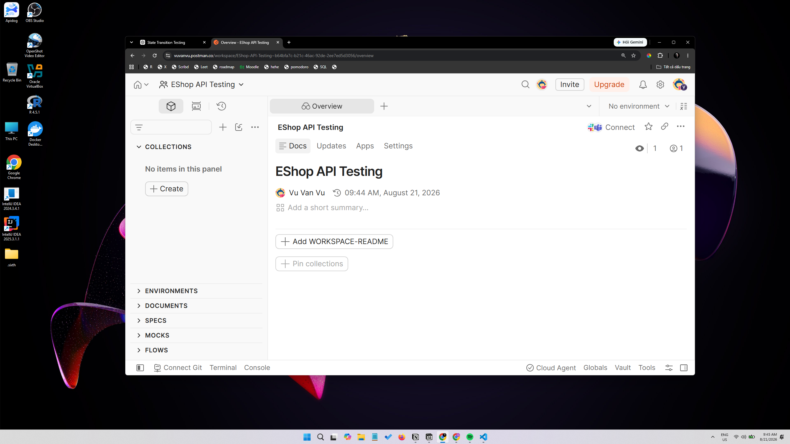
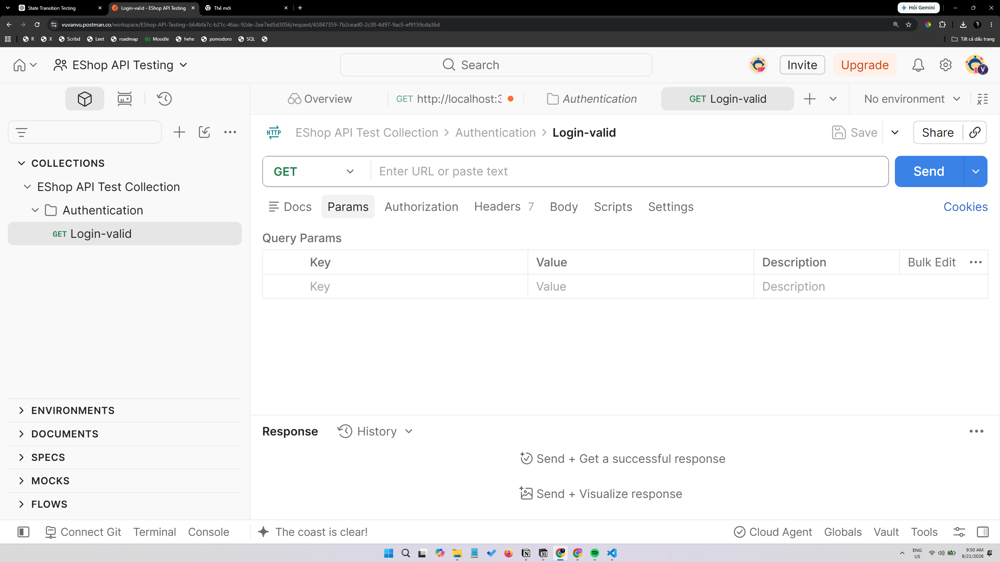
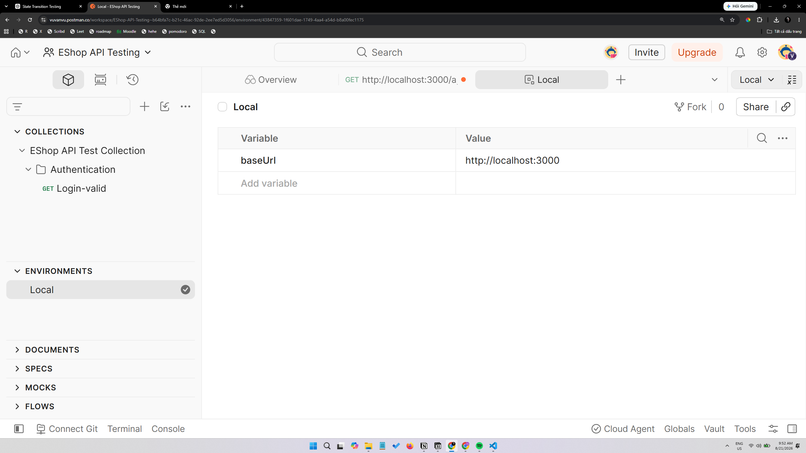
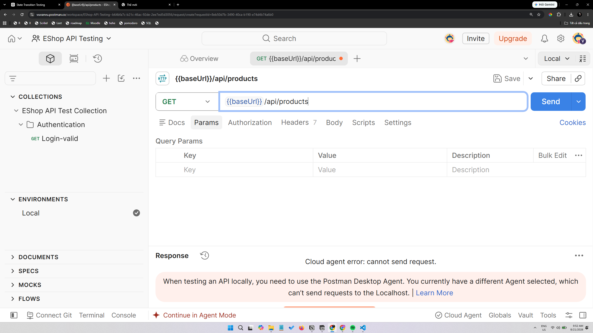
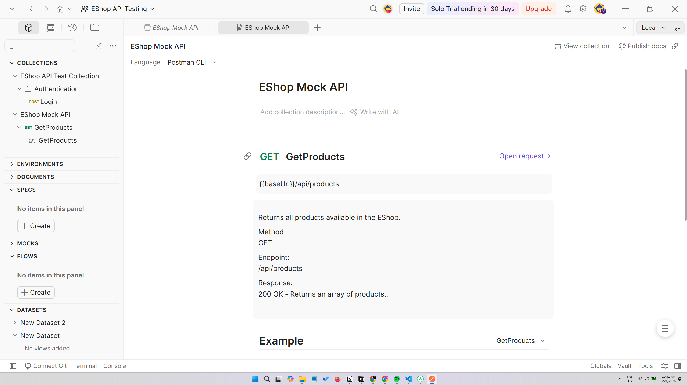
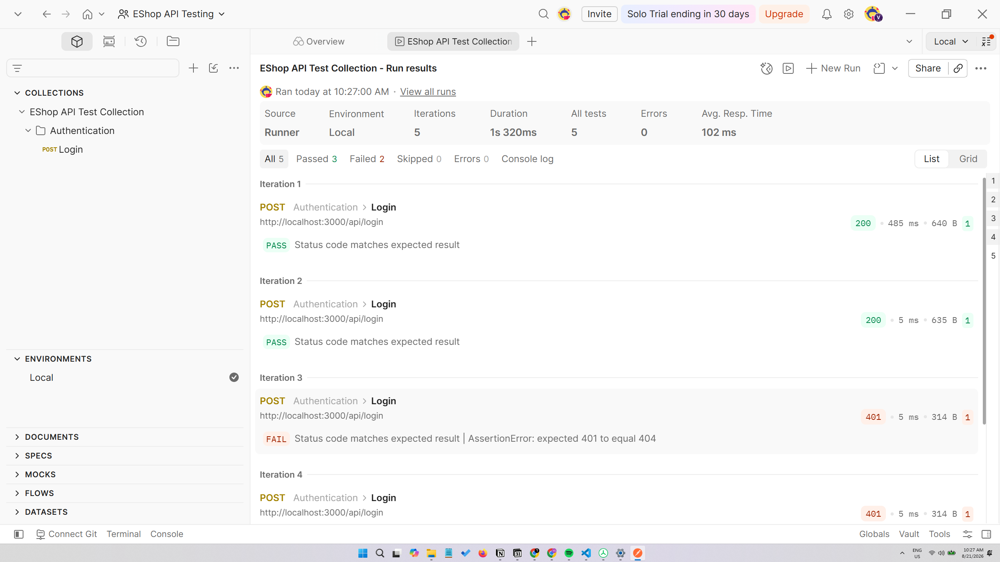
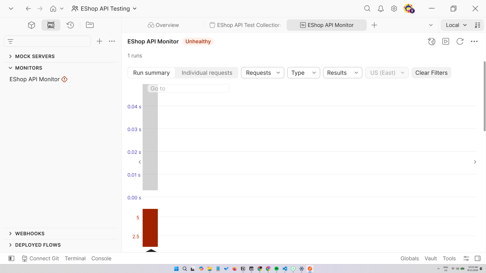
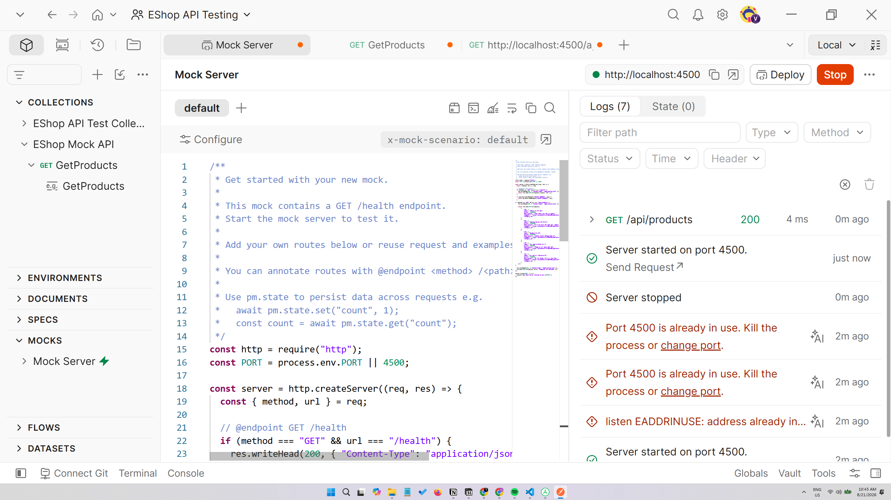
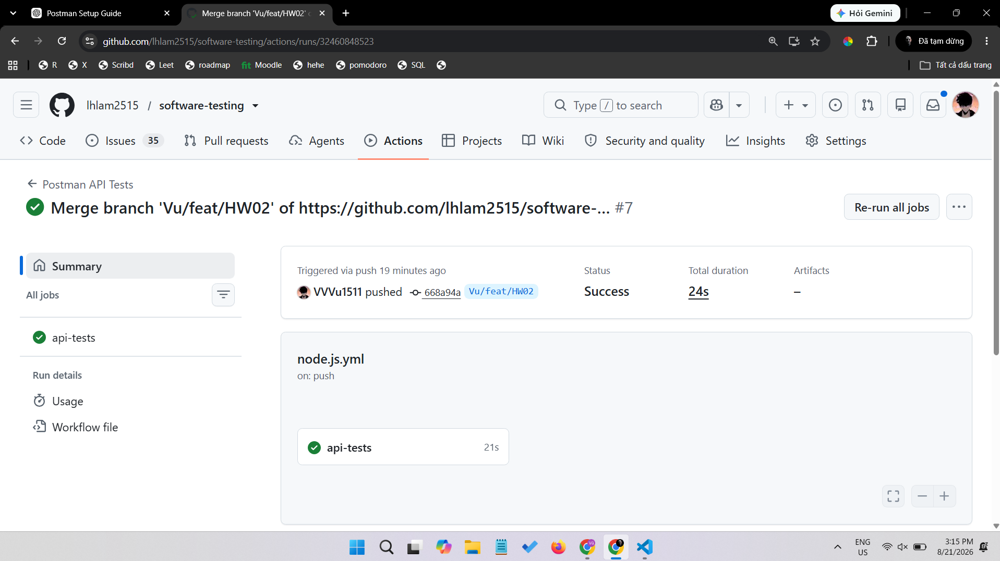
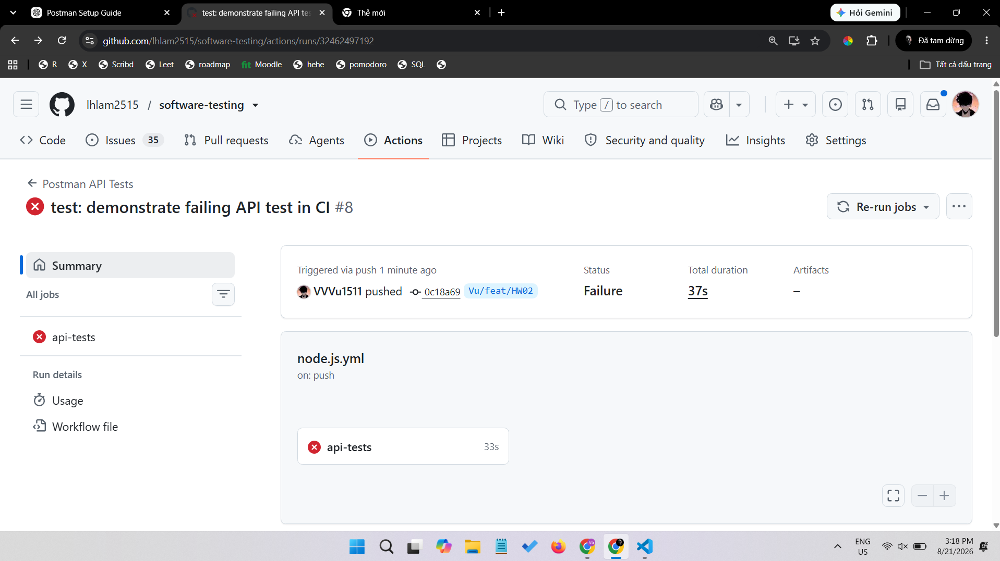

# HW06 — API Testing Report

## 1. Introduction
This homework documents API testing for the HW06 backend using the assignment’s three required functional areas: FR-04, FR-07, and FR-18. The goal was to generate API test cases with AI support, review and refine them manually, execute them in Postman/Newman, and integrate the collection into GitHub Actions for CI/CD evidence.

## 2. System Under Test
The system under test is the HW06 backend in `apps/backend`, exposed through a local API at `http://localhost:3000`. The backend supports:
- FR-04: user profile retrieval and update
- FR-07: shopping cart read/write behavior
- FR-18: admin order listing and order-status updates

The specification used for this report is the repository’s OpenAPI file: [`openapi.yaml`](../openapi.yaml). It documents the tested endpoints, security scheme, and response schemas.

## 3. API Specification
The tested API surface consists of four endpoints across three functional requirements:

| FR | Method | Endpoint | Purpose | Security |
|---|---|---|---|---|
| FR-04 | `GET` | `/api/users/me` | Returns the authenticated user profile row | Bearer JWT |
| FR-04 | `PUT` | `/api/users/me` | Updates the authenticated user profile | Bearer JWT |
| FR-07 | `GET` | `/api/cart` | Returns the authenticated user cart | Bearer JWT |
| FR-07 | `POST` | `/api/cart` | Appends the raw request body to the authenticated user cart | Bearer JWT |
| FR-18 | `GET` | `/api/admin/orders` | Lists all orders for admin review | Bearer JWT |
| FR-18 | `PUT` | `/api/admin/orders/{id}/status` | Updates order status through the implemented transition rules | Bearer JWT |

The OpenAPI file defines the `bearerAuth` security scheme and schemas for `ErrorResponse`, `MessageResponse`, `UserProfile`, `UserProfileUpdateRequest`, `AdminOrder`, and `UpdateOrderStatusRequest`.

## 4. Test Strategy
The test design intentionally covers the assignment-required techniques:
- Domain Partitioning: valid, invalid, missing, null, empty, and wrong-type input values
- Boundary Value Analysis: minimum, zero, large, whitespace-only, long-string, and repeated-request edge cases
- State Transition Testing: order-status flow and forbidden transitions for FR-18
- Security Testing: authentication failures, authorization gaps, token tampering, IDOR-style access, and injection-style payloads
- Schema Validation: response object shape, required fields, response types, and array/object expectations
- Positive and negative testing: successful requests, invalid credentials, malformed requests, and unexpected input
- Authentication/authorization testing: bearer token handling, role separation, and admin-only access checks

## 5. AI-Assisted Test Generation
AI was used as a guided assistant to draft many API test cases from the specification and implementation evidence, but every result was reviewed manually.

The actual generator is [`generate_api_test_cases.py`](../generate_api_test_cases.py). Its real behavior is:
- reads the tested API focus from the repository’s OpenAPI/specification context
- defines case templates for FR-04, FR-07, and FR-18
- generates a workbook of test cases with IDs, categories, methods, endpoints, request data, expected status, and requirement mapping
- validates uniqueness and structure
- writes `API_Test_Cases.xlsx`
- writes `AI_Test_Generation_Log.md`

The companion audit script is [`audit_api_test_cases.py`](../audit_api_test_cases.py). It loads the generated workbook, marks individual cases as VALID / INVALID / INCOMPLETE, appends corrected cases, and updates the generation log.

The AI generation workflow used in this repository was:
1. Provide the API specification and backend behavior context.
2. Generate cases for domain partitions, boundaries, state transitions, security, and schema validation.
3. Review each case against the actual backend behavior.
4. Correct cases whose expected outcomes did not match the implementation.
5. Add extra human-authored cases that AI missed.
6. Convert the reviewed test set into the Postman collection.

Related files:
- [`generate_api_test_cases.py`](../generate_api_test_cases.py)
- [`audit_api_test_cases.py`](../audit_api_test_cases.py)
- [`AI_Test_Generation_Log.md`](../AI_Test_Generation_Log.md)
- [`API_Test_Audit.md`](../API_Test_Audit.md)
- [`API_Test_Cases.xlsx`](../API_Test_Cases.xlsx)

## 6. Test Case Generation Results
The repository evidence shows the following actual counts:

| Metric | Count |
|---|---:|
| APIs | 3 |
| Generated test cases | 144 |
| Added test cases in the Postman collection | 172 requests |
| Executed test cases in the clean Newman baseline | 172 requests |
| Passed | 172 |
| Failed | 0 |
| Assertions | 172 |

Counting method:
- `APIs` means the three selected functional requirements, not the number of HTTP requests.
- `Generated test cases` comes from the generator workbook and generation log.
- `Added test cases` reflects the actual request count in the Postman collection.
- `Executed test cases` uses the clean Newman baseline report.
- `Assertions` are the Newman assertions reported by the HTML output.

## 7. Postman Implementation
The Postman implementation includes:
- one collection: [`postman/EShop-API.postman_collection.json`](../postman/EShop-API.postman_collection.json)
- one environment: [`postman/EShop-Environment.postman_environment.json`](../postman/EShop-Environment.postman_environment.json)
- a setup folder for authentication/state preparation
- request-level tests for the API cases
- environment variables for base URL, credentials, tokens, and order IDs
- collection-level variables and dynamic state passed through the environment
- collection runner usage for executing the suite
- a data-driven run using [`login-data.csv`](../login-data.csv)

The documented Postman features are summarized in [`postman_features.md`](../postman_features.md).

## 8. Test Execution and Results
The clean baseline Newman run completed successfully:
- Requests: 172
- Assertions: 172
- Failed tests: 0
- Total duration: 14.4s

The baseline evidence is the generated HTML report: [`newman-report.html`](../newman-report.html).

The repository also contains an intentionally failing CI demonstration commit, which is separate from the clean baseline and should not be counted as an unresolved API defect.

## 9. CI/CD Integration
The repository’s GitHub Actions workflow is implemented in [`../.github/workflows/api-tests.yml`](../.github/workflows/api-tests.yml). It performs:
1. repository checkout
2. Node.js setup
3. backend dependency installation
4. backend startup
5. backend readiness wait
6. Newman installation
7. Postman collection execution
8. Postman environment loading
9. Newman HTML report generation
10. pass/fail propagation through the workflow exit code

See the short CI/CD report for the two sample runs: [`CI-CD-report.md`](../CI-CD-report.md).

## 10. Evidence
The following screenshots are real files from `evidence/`:

## 11. CI/CD Sample Runs

### Sample Run 1 — All API Tests Passing
- Commit: `37b75001011d03cebe7b02ea8aafaa40fa6d83de`
- Commit message: `all tests pass`
- Branch: `Vu/feat/HW02`
- GitHub Actions run: `[Insert GitHub Actions run URL]`
- Result: passed
- Evidence: [`../evidence/CI/CD/success.png`](../evidence/CI/CD/success.png)

### Sample Run 2 — One Test Case Failing
- Commit: `0c18a69b1f03ade39d899265355e95f14d4b2332`
- Commit message: `test: demonstrate failing API test in CI`
- Branch: `Vu/feat/HW02`
- GitHub Actions run: `[Insert GitHub Actions run URL]`
- Result: failed
- Intentional modification: one Postman test assertion was changed to demonstrate a failing CI run
- Evidence: [`../evidence/CI/CD/fail.png`](../evidence/CI/CD/fail.png)

## 12. Bugs / Defects
The documented bug count is 3.

Counting method:
- Only issues recorded in the repository’s bug documentation and audit evidence were counted.
- Failed tests were not automatically counted as bugs.
- The baseline run is clean, so the intentionally failing CI demonstration is excluded from the bug total.

## 13. Limitations
Real limitations observed in the repository evidence:
- The API scope is limited to the three required functional areas, so the submission does not test the full EShop feature set.
- Several FR-18 state-transition cases are stateful and depend on order setup, which makes some scenarios sensitive to fixture reuse.
- The repository includes both a clean baseline and an intentional CI failure, so the failing run must be interpreted as a demonstration rather than an unresolved defect.

## 14. Conclusion
The HW06 submission demonstrates AI-assisted API test generation, manual auditing and correction, Postman/Newman execution, and CI/CD integration with both passing and intentionally failing sample runs. The clean baseline passes, the evidence is documented in the repository, and the AI usage is explicitly audited below.

# AI Audit Report

## AI Use Summary
AI tools were used in this assignment for test generation support, review assistance, and documentation drafting. Every AI-derived result was checked against the actual repository artifacts and runtime evidence before inclusion.

## AI-Assisted Tasks

| Tool | Task | Input / Context | Output / Use | Human Review |
|---|---|---|---|---|
| ChatGPT / Codex | Generate API test-case ideas | OpenAPI spec, backend behavior, and required techniques | Drafted many FR-04, FR-07, and FR-18 test cases | Reviewed each case against the real collection and execution results |
| ChatGPT / Codex | Analyze specification coverage | OpenAPI schema and functional requirements | Highlighted partitions, boundaries, state transitions, and security cases | Corrected cases that did not match the implementation |
| ChatGPT / Codex | Help construct Postman test logic | Existing Postman collection and environment | Supported request organization, variables, and assertions | Verified collection behavior with Newman |
| ChatGPT / Codex | Refine CI/CD documentation | GitHub Actions workflow and run evidence | Helped describe the pipeline steps and sample runs | Confirmed against the actual workflow file and screenshots |
| ChatGPT / Codex | Draft AI critique text | Observed mismatches between generated tests and runtime behavior | Produced the critique narrative | Edited to reflect only repository-supported facts |

## AI Verification Principle
The final rule used for this homework was: AI may suggest, but the repository evidence decides. Any test, status code, or state transition that did not match the running backend was corrected or excluded.
