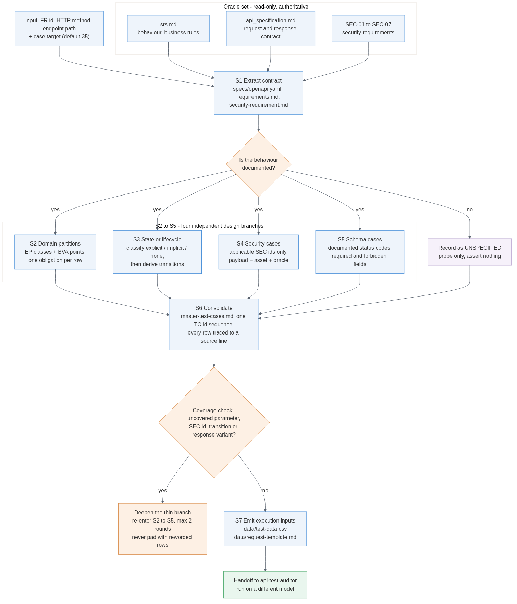
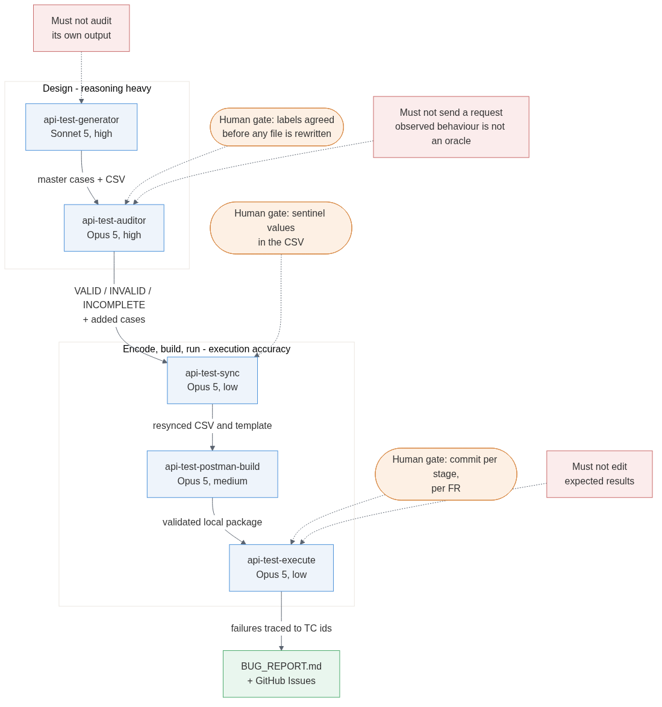

# Main Report - HW06

## 1. Student Information

| Field | Value |
| ----- | ----- |
| Student name | Lê Hoàng Lâm |
| Student ID | 23127216 |
| Class / Cohort | 23KTPM1 |
| GitHub repository | [github.com/lhlam2515/software-testing](https://github.com/lhlam2515/software-testing) |
| Assignment ID | HW#06 |
| Assignment date | 2026-08-25 |
| AI tool(s) used | Claude Code (Claude Sonnet 5 for Pass 1; Claude Opus 5 for the Pass 2 re-audit and re-run) |

## 2. Selected APIs

| Pool | API | Endpoint | Rationale |
| ---- | --- | -------- | --------- |
| Pool A | FR-02 Login & Account Lockout | `POST /api/login` | High security surface (SEC-01, SEC-02, SEC-05: password hashing, JWT issuance, SQL injection risk on credential check) combined with a stateful lockout counter (3 consecutive failures triggers a 30-second lock per SRS section FR-02). Covers both domain partition (email/password format) and state transition (fail counter, lock/unlock) coverage groups required by REQUIREMENTS.md section 6. |
| Pool B | FR-08 Checkout | `POST /api/checkout` | Converts cart state into an order, exercising business-rule validation (`total_amount`, `shipping_address`) and cross-user IDOR risk (a token from user A must not be able to checkout on behalf of user B's cart). Produces a clear oracle: a created order record with a verifiable state. |
| Pool C | FR-15 Product Management (Admin CRUD) | `POST /api/products`, `PUT /api/products/:id`, `DELETE /api/products/:id` | Independent domain from Pool B (no order-state overlap), so the three APIs cover distinct FRs without duplicating coverage. Full CRUD surface gives broad domain-partition coverage (price, category_id, name/description length) plus a direct SEC-03/SEC-06 role-escalation and IDOR target: only `role = 'admin'` may call these endpoints. |

### 2.1 Coverage and Evidence Mapping

This subsection maps each selected API to its specification source and the four mandatory coverage groups from REQUIREMENTS.md section 6, item 1 (domain partition, state transition, security, schema validation). It is the scope plan the generate stage in section 3 follows. Full detail lives in `artifacts/test-cases/README.md`.

| API | Spec source | Domain partition | State transition | Security (SEC-01-07) | Schema validation |
| --- | --- | --- | --- | --- | --- |
| FR-02 Login | `api_specification.md` 1.2; `srs.md` FR-02 | email format, password presence/case-sensitivity | fail counter (0 to 3), lock (30s) to unlock | SEC-01 (no plaintext password echo), SEC-02 (JWT issuance), SEC-05 (SQLi via email/password field) | 200 response shape (`token`, `user`); error response shape on lockout |
| FR-08 Checkout | `api_specification.md` 4.3; `srs.md` FR-07 to FR-08 | `shipping_address` presence/length; empty-cart case | cart to order transition (cart cleared after success); no-cart / already-checked-out edge | SEC-02 (auth required), IDOR (checkout must use the token owner's own cart, not a client-supplied user id), server must recompute `total_amount` and ignore the client-sent value | 200/201 response shape of the created order; rejection shape when `total_amount` is spoofed |
| FR-15 Product CRUD | `api_specification.md` 3.3; `srs.md` FR-12, FR-15 | `name` (required, <= 255 chars), `price` (required, > 0), `category_id` (required, must exist) | none intrinsic to the resource; cross-check: edit of one product must not mutate others (FR-15 isolation rule) | SEC-02 (JWT required), SEC-03 (role must be `'admin'` in token, not just token presence), SEC-06 (role not client-settable) | 200/201 response shape on create/update; 404 shape on delete of non-existent id |

### 2.2 Evidence Location Plan

| Pipeline stage | Evidence location |
| --- | --- |
| Generate (AI cases) | `artifacts/test-cases/` (workbook + Markdown summary); `prompt_log.md` |
| Audit (labels/reasoning) | `artifacts/test-cases/`; `[AI-02]_AI_Audit_Report.md` |
| Extend (student cases) | `artifacts/test-cases/` |
| Agent skills driving each stage | `artifacts/skills/` (five `SKILL.md` files + `README.md`) |
| Execute (Postman/Newman) | `artifacts/postman/`; `artifacts/newman/` |
| Bugs | `BUG_REPORT.md`; GitHub Issues; `assets/` (screenshots) |
| Test-generator design (diagram + pseudocode) | `artifacts/test-generator/` |

## 3. Working Process with AI

The three APIs were not tested with three different methods. They went through the same pipeline of five agent skills, one skill per stage, run once per FR. What changed between them was only the endpoint-specific material: the oracle sections, the state or lifecycle model, and which SEC ids apply.

Each skill states what it may do and what it must not do. The boundaries are the part that keeps the process honest, so they are listed here rather than described in prose. The full instructions are submitted as artifacts under `artifacts/skills/`, with an entry point at `artifacts/skills/README.md`.

```text
api-test-generator -> api-test-auditor -> api-test-sync -> api-test-postman-build -> api-test-execute
```

| Stage | Skill | May do | Must not do | Model, effort |
| --- | --- | --- | --- | --- |
| Design | `api-test-generator` | Contract extraction, EP/BVA catalog, state or lifecycle model, security cases, schema cases, master suite, test data | Audit its own output, send requests | Sonnet 5, high |
| Review | `api-test-auditor` | Label VALID / INVALID / INCOMPLETE with source evidence, correct broken cases, add missed cases | Send any request to the SUT | Opus 5, high |
| Encode | `api-test-sync` | Bring `test-data.csv` and `request-template.md` back in line with the audited suite | Design new test cases | Opus 5, low |
| Build | `api-test-postman-build` | Collection, environment, iteration data, `RUN.md`, static validation, dry run | Send requests to the SUT | Opus 5, medium |
| Run | `api-test-execute` | Run Newman, trace failures back to cases, write `BUG_REPORT.md` | Design cases, edit expected results | Opus 5, low |

The auditor is barred from executing on purpose. An auditor that can run a request starts labelling cases by observed behaviour instead of by specification, and at that point every SUT bug quietly becomes expected behaviour.

### 3.1 Two Passes, and Why the Second One Was Needed

Pass 1 (20-22/08) ran all five stages on a single model, changing only the effort level. Pass 2 (29/08) re-ran audit, sync, build and execute on every FR after two problems showed up in the Pass 1 artifacts:

- The same model generated the suite and then audited it. The audit declared no false trace was found while two wrong line citations sat in the material it was reviewing.
- Roughly half of the Pass 1 audit rows recorded their reasoning as "Matches", which is not a check. A VALID label claims every check passed, so it has to name the check that decided the row.

Three rules were added for Pass 2 and applied identically to all three FRs:

- **Authority order.** `srs.md`, `api_specification.md` and `specs/security-requirement.md` outrank `master-test-cases.md`, which outranks the Pass 1 audit files. Anything the AI produced is a subject under review, never evidence.
- **No inherited labels.** Every row was re-derived from the oracles first. The Pass 1 label was then compared against that result to produce a verdict: upheld, overturned, fix-corrected, or dropped.
- **Contract coverage separated from characterization.** A row whose outcome no source defines counts as input coverage only. This rule is what broke the "no shortfall" claim Pass 1 had granted itself.

Pass 2 also changed the model between the generate and audit stages, so a suite is never graded by the model that wrote it. Two variables moved at once here, the workflow and the model, so the improvement cannot be attributed to either alone. What is verifiable is that Pass 2 names a deciding check and a line citation for every row and Pass 1 does not.

### 3.2 Where the Human Decides

The pipeline is automated, the decisions are not. Every run stopped for approval at these points:

- Before writing `audit-log-v2.md`, and again before writing `extended-test-cases-v2.md`. Labels are agreed before any file is rewritten, so a wrong label does not get baked into a corrected suite.
- Before editing generator documents backwards to remove a false citation. That overwrites Pass 1 evidence, so it never happens silently (FR-08, commit `106ac14`).
- On sentinel decisions in the CSV, for example whether `REAL_CART_TOTAL` stays in FR-08.
- Before every commit, split in pipeline order per FR: audit, sync, build, execute.

Old Newman reports are archived under `artifacts/newman/<fr>/archive/<timestamp>/` rather than overwritten, so the Pass 1 evidence still exists next to the Pass 2 results.

## 4. API 1 - FR-02 Login & Account Lockout (Pool A)

### 4.1 Generate with AI

`api-test-generator` was driven through its seven stages on `POST /api/login`, using `api_specification.md` 1.2 for the contract and `srs.md` FR-02 for the requirement (`prompt_log.md` Entry 001, `2026-08-20T18:34:57+07:00`). It produced 35 cases, TC-01 to TC-35.

- The lockout counter is the centre of this endpoint, so the state model carries most of the design: counter 0 to 3, a 30-second lock, 9 transitions, three of which resolve to UNSPECIFIED.
- Only SEC-01, SEC-02 and SEC-05 apply here. The other four are marked non-applicable with a written reason in `specs/security-requirement.md` instead of being padded into cases.
- The specification documents exactly one response variant (`200`), so the schema group mostly probes error shapes that no source defines.
- Undocumented behaviour was recorded as UNSPECIFIED rather than resolved, including whether a successful login resets the counter.
- Combination rows (TC-12, TC-20, TC-28, TC-29, TC-31) each assert a different oracle, so the count is not inflated by rewording.

| Coverage group | Result |
| --- | --- |
| Domain partition | 12 EC classes on `email` (EC-01..07) and `password` (EC-08..12), TC-01..TC-12 |
| State transition | 9 transitions TR-01..TR-09; 3-value BVA on the lock TTL (TC-13..TC-15) |
| Security | SEC-01, SEC-02, SEC-05; SEC-03/04/06/07 declared non-applicable |
| Schema validation | 1 documented variant (`200`); `400`/`401`/`423` undocumented, probed only |

### 4.2 Audit

Pass 1 labelled the 35 originals with the same model that wrote them. Pass 2 re-derived all 41 rows, the 35 originals plus the 6 Pass 1 additions, from `srs.md` FR-02, `api_specification.md` 1.2 and `specs/security-requirement.md`, with no label carried forward.

| | Pass 1 | Pass 2 |
| --- | --- | --- |
| Rows labelled | 35 | 41 |
| VALID / INVALID / INCOMPLETE | 29 / 1 / 5 | 21 / 0 / 20 |
| Verdicts | n/a | 24 upheld, 15 overturned, 2 fix-corrected |
| Same 35 originals only | 29 / 1 / 5 | 19 / 0 / 16 |

- Fourteen rows cited only a generator artifact as evidence. TC-13 to TC-18 pointed at `state-model.md` and TC-28 to TC-35 at `schema-cases.md`, both written by the same AI. Each was re-anchored to an `srs.md` or `api_specification.md` location.
- A Pass 1 fix was itself defective: TC-01 was "corrected" into asserting `Content-Type: application/json`, a value the spec never states and `schema-cases.md` itself flags as inferred.
- The non-leak clause at `srs.md` line 42 was applied inconsistently. Pass 1 used it to correct TC-12, then accepted TC-28 which stretches the same clause over a key-set comparison that includes required-field errors.
- The shared-account precondition was fixed on TC-21 and TC-23 only. TC-02, TC-07, TC-11 and TC-26 run on the same account right after TC-20 leaves it locked, so their results are unattributable. TC-26 is the worst of the four: a successful SQL injection bypass would be masked by the lock.
- TC-32, TC-33, TC-34 and TC-41 asserted "a structured error, not a 500 with a stack trace" where no source defines any error body, and were demoted to characterization. TC-19 moved from INVALID to INCOMPLETE, because its only contradiction was against `state-model.md`, which is not an authority.

### 4.3 Extend

Pass 1 added six cases (TC-36 to TC-41) in `audit/extended-test-cases.md`. Pass 2 re-derived all six against the oracles, confirmed two, corrected four, and added five more (TC-42 to TC-46) in `audit/extended-test-cases-v2.md`.

**Pass 1 additions**

| TC ID | Technique | What it covers | Miss category | Why the AI missed it | Pass 2 outcome |
| --- | --- | --- | --- | --- | --- |
| TC-36 | State | Closes the TR-06 gap left by invalid TC-19 (success from S2, counter=2) | Model limitation | The cross-document connection between `state-model.md`'s TR-06 precondition and TC-19's own precondition field was never checked | INCOMPLETE, overturned. Its primary trace was `state-model.md`, a generated file; re-anchored to `api_specification.md` 1.2 and `srs.md` line 43, and the post-success counter observation demoted to characterization |
| TC-37 | EP | Same no-password-leak invariant instantiated for the admin account, not only the customer account | Prompt quality | Principal/role was never treated as its own equivalence dimension despite `srs.md` section 1 documenting two distinct default accounts | INCOMPLETE, overturned. Every assertion is already made by TC-01 and TC-21, and SEC-03 does not apply at this endpoint, so it adds no unique coverage. Kept only because TC-39 and TC-43 need `admin@eshop.com` established as a second principal |
| TC-38 | State (functional) | An issued token must actually be accepted by a protected endpoint (`GET /api/users/me`), not only be structurally valid | Model limitation | SEC-C-03 stopped at structural JWT parsing and never followed the cross-source link to `srs.md` FR-02 line 43 | VALID, upheld. Both cited locations were reopened and both exist |
| TC-39 | State (cross-account isolation) | A locked `test@eshop.com` must not block a different, unlocked account (`admin@eshop.com`) from logging in | API characteristic | `state-model.md`'s Notes flagged lock scope as undocumented but never tested the one reading ("tài khoản" = the specific account) the SRS wording itself supports | INCOMPLETE, overturned. It asserted the admin login "must succeed", which resolves an UNSPECIFIED: the counter's scope (per email, per IP, global) is undocumented. Demoted to characterization |
| TC-40 | Security (concurrency) | 3 concurrent wrong-password attempts must still reach LOCKED with no lost update | API characteristic | All 5 generated catalogs model single sequential requests only; none consider the counter's read-modify-write logic as a race-condition surface | VALID, upheld. The counter arithmetic is documented, so the concurrent invariant is decidable |
| TC-41 | Schema | `email=null` as a third wrong-JSON-type facet, distinct from empty string (TC-05) and omitted key (TC-06) | Prompt quality | `schema-cases.md`'s own scope note enumerates only two wrong-type facets (number, array); `null` was left out | INCOMPLETE, overturned. The "not a 500 with a stack trace" assertion rests on silence and was stripped; the wire-condition intent survives as characterization |

**Pass 2 additions**

- TC-42 compares the locked-account error body against the unknown-email body, which is the direct test of the non-leak clause TC-28 had only gestured at. Analysis-only, it fires no new request.
- TC-43 interleaves failed logins across `test@eshop.com` and `admin@eshop.com` to observe whether the counter is per account, per IP, or global. Recorded as characterization, since the spec does not define the scope.
- TC-44 checks the trigger guard: does a successful login break the "3 consecutive" chain, or does the counter keep accumulating across it.
- TC-45 submits attempts inside an active lock window to see whether the TTL renews.
- TC-46 crosses case-sensitivity with lockout, the one intersection where TC-02's observed behaviour changes the meaning of the counter.

Four of the five are contract tests. The reason the AI missed each one is recorded per case in `extended-test-cases-v2.md`, and follows the same shape across all three FRs: catalogs written per field never look at what happens when two fields interact, and no catalog re-reads another catalog's Notes section.

### 4.4 Execute

`api-test-sync` rewrote `data/test-data.csv` from the Pass 2 suite, `api-test-postman-build` rebuilt the package, and `api-test-execute` ran it. Final package: 46 test cases over 53 CSV rows (some cases split into a/b sub-rows).

```shell
newman run collection.postman_collection.json -e environment.postman_environment.json \
  -d test-data.csv --env-var "studentId=23127216" --timeout-request 60000 \
  --timeout-script 60000 --reporters cli,json,html \
  --reporter-json-export ../../newman/fr-02-login/newman-report.json --reporter-html-export ../../newman/fr-02-login/newman-report.html
```

| Item | Pass 1 | Pass 2 |
| --- | --- | --- |
| Started | `2026-08-22T08:27:13Z` | `2026-08-28T19:40:34Z` |
| Iteration rows | 42 | 53 |
| Requests | 65/65 | 89/89 |
| Assertions | 185/207 | 247/267 |
| Newman failures | 22 | 20 |

- Newman exit code `1`, and every failure is an assertion failure. Zero requests failed, so the collection is wired correctly and the gap is the SUT's real behaviour.
- Request timeouts were raised to 60s because TC-13, TC-14, TC-15 and TC-45 wait out the real lock window. A run takes 3 to 4 minutes, about 2.5 of which is deliberate waiting.
- `X-Student-Id: 23127216` is set by the collection-level pre-request script on every request, including those fired through `pm.sendRequest`, and the script refuses to run when `studentId` is blank. Proof is in the recorded request headers in `artifacts/newman/fr-02-login/newman-report.json`.
- The build stage ran static validation before handing over: every `tc_id` present, every assertion name reversible to its case, `X-Student-Id` on every request, Postman sandbox constraints respected, then a dry run.
- The Pass 1 report is archived at `artifacts/newman/fr-02-login/archive/20260828T194022Z/`. Leftover state is recorded in `run-cycle.json`: both accounts finish with a non-zero counter and possibly an active lock, because no API resets it.

### 4.5 Bugs Found

| Bug ID | Severity | Found by | Issue | Summary |
| --- | --- | --- | --- | --- |
| BUG-FR02-01 | Medium | Beyond AI | [#44](https://github.com/lhlam2515/software-testing/issues/44) | Failed-login counter increments by 2 per attempt, locking the account after 2 failures instead of the documented 3 |
| BUG-FR02-02 | Medium | AI | [#45](https://github.com/lhlam2515/software-testing/issues/45) | Account lockout lasts 180 seconds instead of the documented 30-second window |
| BUG-FR02-03 | Critical | AI | [#46](https://github.com/lhlam2515/software-testing/issues/46) | Successful login responses leak the user's plaintext password in the `user` object |
| BUG-FR02-04 | High | AI | [#47](https://github.com/lhlam2515/software-testing/issues/47) | Malformed JSON or a missing `Content-Type` crashes login with a raw HTML stack trace instead of a structured error |

BUG-FR02-04 carries a caveat recorded during the re-audit: the cases it was anchored to (TC-32, TC-33, TC-34) were demoted to characterization, so the bug still stands on information disclosure but its expected-behaviour argument needs a different anchor.

## 5. API 2 - FR-08 Checkout (Pool B)

### 5.1 Generate with AI

Same seven stages on `POST /api/checkout`, sources `api_specification.md` 4.3 and `srs.md` FR-07 to FR-08 (`prompt_log.md` Entry 003, `2026-08-20T21:07:13+07:00`). Output: 35 cases, TC-01 to TC-35.

- The spec documents one transition and no state table, so cart-to-order was modelled as a lifecycle adaptation rather than a state machine. Calling it a state machine would have overstated the coverage claim.
- The spec gives no response example for this endpoint at all. The schema group therefore has zero documented variants to check against, which is a specification gap and was recorded as one.
- Two security checks were added as extensions rather than as SEC ids: cross-user IDOR on the cart, and the server-side recompute rule from `srs.md` FR-08 line 107.
- `shipping_address` appears only as an example value. No source states requiredness, length, or validation, so those rows record instead of assert.
- Same-request pairs (TC-07/26/30, TC-11/21, TC-12/22, TC-14/31, TC-02/35) share a request but assert different oracles, disclosed in the suite's Coverage Gate.

| Coverage group | Result |
| --- | --- |
| Domain partition | 14 EC classes on `shipping_address`, `total_amount`, `Authorization`; cart-count boundary in TC-14/TC-15 |
| State transition | Lifecycle adaptation, 5 scenarios S-01..S-05 |
| Security | SEC-02, SEC-05, plus IDOR and server-recompute extensions |
| Schema validation | 0 documented response variants; spec gap, not a coverage shortfall |

### 5.2 Audit

This is the FR where Pass 1 looked cleanest and held up worst. It reported 33 VALID, 0 INVALID and 2 INCOMPLETE. Pass 2 overturned half the suite.

| | Pass 1 | Pass 2 |
| --- | --- | --- |
| Rows labelled | 35 | 41 |
| VALID / INVALID / INCOMPLETE | 33 / 0 / 2 | 15 / 4 / 22 |
| Verdicts | n/a | 16 upheld, 20 overturned, 5 fix-corrected |

- Two line citations were simply wrong (`api_specification.md` line 141, `srs.md` line 164). They were spread across 8 rows and had propagated back into `specs/requirements.md`. Correcting the generator documents was approved separately and committed on its own (`106ac14`).
- TC-14 and TC-31 both check out against an empty cart and reach opposite conclusions. TC-14 records the outcome as UNSPECIFIED, TC-31 asserts "no order created" as an invariant. Pass 1 labelled both VALID.
- Run-order conflict that no per-case review can see: TC-17 must run immediately after TC-16 succeeds, at which point the cart is empty, while more than 15 other rows require a non-empty cart, and the spec defines no clear-cart endpoint.
- This is the only FR with INVALID rows in Pass 2. Four rows make claims the sources contradict, rather than claims the sources merely fail to support.
- FR-09 coupon coverage was zero across TC-01 to TC-41, although `srs.md` line 112 puts coupon entry inside the checkout step. That gap drove most of the Pass 2 additions.

### 5.3 Extend

Pass 1 added six cases (TC-36 to TC-41). Pass 2 kept all six, confirmed two, repaired the citations or the expected result on the other four, and added six more (TC-42 to TC-47) weighted toward the FR-09 gap and the read path.

**Pass 1 additions**

| TC ID | Technique | What it covers | Miss category | Why the AI missed it | Pass 2 outcome |
| --- | --- | --- | --- | --- | --- |
| TC-36 | Security (EP) | The "wrong-scheme value" sub-variant of a malformed `Authorization` header (raw token with no `Bearer` prefix; `Basic` scheme) | Prompt quality | `domain-partition-catalog.md` P-14 itself named three EC-14 sub-variants, but only the "garbage string" member (TC-12/TC-22) was ever instantiated into a case | INCOMPLETE, fix-corrected. It inherited the false `line 141` citation from the artifact that seeded it; the gap is real, so the trace was repaired to `api_specification.md` line 131 and `srs.md` FR-08 line 104 |
| TC-37 | Schema | Side-effect check (no order created, cart unchanged) for the `shipping_address`/`total_amount` validation-error family, not only the empty-cart case | Model limitation | `schema-cases.md`'s SC-08 scope statement names both families, but the generator only wired SC-08 to the empty-cart case (TC-31) when assembling the master suite | INCOMPLETE, fix-corrected. No source states those inputs must be rejected at all, so "no order created" cannot be asserted here. Rewritten as a characterization sweep that exposes the validation gap |
| TC-38 | Schema/Lifecycle | `GET /api/orders/my-orders` as a direct existence/count oracle confirming the happy-path checkout actually persisted an order | Model limitation | None of the four catalogs used this endpoint as a general-purpose success oracle; it was only wired to inspect the recomputed total for the tampered-amount case | VALID, upheld |
| TC-39 | Security | Read-path cross-user order-visibility isolation, mirroring the write-path IDOR check already covered on checkout itself | Model limitation | Cross-user isolation was modeled only on the write path (SEC-C-05); the equivalent read-side rule in `srs.md` FR-11 was never connected to FR-08's checkout-creates-an-order behavior | INCOMPLETE, fix-corrected. The quoted rule is accurate but sits at `srs.md` line 166, not the cited line 164, which is the FR-11 heading. Citation only |
| TC-40 | Schema | Server-side recompute rule extended to the negative/zero `total_amount` class (TC-09), not only the tampered-positive class | Model limitation | The companion recompute-verification pattern (TC-30) was applied only to the positive-tampered class, even though `srs.md` FR-08 line 107's recompute rule is unconditional | VALID, upheld |
| TC-41 | Schema | An incorrect (not merely missing) `Content-Type` value (`text/plain`), completing the three-way missing/correct/incorrect split | Prompt quality | `schema-cases.md` SC-11 and its instantiation (TC-34) covered only the "header entirely omitted" member of the Content-Type dimension | INCOMPLETE, fix-corrected. Expected result was already UNSPECIFIED, but the trace named no verifiable location; re-anchored to `api_specification.md` 4.3 lines 151-161 |

**Pass 2 additions**

- TC-42 applies SAVE10 and then checks out, which tests the discount formula and the checkout side of it in one sequence.
- TC-43 covers the expired-coupon condition, TC-44 the `max_uses_per_user` limit. Both have a defined outcome in `srs.md`, so both are contract tests.
- TC-45 reads another user's order by id through `GET /api/orders/:id`, the read-path counterpart to the write-path IDOR check that already existed.
- TC-46 reads back the created order to confirm the checkout persisted what it claimed.
- TC-47 checks whether a client-supplied price is trusted across endpoints, using the real catalog price from `GET /api/products/:id` as the reference.

One gap was examined and deliberately left empty. No product model in `api_specification.md` has a stock field and neither source mentions stock at checkout, so an out-of-stock case would have required inventing a data dimension the specification does not define. It is reported as a specification gap instead.

### 5.4 Execute

Same sync, build, execute chain. Final package: 47 test cases over 50 CSV rows, plus a fixture item that provisions two accounts and captures the order-count baseline.

| Item | Pass 1 | Pass 2 |
| --- | --- | --- |
| Started | `2026-08-22T08:42:43Z` | `2026-08-29T04:27:05Z` |
| Iteration rows | 42 | 50 |
| Requests | 222/222 | 250/250 |
| Assertions | 89/95 | 119/127 |
| Newman failures | 6 | 8 |

- Zero request failures again. Exit code `1` comes entirely from assertions.
- The fixture item runs first and captures each user's order count before the suite starts, because several oracles are before/after comparisons rather than single-response checks.
- Cross-user rows need two live sessions, so the fixture logs in as both User A and User B and caches the tokens as environment variables.
- The `REAL_CART_TOTAL` sentinel in the CSV was kept after review: it lets a row submit the server's own computed total without hardcoding a number that changes with the seed data.
- Pass 1 evidence archived at `artifacts/newman/fr-08-checkout/archive/20260829T042700Z/`.

### 5.5 Bugs Found

| Bug ID | API | Severity | Found by | Issue | Summary |
| --- | --- | --- | --- | --- | --- |
| BUG-FR08-01 | `POST /api/checkout` | High | Beyond AI | [#48](https://github.com/lhlam2515/software-testing/issues/48) | Checkout accepts an empty `shipping_address` and still creates an order |
| BUG-FR08-02 | `POST /api/checkout` | High | AI | [#49](https://github.com/lhlam2515/software-testing/issues/49) | Checkout on an empty cart still creates a pending order with `total_amount` 0 |
| BUG-FR08-03 | `POST /api/checkout` | High | AI | [#50](https://github.com/lhlam2515/software-testing/issues/50) | A successful checkout does not clear the user's cart |
| BUG-FR08-04 | `POST /api/checkout` | High | AI | [#51](https://github.com/lhlam2515/software-testing/issues/51) | Malformed JSON or a non-JSON `Content-Type` crashes checkout with a raw HTML stack trace |
| BUG-FR08-05 | `POST /api/apply-coupon` | High | Beyond AI | [#55](https://github.com/lhlam2515/software-testing/issues/55) | Percent discount uses the wrong formula, returning a negative discount and a final amount ten times the cart total |
| BUG-FR08-06 | `GET /api/orders/:id` | Critical | Beyond AI | [#56](https://github.com/lhlam2515/software-testing/issues/56) | No authentication or ownership check, so any user's order is readable by anyone |

The last two exist only because Pass 2 closed the FR-09 and read-path gaps. Pass 1 had no case that could have reached either.

## 6. API 3 - FR-15 Product Management (Admin CRUD) (Pool C)

### 6.1 Generate with AI

Same seven stages, but run over three endpoints as one suite with a single TC sequence, sources `api_specification.md` 3.3 and `srs.md` FR-12/FR-15 (`prompt_log.md` Entry 005, `2026-08-20T21:47:24+07:00`). Output: 43 cases, TC-01 to TC-43.

- Treating `POST`, `PUT` and `DELETE` as one suite keeps the trace readable, since the three verbs share the same field constraints and the same role rule.
- Security is the largest group here (12 rows), because `srs.md` FR-12 restricts these endpoints to `role = 'admin'` and that is checkable per verb.
- Isolation, meaning an edit to one product must not mutate another, was labelled lifecycle adaptation rather than state transition. The resource has no documented state table.
- TC-18 and TC-19 re-verify a `POST` rule on the `PUT` path. Kept because `srs.md` states the add and edit constraints jointly while the two verbs may run different code, and each asserts an isolation oracle the `POST` rows do not.
- Field constraints come straight from `srs.md`: `name` required and at most 255 characters, `price` a positive number, `category_id` must exist.

| Coverage group | Result |
| --- | --- |
| Domain partition | 17 EC/BVA classes on `name`, `price`, `category_id`, `description`, `imageUrl`, path `id` |
| State/isolation | Lifecycle adaptation, 5 scenarios S-01..S-05 |
| Security | SEC-02, SEC-03 including role escalation and IDOR, SEC-05, SEC-06 |
| Schema validation | 8 response-variant slots across the three verbs; the spec has no response example |

### 6.2 Audit

The highest upheld rate of the three FRs. Most of the Pass 2 cost here was in coverage claims, not in defective rows.

| | Pass 1 | Pass 2 |
| --- | --- | --- |
| Rows labelled | 43 | 48 |
| VALID / INVALID / INCOMPLETE | 34 / 0 / 9 | 27 / 0 / 21 |
| Verdicts | n/a | 35 upheld, 10 overturned, 3 fix-corrected |

- Overturned rows are named in `audit-log-v2.md`: TC-03, TC-11, TC-14, TC-23, TC-24, TC-29, TC-33, TC-34, TC-35, TC-36. Fix-corrected: TC-43, TC-45, TC-48.
- SEC-02's defect matrix had four of six cells empty. `DELETE` was never tested against any token defect at all.
- SEC-05 instantiated only one verb per defect class, and dropped `imageUrl` even though `specs/security-requirement.md` names it as a persisted free-text field.
- The lifecycle model was product-internal. Deleting a product that a cart or a placed order still references was outside the model entirely.
- The `INVALID: 0` result was checked rather than assumed. Every trace was reopened at its cited location, and the two rows closest to INVALID (TC-35, TC-36, both carrying a cross-domain false trace) were held at INCOMPLETE because their intent survives as a characterization test.

### 6.3 Extend

Pass 1 added five cases (TC-44 to TC-48), prioritized toward security and state as the assignment directs: 2 security, 1 cross-FR lifecycle, 2 domain partition. Pass 2 confirmed three, corrected two, and added eight more (TC-49 to TC-56) closing four gaps that the Pass 1 coverage claims had hidden.

**Pass 1 additions**

| TC ID | Technique | What it covers | Miss category | Why the AI missed it | Pass 2 outcome |
| --- | --- | --- | --- | --- | --- |
| TC-44 | Security | A JWT with a well-formed `role='admin'` claim but a tampered signature must still be rejected, not merely a syntactically invalid or expired-shaped token | Model limitation | `security-cases.md`'s SEC-C-04/05 rows only model token-shape defects; connecting "hợp lệ" in `srs.md` line 177 to cryptographic signature verification was a semantic leap the per-field pass never made | VALID, upheld |
| TC-45 | Security | SQL injection via the path `:id` segment on `DELETE`, not only via body fields | Prompt quality | `security-cases.md`'s own scope statement restricted SEC-05 rows to persisted free-text body fields (`name`, `description`), a restriction the source text does not place on path parameters | INCOMPLETE, fix-corrected. The SEC-05 half stands, but the row also asserted "rejected as an invalid id" where the spec documents no handling for a non-numeric `:id`, the same condition TC-17 leaves UNSPECIFIED. The unsupported half was stripped |
| TC-46 | Lifecycle (cross-FR) | Deleting a category (FR-14) that a product still references (FR-15's `category_id`) is a documented gap in both FRs | Model limitation | The generator modeled `category_id` referential validity only at product create/update time; it never connected FR-14's independent category-delete operation to FR-15's referential constraint on the same field | VALID, upheld |
| TC-47 | EP (price type) | `price=9.99` (fractional positive value), which `srs.md` line 196's "số dương" does not exclude | Model limitation | `domain-partition-catalog.md`'s own BVA-06 row flags this exact ambiguity in prose, but the generator never authored a row with an actual fractional value | VALID, upheld |
| TC-48 | EP (path id boundary) | `id=0` and `id=-1` on `PUT`, numeric but impossible ids, distinct from the "large non-existent id" class already covered | API characteristic | `domain-partition-catalog.md`'s path-id rows treat "numeric" as one homogeneous class and only vary existence, never partitioning the numeric domain at the zero/negative boundary | INCOMPLETE, fix-corrected. It tested two inputs in one case, which the audit forbids elsewhere; `test-data.csv` had already been forced to split it into TC-48a/TC-48b. TC-48 keeps `0`, and `-1` moves to the new TC-55 |

**Pass 2 additions**

- TC-49 sends a partial `PUT` body. The suite had tested every field's value domain but never merge-versus-replace, which is the one semantic question unique to the update verb.
- TC-50 and TC-51 delete a product that a cart, then an order, still references. TC-51 is the higher risk of the two, because an order is historical data.
- TC-52 compares a validation error against a not-found error, and one verb's error shape against another's. No earlier row crossed those two axes.
- TC-53 and TC-54 fill the empty cells of the token-validity matrix on `PUT` and `DELETE`.
- TC-55 takes the negative path id split out of TC-48, and TC-56 puts SEC-05 on `imageUrl`.

One gap stays open and is written down rather than papered over: expired-token coverage still exists only on `PUT` (TC-29). Extending it would rest on the same unresolved signing-secret precondition, which would multiply an unverified assumption instead of adding coverage.

### 6.4 Execute

Final package: 56 test cases over 56 CSV rows, plus a fixture that logs in as admin and customer and seeds products A, B and C.

| Item | Pass 1 | Pass 2 |
| --- | --- | --- |
| Started | `2026-08-22T08:57:40Z` | `2026-08-29T08:00:55Z` |
| Iteration rows | 49 | 56 |
| Requests | 140/140 | 199/199 |
| Assertions | 123/138 | 157/173 |
| Newman failures | 15 | 16 |

- Zero request failures. The Pass 1 run had a fixture failure (8 assertions expecting seeded fields as strings observed `null`); the Pass 2 fixture passes 16/16.
- Two archives exist for this FR, `20260829T072916Z` and `20260829T080048Z`, because the first Pass 2 run was superseded by a corrected package. Neither was overwritten.
- Many failures here are count comparisons (`expected 10 to deeply equal 9`), which is the isolation oracle firing: a row that should have been rejected created a product anyway.
- Leftover state is recorded in `run-cycle.json`: the suite leaves 32 product rows in `database.sqlite` against 5 seeded, since per-case teardown does not remove them.
- The same student-id pre-request script and the same static validation gate apply, unchanged from FR-02 and FR-08.

### 6.5 Bugs Found

| Bug ID | API | Severity | Found by | Issue | Summary |
| --- | --- | --- | --- | --- | --- |
| BUG-FR15-01 | `POST /api/products` | Critical | AI | [#52](https://github.com/lhlam2515/software-testing/issues/52) | No authentication or authorization at all: no token, an invalid token, a non-admin token and a tampered admin-claim token are all accepted |
| BUG-FR15-02 | `PUT /api/products/:id` | Critical | AI | [#53](https://github.com/lhlam2515/software-testing/issues/53) | No authentication or authorization: a request with no `Authorization` header still updates the product |
| BUG-FR15-03 | `DELETE /api/products/:id` | Critical | AI | [#54](https://github.com/lhlam2515/software-testing/issues/54) | No authentication or authorization: a request with no `Authorization` header still deletes the product |
| BUG-FR15-04 | `POST` / `PUT /api/products` | High | AI | [#57](https://github.com/lhlam2515/software-testing/issues/57) | No input validation: products violating every documented field constraint are persisted |
| BUG-FR15-05 | `GET /api/products/:id` | Medium | AI | [#58](https://github.com/lhlam2515/software-testing/issues/58) | Returns `200` with an empty object for a non-existent id instead of `404` |

### 6.6 Totals Across the Three APIs

| | FR-02 | FR-08 | FR-15 | Total |
| --- | --- | --- | --- | --- |
| Generated cases (Pass 1) | 35 | 35 | 43 | 113 |
| Final audited cases | 46 | 47 | 56 | 149 |
| Iteration rows executed | 53 | 50 | 56 | 159 |
| Assertions passed | 247/267 | 119/127 | 157/173 | 523/567 |
| Bugs filed | 4 | 6 | 5 | 15 |

Pass 2 re-derived 130 rows across the three FRs: the 113 generated cases plus the 17 cases Pass 1 added itself. 45 labels were overturned and 10 more had to be corrected, so 55 of 130 did not survive. That number is the honest measure of what a same-model self-audit is worth.

## 7. Postman Features Used

| Feature | Description | API Applied To |
| ------- | ----------- | -------------- |
| Environments | One `.postman_environment.json` per API (`baseUrl`, `studentId` placeholders, no committed credentials); actual values injected at run time via `--env-var` | FR-02, FR-08, FR-15 |
| Collection-level pre-request script | Sets `X-Student-Id` on every outgoing request (including calls made via `pm.sendRequest`) and refuses the run when `studentId` is blank | FR-02, FR-08, FR-15 |
| Request-level pre-request scripts | Build wire-mutated bodies/headers from CSV sentinel columns (`OMIT_KEY`, `RAW_TYPE_NUMBER`, forged/tampered JWTs, etc.), drive multi-step sequences, and capture before/after state snapshots | FR-02, FR-08, FR-15 |
| Test scripts (collection- and request-level) | Collection-level auto-capture of each response (`captured_<tc_id>`) plus per-request assertions named `[<tc_id>][<trace>] <assertion>`, mapping Newman results back to the audited suite | FR-02, FR-08, FR-15 |
| Environment variables (runtime) | `pm.environment.set/get` used for cached auth tokens, captured responses, and order/cart-count snapshots shared across data rows | FR-02, FR-08, FR-15 |
| Data-driven Collection Runner (CSV) | `newman run ... -d test-data.csv`, one row per `tc_id`, run through the CLI equivalent of the Collection Runner | FR-02 (53 rows), FR-08 (50 rows), FR-15 (56 rows) |
| `pm.sendRequest` (chained requests) | Fixture-setup items (account provisioning, admin/customer login, product seeding) and in-script multi-step sequences (e.g. FR-02 TC-16/19/20/40, FR-08 double-submit, FR-15 TC-20/21/24/46) fire auxiliary requests ahead of or instead of the visible one | FR-02, FR-08, FR-15 |
| Newman CLI, multi-reporter export | `--reporters cli,json,html` with `--reporter-json-export`/`--reporter-html-export`, producing the JSON/HTML evidence used for `test-execution.md` | FR-02, FR-08, FR-15 |

Workspaces, monitors, and mock servers were not used: `artifacts/postman/README.md` documents that execution is local and account-free by design (no Postman API key, collection ID, or cloud workspace permission required), and no artifact in this repository references a mock server or a monitor.

## 8. CI/CD Report

The full report, with the workflow walkthrough and both runs, is
`artifacts/cicd/README.md`. This section is the summary.

### 8.1 Pipeline Configuration

- Platform: GitHub Actions, workflow `.github/workflows/hw06-api-tests.yml`,
  repository <https://github.com/lhlam2515/software-testing> (public).
- Triggers: `push` on `feature/HW06` touching the backend, the Postman packages
  or the CI directory, plus manual `workflow_dispatch`.
- One matrix job per API (`fr-02-login`, `fr-08-checkout`, `fr-15-product-crud`)
  with `fail-fast: false`, so a red job names the endpoint that broke.
- Each job deletes `database.sqlite`, starts `node server.js` with `RESET_DB=1`,
  waits on `http://127.0.0.1:3000/api/products`, then runs Newman. No secrets:
  the SUT seeds its own SQLite database with the committed demo accounts.
- `X-Student-Id: 23127216` is injected as the `STUDENT_ID` workflow env var and
  set on every request by the collection-level pre-request script, which refuses
  to run when it is blank.
- Every job uploads its Newman JSON and HTML report plus the SUT log as an
  artifact, and writes a Markdown result table to the GitHub job summary.
- `artifacts/cicd/run-ci-suite.sh` is the same entry point locally and in the
  pipeline, so any run reproduces offline with one command.

What the pipeline gates on: the three suites deliberately contain test cases
that fail against the current SUT because of real bugs already filed as GitHub
issues. Removing them from the suites would destroy the evidence, so the
pipeline runs the CI regression subset instead. `artifacts/cicd/ci-quarantine.json`
names every excluded case with its bug id and issue number, and
`build-ci-data.mjs` derives the committed `ci-data.csv` from the audited
`test-data.csv`, also dropping rows that depend on an excluded one. A green
pipeline means no new regression, not "no known bugs".

| API | Suite rows | Quarantined (bug) | Dropped (dependency) | Rows in the CI gate |
| --- | ---: | ---: | ---: | ---: |
| FR-02 login | 53 | 13 | 0 | 40 |
| FR-08 checkout | 50 | 8 | 6 | 36 |
| FR-15 product CRUD | 56 | 17 | 3 | 36 |

Building the subset produced a finding of its own: FR-15 TC-32 (DELETE with a
non-admin token) passes in the full suite only because an earlier quarantined
row had already deleted the same product. Run in isolation it fails, so it is
quarantined under BUG-FR15-03 instead of being counted as green.

### 8.2 Sample Commit: All Tests Passing

- Commit `f018a7d` "ci(hw06): run the API test suites in GitHub Actions".
- Run: <https://github.com/lhlam2515/software-testing/actions/runs/33260661696>
  Success, 3m 38s, all three jobs green.
- Screenshot: `assets/cicd-run-all-pass.png` (run) and
  `assets/cicd-run-all-pass-job-fr15.png` (job steps).
- Reports: `artifacts/cicd/evidence/run-all-pass/`.

| Job | Iterations | Requests | Assertions | Failed |
| --- | ---: | ---: | ---: | ---: |
| fr-02-login | 40 | 56 | 204 | 0 |
| fr-08-checkout | 36 | 218 | 92 | 0 |
| fr-15-product-crud | 36 | 128 | 107 | 0 |

### 8.3 Sample Commit: One Test Failing

- Commit `49dd0dc` "test(hw06): seed a PUT /api/products regression to prove the
  CI gate". It adds an id guard to `PUT /api/products/:id` that raises instead of
  answering, so Express serves its default HTML error page, the same defect class
  the SUT already shows on malformed input (BUG-FR02-04, BUG-FR08-04).
- Run: <https://github.com/lhlam2515/software-testing/actions/runs/33261095283>
  Failure, 3m 33s. `fr-15-product-crud` red, the other two jobs green.
- FR-15 TC-17 is the only gated case that sends a non-numeric product id, so
  exactly one test case fails, on the assertion "non-2xx-shaped response never
  leaks a stack trace / HTML error page".
- Screenshot: `assets/cicd-run-one-fail.png`. Reports:
  `artifacts/cicd/evidence/run-one-fail/`.
- Commit `8d2013f` reverts the seeded fault, so the SUT is back to the state
  every other HW06 artifact was produced against.

## 9. Agent Skill - AI-driven API Test Generator

The generator required by section 7 is not a document written for this section.
It is `api-test-generator`, the first of the five skills that produced every test
case in this report. It takes an FR id, an HTTP method and an endpoint path,
reads the specification, and writes a traceable suite plus its execution data.
The design artifacts are in `artifacts/test-generator/`: two diagrams, each in a
portrait and a landscape layout with identical content, their Mermaid sources,
and `pseudocode.md`.

### 9.1 Self-drawn Diagram



Sources: `artifacts/test-generator/diagrams/src/generator-pipeline-portrait.mmd`
and `generator-boundaries-portrait.mmd`, rendered with `mmdc`. The same two diagrams
are also provided in a landscape layout for screen reading. The design decisions are mine
and predate this section: they are the skill contract in
`artifacts/skills/api-test-generator/SKILL.md`, written before the three FRs were
tested. Mermaid was used only to draw what that contract already specifies.

Six decisions carry the shape of the pipeline:

- **One contract extraction feeds every technique.** S1 derives the parameter
  list, the documented response variants and the SEC applicability table once.
  Branches that re-read the specification separately end up disagreeing about
  what the endpoint accepts.
- **A documented-or-UNSPECIFIED gate sits between S1 and the branches.** This is
  the rule that stops the AI inventing an oracle. An undocumented status code
  becomes a probe with no assertion, not an expected result. FR-02 shows the
  effect: the specification documents one variant (`200`), so `400`, `401` and
  `423` were probed rather than asserted.
- **S2 to S5 are independent branches, not a chain.** A thin branch stays
  visible in the coverage report instead of hiding behind a large EP group.
- **S3 classifies before it models.** `POST /api/login` has implicit state, the
  lockout counter. `PUT /api/products/:id` has none, so it gets resource
  lifecycle cases labelled as lifecycle. Reporting those as state-transition
  coverage would overstate the suite.
- **The coverage check may loop back, but only to deepen a named group.** The
  exit condition is coverage, not case count. Padding with reworded rows passes
  a count target and fails the audit.
- **The skill ends at handoff.** It may not label its own cases and may not send
  a request. The second diagram,
  `artifacts/test-generator/diagrams/render/generator-boundaries-portrait.png`, shows those
  boundaries
  together with the four human gates across the full five-skill pipeline.



The last decision is the one this homework paid for. Pass 1 let the same model
generate and audit, and it certified two wrong line citations as correct. A
generator that grades its own output produces a suite that is complete and
correct on paper only.

### 9.2 Pseudocode

Full pseudocode: `artifacts/test-generator/pseudocode.md`. It is written as
pseudocode in Markdown rather than as a `.py` file, so that nothing in it reads
as runnable code: the named steps are obligations the skill instructions place on
the agent, not functions in a module. The core loop:

```text
procedure generate_api_test_suite(fr_id, method, path, target = 35):

    contract = extract_contract(fr_id, method, path, ORACLES)     # S1

    function oracle(claim):                  # the documented-or-nothing gate
        line = locate_in(ORACLES, claim)
        if line is none: return UNSPECIFIED
        return Expected(value = claim.value, trace = line)

    branches["EP"]     = partition_catalog(contract.parameters, oracle)   # S2
    branches["STATE"]  = lifecycle_model(contract, oracle)                # S3
    branches["SEC"]    = security_cases(contract, oracle)                 # S4
    branches["SCHEMA"] = schema_cases(contract.responses, oracle)         # S5

    for round in 0 .. MAX_REFINEMENT_ROUNDS:                      # S6
        suite = merge_into_one_tc_sequence(branches)
        gaps  = coverage_gaps(suite, contract)
        if gaps is empty and count(suite) >= target:
            break
        if round == MAX_REFINEMENT_ROUNDS:
            report_shortfall(gaps, thin_group = weakest(branches))
            break
        branches = deepen(branches, gaps)    # never pad, only cover

    write("data/test-data.csv",       one_row_per_case(suite))    # S7
    write("data/request-template.md", one_parameterised_request(contract))
    assert every case in suite: case.trace points to a real source line
    return handoff(suite, next_stage = "api-test-auditor", model = "different")
```

Two details in that loop are the design, not implementation noise. `oracle()` is
called by all four branches, so no branch can produce an expected result the
specification does not carry. And the loop exits on coverage, not on a satisfied
count, so `report_shortfall` and the coverage report are real outputs: FR-02's
coverage gate reports documented-variant coverage (1/1) separately from the
undocumented `400`/`401`/`423` probes rather than folding them into one ratio.

The limit of that self-check is visible in the same artifacts. All three suites
declared "Shortfall: none", and the Pass 2 audit overturned that claim for FR-08
by separating contract tests from characterization rows. A coverage gate can
verify that every id it created has a row. It cannot verify that the ids were
the right ones, which is exactly the work the audit stage exists to do.

## 10. AI Critique (200-300 words)

The AI was wrong in a way that was easy to miss because it looked well sourced. In FR-08 it cited `api_specification.md` line 141 and `srs.md` line 164 as the basis for expected results. Line 141 is a blank line and line 164 is the FR-11 heading, so neither supports anything. The two references were spread over eight test cases and then copied back into `specs/requirements.md`. A citation with a file name and a line number reads like evidence, so nothing in the artifact signals that it should be opened and checked.

It was biased because the same model generated the suite and then reviewed it. That audit concluded no false trace was found while both wrong citations sat inside the material it was reading, one of them in a case it had written itself. It also recorded "Matches" as the reason for 17 of 35 FR-02 rows, which asserts a conclusion without naming the check that decided it.

It was incomplete at the level between cases. FR-08 TC-14 and TC-31 both act on an empty cart and reach opposite conclusions, and both were labelled VALID. TC-17 requires a cart state that more than fifteen other rows contradict. Per-case review cannot see this, because each case is defensible on its own.

The principle: anything the AI produces is a subject under audit, never a source of evidence. That has two operational consequences. A different model has to grade the output, which is why FR-02 was spot-checked across three models before Pass 2 was scoped, and cross-row consistency has to be a separate pass with its own rules, not a by-product of reviewing cases one at a time.
