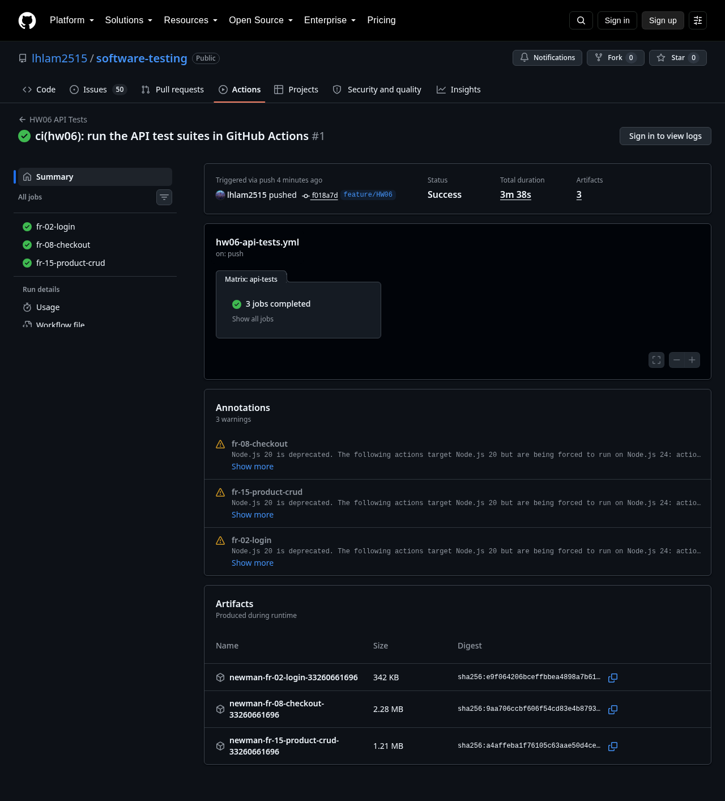
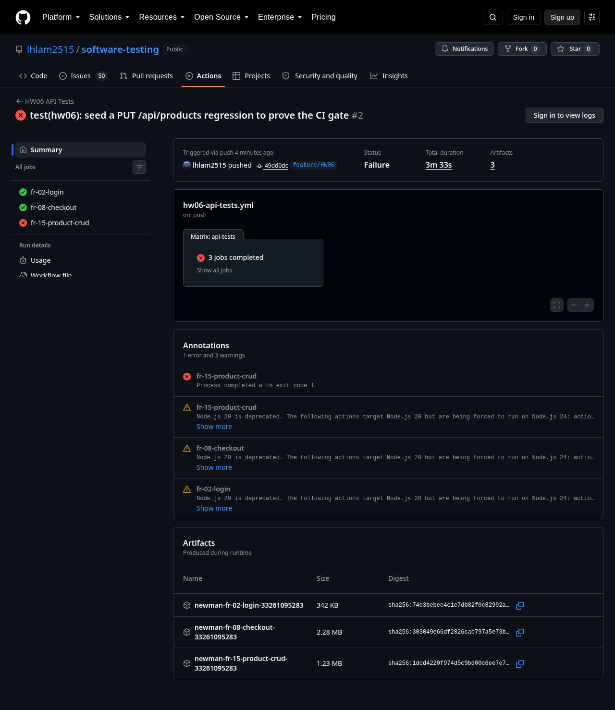

# CI/CD Report

Pipeline configuration and the two sample runs required by REQUIREMENTS.md
section 6, submitted as the short CI/CD report named in section 14.

## 1. Pipeline configuration

| Item | Value |
|---|---|
| Platform | GitHub Actions |
| Workflow file | [`.github/workflows/hw06-api-tests.yml`](../../../../.github/workflows/hw06-api-tests.yml) |
| Repository | <https://github.com/lhlam2515/software-testing> (public) |
| Triggers | `push` on `feature/HW06` touching `apps/backend/**`, `homeworks/HW06/artifacts/postman/**`, `homeworks/HW06/artifacts/cicd/**` or the workflow itself; plus `workflow_dispatch` |
| Jobs | one matrix job per API: `fr-02-login`, `fr-08-checkout`, `fr-15-product-crud`, `fail-fast: false` |
| Runner | `ubuntu-latest`, Node 20 |
| Secrets | none. The SUT runs on a local SQLite database seeded at startup with the committed demo accounts |
| Student id | `X-Student-Id: 23127216`, injected as the `STUDENT_ID` workflow env var and set on every request by the collection-level pre-request script |
| Reports | Newman JSON + htmlextra HTML uploaded as a per-job artifact; a Markdown summary is written to the job summary |

Each job does the same four things:

1. `npm install` in `apps/backend` (see the `npm ci` gotcha in the appendix).
2. `run-ci-suite.sh <fr>` — deletes `database.sqlite`, starts `node server.js`
   with `RESET_DB=1`, waits on `http://127.0.0.1:3000/api/products`, then runs
   Newman against that API's collection.
3. `summarize-run.mjs` renders the Newman JSON as the job summary.
4. `actions/upload-artifact` publishes the raw reports and the SUT log.

`run-ci-suite.sh` is the same entry point locally and in the pipeline, so any
run can be reproduced offline:

```bash
STUDENT_ID=23127216 homeworks/HW06/artifacts/cicd/run-ci-suite.sh fr-15-product-crud
```

## 2. What the pipeline gates on

The three audited suites contain test cases that fail against the current SUT
because of real bugs already filed on the GitHub Issues page. Those cases are
evidence and must stay in the suites, so the pipeline gates on the **CI
regression subset** instead:

- [`ci-quarantine.json`](ci-quarantine.json) lists every excluded test case with
  its bug id and issue number (37 cases across the three APIs).
- [`build-ci-data.mjs`](build-ci-data.mjs) derives `ci-data.csv` from the audited
  `test-data.csv`, dropping the quarantined rows and any row that references a
  dropped one in `precondition_note` / `tc_ref`.
- The generated `ci-data.csv` is committed next to each collection, so the gated
  subset is reviewable in the diff.

A green pipeline therefore means **no new regression**, not "no known bugs".
The known bugs stay documented in [`BUG_REPORT.md`](../../BUG_REPORT.md) and in
the full-suite evidence under [`artifacts/newman/`](../newman/).

| API | Suite rows | Quarantined (bug) | Dropped (dependency) | Rows in the CI gate |
|---|---:|---:|---:|---:|
| FR-02 login | 53 | 13 | 0 | 40 |
| FR-08 checkout | 50 | 8 | 6 | 36 |
| FR-15 product CRUD | 56 | 17 | 3 | 36 |

Building the subset surfaced one finding of its own: FR-15 **TC-32** (DELETE with
a non-admin token) passes in the full suite only because an earlier quarantined
row had already deleted the same product. Run in isolation it fails, so it is
quarantined under BUG-FR15-03 rather than counted as green.

## 3. Sample run 1 — all API test cases passing

| Field | Value |
|---|---|
| Commit | [`f018a7d`](https://github.com/lhlam2515/software-testing/commit/f018a7dcf6c182bc373fd9b40c4f3ec2d216876a) "ci(hw06): run the API test suites in GitHub Actions" |
| Run | <https://github.com/lhlam2515/software-testing/actions/runs/33260661696> |
| Result | Success, 3m 38s, 3 jobs green, 3 artifacts |
| Screenshot | [`assets/cicd-run-all-pass.png`](../../assets/cicd-run-all-pass.png), job view [`assets/cicd-run-all-pass-job-fr15.png`](../../assets/cicd-run-all-pass-job-fr15.png) |
| Reports | [`evidence/run-all-pass/`](evidence/run-all-pass/) |

| Job | Iterations | Requests | Assertions | Failed |
|---|---:|---:|---:|---:|
| fr-02-login | 40 | 56 | 204 | 0 |
| fr-08-checkout | 36 | 218 | 92 | 0 |
| fr-15-product-crud | 36 | 128 | 107 | 0 |



## 4. Sample run 2 — one test case failing

To show the gate actually catches a code change, the next commit seeds a
regression in the SUT: `PUT /api/products/:id` gains an id guard that raises
instead of answering, so Express serves its default HTML error page. That is the
same defect class the SUT already exhibits on malformed input (BUG-FR02-04,
BUG-FR08-04). FR-15 TC-17 is the only test case in the gate that sends a
non-numeric product id, so exactly one test case fails.

| Field | Value |
|---|---|
| Commit | [`49dd0dc`](https://github.com/lhlam2515/software-testing/commit/49dd0dc92b1c687ef6c4600b3fc1240ad461760c) "test(hw06): seed a PUT /api/products regression to prove the CI gate" |
| Run | <https://github.com/lhlam2515/software-testing/actions/runs/33261095283> |
| Result | Failure, 3m 33s — `fr-15-product-crud` red, `fr-02-login` and `fr-08-checkout` green |
| Screenshot | [`assets/cicd-run-one-fail.png`](../../assets/cicd-run-one-fail.png) |
| Reports | [`evidence/run-one-fail/`](evidence/run-one-fail/) |

Failing assertion, from the job summary:

```text
Test cases: 37 exercised, 1 failing

| Test case | Passed | Failed | First failure |
| TC-17 | 2 | 2 | [TC-17][EC-16] non-2xx-shaped response never leaks a stack
                   trace / HTML error page - expected '<!DOCTYPE html>...'
                   not to match /<html/i |
```



The seeded fault is removed again by commit
[`8d2013f`](https://github.com/lhlam2515/software-testing/commit/8d2013f) so the
SUT is back to the state every other HW06 artifact was produced against.

## 5. Committed evidence

```text
cicd/
├── README.md                  - this report
├── ci-quarantine.json         - the excluded test cases and their bug ids
├── build-ci-data.mjs          - derives ci-data.csv from the audited suite
├── run-ci-suite.sh            - the run entry point, local and in CI
├── summarize-run.mjs          - Newman JSON to Markdown summary
└── evidence/
    ├── run-all-pass/<fr>/     - newman-report.html, summary.md, sut.log
    └── run-one-fail/<fr>/     - newman-report.html, summary.md, sut.log
```

The raw `newman-report.json` files are 2-16 MB each and are not committed; they
remain downloadable from the Actions run artifacts linked above.

## Appendix - T3 spike readiness (confirmed 20/08)


- **Workflow/Actions permissions**: confirmed via `gh api repos/lhlam2515/software-testing/actions/permissions` → `enabled: true`, `allowed_actions: all`. `gh auth status` token scope includes `workflow`; repo viewer permission is `ADMIN`. No blocker.
- **Secrets**: none required. The SUT runs on local SQLite with seeded test/dev accounts (`test@eshop.com` / `admin@eshop.com`), already committed in `assets/t2-spike-environment.json` — not production credentials.
- **SUT startup mechanism**: confirmed both locally (T1/T2) and in a real Actions run — `node server.js` + `wait-on http://127.0.0.1:3000/api/products`; gotcha `localhost` → intermittent DNS failure, must use `127.0.0.1`.
- **Link/screenshot capability**: **confirmed with a real run.** Pushed `assets/t3-spike-workflow-pushable.yml` to a throwaway branch (`spike/hw06-ci-t3`, deleted after the spike) and triggered it via a real `push` event (workflow_dispatch is not dispatchable until a workflow file exists on the default branch — a GitHub platform constraint, not something specific to this repo).
  - Real run: **https://github.com/lhlam2515/software-testing/actions/runs/32319719528** — status `Success`, 26s, 1 artifact (`hw06-ci-spike-newman-32319719528`, Newman JSON report, 6.91 KB).
  - Newman result against the T2 spike collection (7 requests): **7/7 executed, 0 failed** (requests, test-scripts, and assertions all 7/7).
  - Screenshot and downloaded JSON artifact saved as real evidence: `assets/t3-ci-spike-run-screenshot.png`, `assets/t3-ci-spike-newman-report.json`.
- This spike workflow is **not** the final CI/CD skeleton (that official `.github/workflows/` commit is task F7) and its run is **not** one of the two official sample runs required by section 6 (those are task S7, against the full 35+ test-case collection per API, executed by the student).

### Real gotchas found during the spike (carry into F7)

1. **`npm ci` false-positive `EUSAGE`**: `apps/backend/package-lock.json` (committed since the initial `init` commit) makes the Actions runner's `npm ci` fail with `Missing: picomatch@4.0.5 from lock file` (a real but unresolved `tinyglobby` → `picomatch` dependency entry). Reproducible on the runner across Node 20 (forced to 24), Node 22, and after `npm install -g npm@latest` in-job. **Not reproducible locally** — `npm ci` and `npm install` both succeed locally (npm 11.6.2) against the identical, unmodified lock file, even from a clean `node_modules`. Root cause not fully isolated. Workaround used: `npm install` instead of `npm ci` in the workflow. F7 should either keep this workaround or investigate further (try `npm ci --) --legacy-peer-deps`, or regenerate the lock file with a matching npm major version).
2. **Missing `newman-reporter-html`**: the `html` reporter is not bundled with `newman` — `npx --yes newman run ... --reporters cli,json,html` silently drops the HTML report ("could not find 'html' reporter") and only produces JSON. F6/F7 need `npm install newman-reporter-html` (or `npx --package newman-reporter-html`) if an HTML report artifact is wanted for the two official S7 runs.
