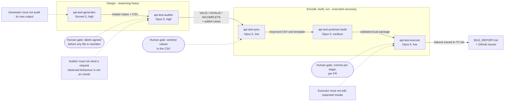

# AI-driven API Test Generator - Design Diagram

Design of the `api-test-generator` agent skill: given one endpoint of the e-Shop
API specification, it produces a traceable, data-driven test-case suite.

Both diagrams below are the student's own design. They were drawn in Mermaid from
the skill contract in `artifacts/skills/api-test-generator/SKILL.md`, which was
designed and written before this homework's three FRs were tested. Each diagram ships in two layouts with identical content: a landscape one
(`diagrams/src/*-pipeline.mmd`, `*-boundaries.mmd`) for screen reading, and a portrait one
(`diagrams/src/*-portrait.mmd`) that fits an A4 page in the PDF report. Rendered with
`mmdc -i <file>.mmd -o <file>.png -b white -w <width>`.

## 1. Generator pipeline

The generator is one skill with seven stages, not one prompt.

Landscape variant: `diagrams/render/generator-pipeline.png`.

```mermaid
flowchart LR
    IN["Input: FR id, HTTP method, endpoint path<br/>+ case target (default 35)"]
    S1["S1 Extract contract<br/>specs/openapi.yaml, requirements.md,<br/>security-requirement.md"]
    GATE{"Is the behaviour<br/>documented?"}
    UNSPEC["Record as UNSPECIFIED<br/>probe only, assert nothing"]
    S6["S6 Consolidate<br/>master-test-cases.md, one TC id sequence,<br/>every row traced to a source line"]
    CHECK{"Coverage check: uncovered parameter,<br/>SEC id, transition or response variant?"}
    DEEPEN["Deepen the thin branch<br/>never pad with reworded rows"]
    S7["S7 Emit execution inputs<br/>data/test-data.csv + data/request-template.md"]
    OUT["Handoff to api-test-auditor<br/>run on a different model"]

    subgraph Oracles["Oracle set - read-only, authoritative"]
        SRS["srs.md<br/>behaviour, business rules"]
        SPEC["api_specification.md<br/>request and response contract"]
        SECREQ["SEC-01 to SEC-07<br/>security requirements"]
    end

    subgraph BR["S2 to S5 - four independent design branches"]
        S2["S2 Domain partitions<br/>EP classes + BVA points,<br/>one obligation per row"]
        S3["S3 State or lifecycle<br/>classify explicit / implicit / none,<br/>then derive transitions"]
        S4["S4 Security cases<br/>applicable SEC ids only,<br/>payload + asset + oracle"]
        S5["S5 Schema cases<br/>documented status codes,<br/>required and forbidden fields"]
    end

    IN --> S1
    Oracles --> S1
    S1 --> GATE
    GATE -- "yes" --> BR
    GATE -- "no" --> UNSPEC
    BR --> S6
    UNSPEC --> S6
    S6 --> CHECK
    CHECK -- "yes" --> DEEPEN
    DEEPEN -.-> BR
    CHECK -- "no" --> S7
    S7 --> OUT
```

### Design decisions behind this shape

| Decision | Why |
| --- | --- |
| One contract extraction feeds every technique (S1 before S2 to S5) | The parameter list, the response variants and the SEC applicability table are derived once. If each branch re-read the specification, the branches would disagree on what the endpoint even accepts |
| The documented-or-UNSPECIFIED gate sits between S1 and the branches | This is the single rule that keeps the AI from inventing an oracle. An undocumented status code becomes a probe with no assertion, not an expected result |
| S2 to S5 are independent branches, not a chain | A weak branch stays visible in the coverage report. Chained stages hide a thin security group behind a large EP group |
| S3 classifies before it models | `POST /api/login` has implicit state (the lockout counter), `PUT /api/products/:id` has none. Calling lifecycle cases "state-transition coverage" would overstate the suite |
| The coverage check may loop back, but only to deepen a named group | The exit condition is coverage, not case count. Padding with reworded rows would pass a count target and fail the audit |
| S7 emits CSV plus one parameterised request, not a collection | The suite has to survive the audit. Test data is data; the request shape is built downstream, after the audit changes cases |
| The skill ends at handoff | The generator is barred from auditing its own output and from sending requests. Both boundaries are enforced in the skill text |

## 2. Where the generator sits, and what it may not do

Landscape variant: `diagrams/render/generator-boundaries.png`.

The generator is deliberately not the whole system. A generator that also grades
its own suite produces a suite that is always complete and always correct on
paper. Pass 1 of this homework is the evidence: the same model generated and
audited, and it certified two wrong line citations as correct.

## 3. Pseudocode

See [`pseudocode.md`](pseudocode.md).
